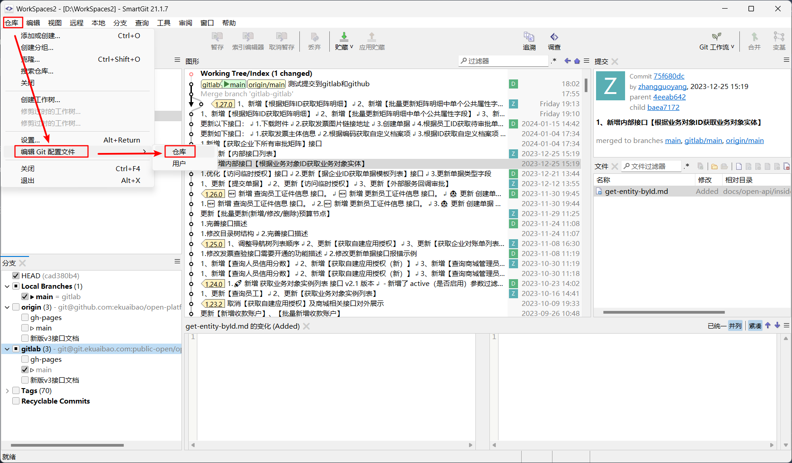
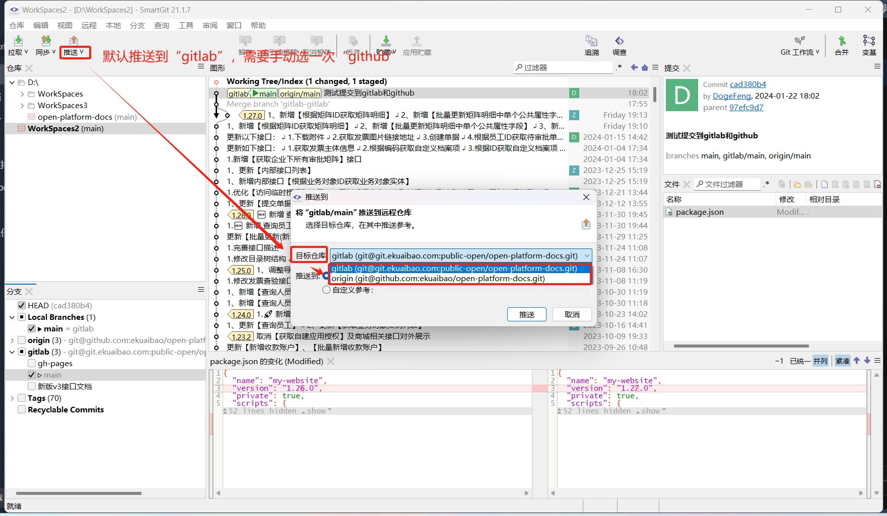

# 合思开放平台文档中心

合思开放平台文档中心

## 开发

> 开发环境 `node >= 14.0.0`

```bash
npm i
npm run start
```

本地预览地址：<http://localhost:3000/>

## 修改代码后，如何同时推送 `gitlab` 和 `github`

### 1.从 `gitlab` 克隆下来文档中心的代码

#### （1）克隆好后，在控制台输入 `npm i` 编译代码，下载插件。
#### （2）有可能部分从 `github` 仓库下载的插件会因为链接超时报错，导致编译不成功，可找已经编译成功的研发要一下 `node_modules` 这个文件夹，复制并替换即可省去编译这步。
#### （3）在控制台输入 `npm run start` 启动项目，项目启动成功，可打开 <http://localhost:3000/> 进行预览。

### 2.修改 `smartGit` 的配置文件，新配置一个远程地址 `github`


```bash
[core]
	repositoryformatversion = 0
	filemode = false
	bare = false
	logallrefupdates = true
	symlinks = false
	ignorecase = true
[remote "origin"]
    url = git@git.ekuaibao.com:public-open/open-platform-docs.git
	fetch = +refs/heads/*:refs/remotes/gitlab/*
[taggrouping]
	groups =
	singles =
# 新增的远程地址
[remote "github"]   
	url = git@github.com:ekuaibao/open-platform-docs.git
	fetch = +refs/heads/*:refs/remotes/origin/*
[branch "main"]
# 默认远程地址
	remote = origin
	merge = refs/heads/main
```

### 2.修改代码提交到本地后，推送2次即可，`origin` 1次，`github` 1次



