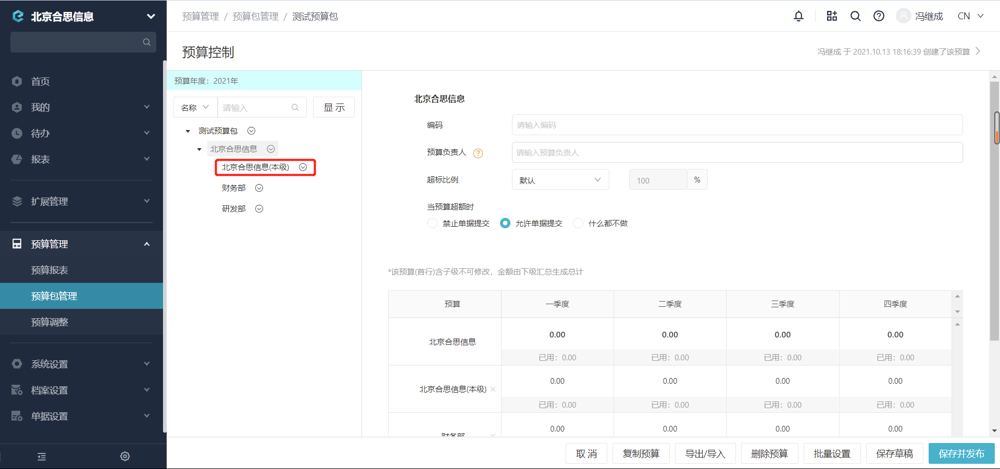
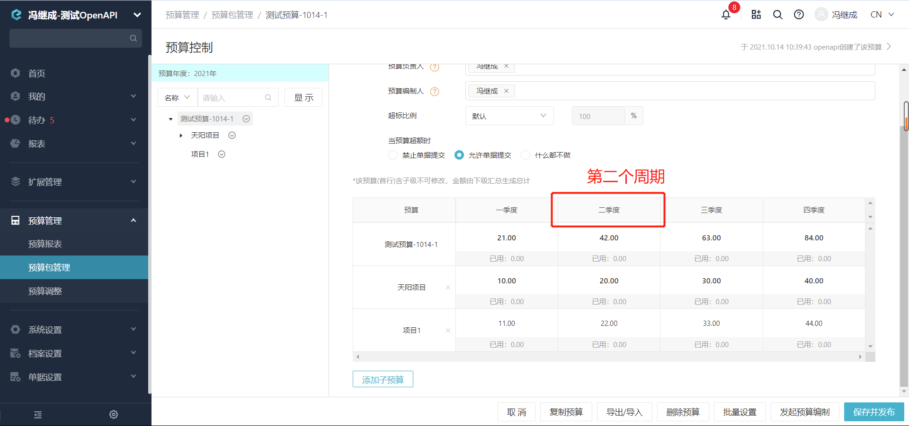

# 常见问题总结

---
## 问题一
Q: 什么是“维度是否必定为叶节点(本部)”？

A:预算维度分类是否为其维度下的子预算的意思。如附图所示，测试预算包下的维度为“北京合思信息”,其也作为维度下的子预算配置预算金额。

---
## 问题二
Q: 接口中的参数“第几个周期”是什么概念？

A:预算包的控制周期为： 

- 年度和自定义区间 : 此预算包只有1个周期，全年；
- 半年度 : 此预算包有2个周期，上半年/下半年；
- 季度 : 此预算包有4个周期，一季度/二季度/三季度/四季度；
- 月度 : 此预算包有12个周期，1月/2月/3月/4月/5月/6月/7月/8月/9月/10月/11月/12月。

  例如，预算包控制周期为季度类型，第2个周期的预算金额，就代表此预算项“第二季度的预算额度”：

  
