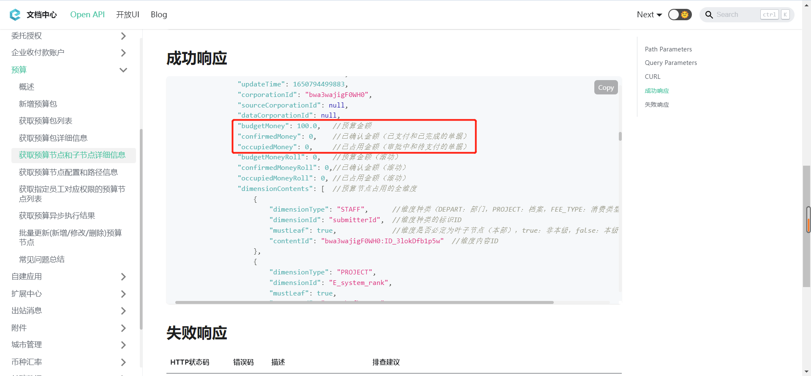

# 常见问题总结

---
## 问题一
### Q：什么是“维度是否必定为叶子节点(本部)”？

A：预算维度分类是否为其维度下的子预算，其概念如附图所示，“测试预算包”下的维度为“北京合思信息”，其也作为维度下的子预算配置预算金额。

---
## 问题二
### Q：接口中的参数“第几个周期”是什么概念？

A：预算包的控制周期为： 

- 年度和自定义区间 : 此预算包只有1个周期，全年；
- 半年度 : 此预算包有2个周期，上半年/下半年；
- 季度 : 此预算包有4个周期，一季度/二季度/三季度/四季度；
- 月度 : 此预算包有12个周期，1月/2月/3月/4月/5月/6月/7月/8月/9月/10月/11月/12月；

  例如，预算包控制周期为季度类型，第2个周期的预算金额，就代表此预算项“第二季度的预算额度”：

  

---
## 问题三
### Q：“批量更新(新增/修改/删除)预算节点”接口新增预算节点时等待时间长？

A：批量新增预算节点时，每新增一个预算节点，整个预算树都要计算一遍，然后再顺序新增下一个节点；预算树节点数量和服务性能都会影响计算时间，每个预算节点短则几秒，长则几分钟才能计算完毕，再继续新增下一个预算节点。

---
## 问题四
### Q：预算余额如何获取？

A：预算余额 = 预算金额（`budgetMoney`）- 已使用金额（`confirmedMoney`）- 占用金额（`occupiedMoney`）

  

---
