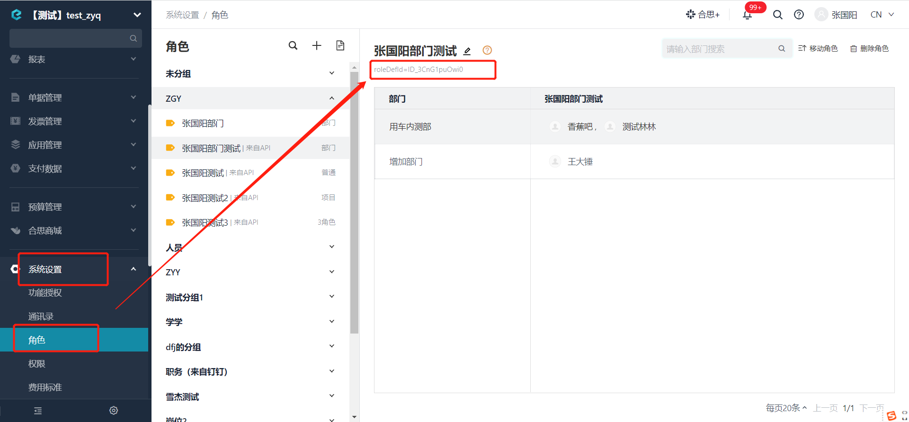

# 查询角色下员工信息
获取某个角色下包含的员工信息

import Control from "../../../components/Control";

<Control
method="GET"
url="/api/openapi/v1/roledefs/$`roledefId`"
/>

## Path Parameters

| 名称 | 类型 | 描述 | 是否必填 | 默认值 | 备注 |
| :--- | :--- | :--- | :--- |:--- | :--- |
| **roledefId** | String | 角色ID | 必填 | - | 在易快报桌面端「系统设置」>「角色管理」处查看 | 

## Query Parameters

| 名称 | 类型 | 描述 | 是否必填 | 默认值 | 备注 |
| :--- | :--- | :--- | :--- |:--- | :--- |
| **accessToken** | String | 认证token	      | 必填   | - | [通过授权接口获取](/docs/open-api/getting-started/auth) |
| **staffBy**     | String | 查询员工信息显示类型 | 非必填 | id | `id`: 显示完整员工ID，格式：企业id : userId<br/>`sourceId`: 只显示userId |

> ⚠️ 注意：
> 
> - 角色ID获取如下所示
> 

## CURL
```
curl --location --request GET 'https://app.ekuaibao.com/api/openapi/v1/roledefs/$JOYbpjPP-E2Q00:leader?accessToken=RCIbwHcnF0kg00&staffBy=id' \
--header 'content-type: application/json' \
--header 'Accept: application/json'
```

## 成功响应
```json
{
      "value": {
            "id": "JOYbpjPP-E2Q00:leader",  //角色ID
            "name": "部门主管",              //角色名称
            "contents": [                  //角色配置情况，每一个元素对应「角色管理」界面右侧列表的一行
                  {
                        "path": [          //如果是普通角色，则无此节点。这个节点通过路径名称来表示一个部门或自定义档案值
                              "恒达"
                        ],
                        "staffs": [        // 员工集合
                              "JOYbpjPP-E2Q00:y8gbpjP9OsnI00"
                        ]
                  }
            ]
      }
}
```

## 失败响应
```json
{
      "errorCode": 400,
      "errorMessage": "角色不存在",
      "errorDetails": null,
      "code": null,
      "data": null
}
```