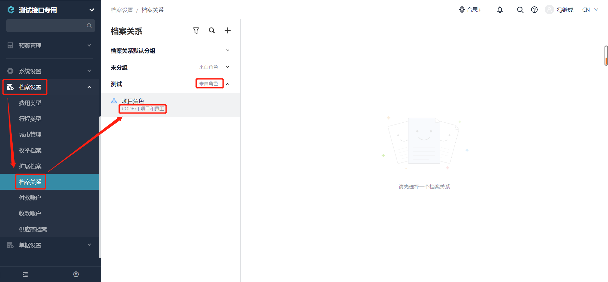

# 常见问题总结

---
## 问题一
### Q: [更新角色下员工信息](/docs/open-api/corporation/update-roles) 接口提示“数据错误 : [ 0 : 路径不存在[子部门] ]”？

A：更新角色下员工信息中的 `path` 参数传值为完整的路径信息，例如：在 "部门1” 下有 “子部门” ，在更新时 `path` 传 “子部门” 是检索不到数据的，需要填写完整路径，示例
path : [ "部门1", "子部门"]。

---
## 问题二
### Q: 如何删除部门角色下的离职员工？

A：建议调用 [更新角色下员工信息](/docs/open-api/corporation/update-roles) 接口，采取覆盖方式删除掉离职员工。

---
## 问题三
### Q: 如何在系统上获取角色的CODE？

A：【档案设置】 - 【档案关系】 - 【分组（来自角色）】下获取。

---
