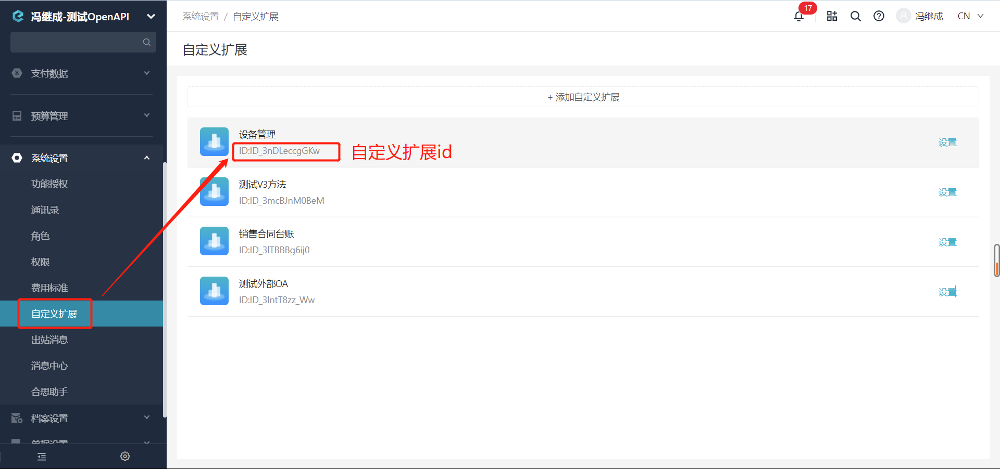

# 获取业务对象
获取某个扩展的所有业务对象。

import Control from "@theme/Control";

<Control
method="GET"
url="/api/openapi/v2/datalink/entity/$`platformId`"
/>

## Path Parameters

| 名称 | 类型 | 描述 | 是否必填 | 默认值 | 备注 |
| :--- | :--- | :--- | :--- |:--- | :--- |
| **platformId** | String | 扩展id | 必填 | - | 自定义扩展id |

## Query Parameters

| 名称 | 类型 | 描述 | 是否必填 | 默认值 | 备注 |
| :--- | :--- | :--- | :--- |:--- | :--- |
| **accessToken** | String | 认证token | 必填 | - | [通过授权接口获取](/docs/open-api/getting-started/auth) |

:::tip

:::

## CURL
```shell
curl --location --request GET 'https://app.ekuaibao.com/api/openapi/v2/datalink/entity/$PgQbrAHda85Y00?accessToken=cxEbrzNJSA3A00'
```

## 成功响应
```json
{
    "items": [
        {
            "version": 3,
            "active": true, // 是否启用
            "createTime": 1597659931743,
            "updateTime": 1597659931743,
            "name": "业务对象1", // 业务对象名称
            "nameSpell": "SHITI1", // 业务对象名称拼音
            "code": "",
            "corporationId": "34A73EyI8A0w00",
            "ledgerIds": null,
            "plannedIds": null,
            "parentId": "",
            "scoped": true, // true部分可见，false全员可见
            "type": "BILL", // 业务对象类型 DIMENSION档案、BILL单据、ORDER订单
            "disableStrategy": "MANUAL_ADMIN", // "MANUAL_ADMIN", MANUAL_ADMIN管理员停用/启用、LIMIT_COUNT引用次数停用
            "maxUsageCount": 0, // 最大引用次数
            "writtenOffField": null,
            "fields": [ //业务对象字段
                {
                    "name": "E_ea9d0b6e522a25878000_name", // 字段名称，业务对象字段唯一标示
                    "label": "名称", // 显示名称
                    "type": "text", // 类型: text文本、date时间、dateRange时间段、number数字、money金额、switcher开关
                    "source": "dataLink",
                    "optional": false, // 是否选填
                    "defaultValue": null,
                    "formula": false,
                    "calculation": {
                        "dependencies": [],
                        "dependenciesBy": [],
                        "order": 1
                    }
                },
                {
                    "name": "E_ea9d0b6e522a25878000_code",
                    "label": "编码",
                    "type": "autoNumber",
                    "source": "dataLink",
                    "optional": false,
                    "defaultValue": null,
                    "formula": false,
                    "calculation": {
                        "dependencies": [],
                        "dependenciesBy": [],
                        "order": 0
                    },
                    "rule": "{000}"
                },
            ],
            "defaultMappingRuleId": "NyIbrB8G9ous00",
            "filterId": null,
            "id": "ea9d0b6e522a25878000", // 业务对象id
            "platformId": "PgQbrAHda85Y00", // 扩展id
            "details": null,
            "homePageVisibleIds": null,
            "homeVisibility": {
                "fullVisible": false,
                "staffs": null,
                "roles": null,
                "departments": null,
                "departmentsIncludeChildren": true
            },
            "showOnPage": true,
            "importMethod": [
                "excel",
                "api"
            ],
            "allowRecordLog": false,
            "logFields": []
        }
    ]
}
```

## 失败响应
请确保获取的 `扩展id` 是真实存在的，否则会返回如下响应：
```text
该扩展不存在
```