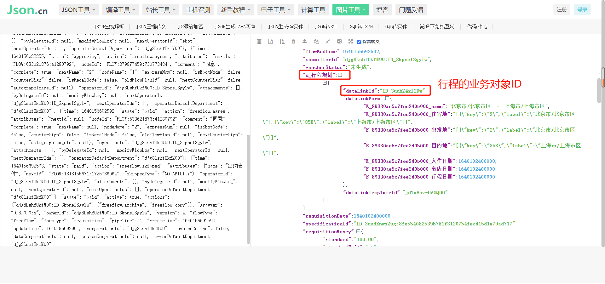

# 根据实例ID获取行程管理/订单管理业务对象实例

import Control from "@theme/Control";

<Control
method="GET"
url="/api/openapi/v2/datalink/TRAVEL_MANAGEMENT/byDataLinkIds"
/>

## Query Parameters

| 名称 | 类型 | 描述 | 是否必填 | 默认值 | 备注 |
| :--- | :--- | :--- | :--- |:--- | :--- |
| **accessToken** | String | 认证token | 必填 | - | 通过 [获取授权](/docs/open-api/getting-started/auth) 获取 `accessToken` |

## Body Parameters

| 名称 | 类型 | 描述 | 是否必填 | 默认值 | 备注 |
| :--- | :--- | :--- | :--- |:--- | :--- |
| **ids** | Array | 业务对象实例ID | 必填 | - | 通过 [获取行程管理/订单管理业务对象列表](/docs/open-api/datalink/get-tripManager-order) 获取 |

:::tip
- 例如：**“行程管理”**的业务对象实例ID可以在单据详情里面获取到。

  
:::

## CURL
```json
curl --location --request GET 'https://app.ekuaibao.com/api/openapi/v2/datalink/TRAVEL_MANAGEMENT/byDataLinkIds?accessToken=NegbQ-IpSM6g00' \
--header 'content-type: application/json' \
--header 'Accept: application/json' \
--data-raw '{
    "ids":["gyMbDPToxUnQ00", "sNsbE5ikQ0n800"]
}'
```

## 成功响应
```json
{
	"items": [
        {
			"id": "gyMbDPToxUnQ00",                 //业务对象实例ID
			"version": 2,
			"active": true,
			"createTime": 1600942574851,
			"updateTime": 1600942574851,
			"name": "广东省/广州市/广州市区",
			"nameSpell": "GUANGDONGSHENG/GUANGZHOUSHI/GUANGZHOUSHIQU",
			"code": "TRIP202009240000000002",
			"corporationId": "kRsbl5WsyMmg00",
			"form": {
				"E_0ee20b9ed9cade87bc00_code": "TRIP202009240000000002",    //业务对象实例编码
				"E_0ee20b9ed9cade87bc00_name": "广东省/广州市/广州市区",     //业务对象实例名称
				"E_0ee20b9ed9cade87bc00_住宿地": "[{\"key\":\"2123\",\"label\":\"广州市区\"}]",
				"E_0ee20b9ed9cade87bc00_出行人": [
					"kRsbl5WsyMmg00:pgEbDN7NbIg000"
				],
				"E_0ee20b9ed9cade87bc00_申请人": "kRsbl5WsyMmg00:pgEbDN7NbIg000",
				"E_0ee20b9ed9cade87bc00_订票人": "kRsbl5WsyMmg00:pgEbDN7NbIg000",
				"E_0ee20b9ed9cade87bc00_入住日期": 1600942541371,
				"E_0ee20b9ed9cade87bc00_原始单据": "MCAbDPTiSA2w00",
				"E_0ee20b9ed9cade87bc00_离店日期": 1601028941371,
				"E_0ee20b9ed9cade87bc00_订购状态": "待订购",
				"E_0ee20b9ed9cade87bc00_申请单标题": "北京申请单",
				"E_0ee20b9ed9cade87bc00_申请单编码": "S20000002",
				"E_0ee20b9ed9cade87bc00_申请单预算金额": {
					"standard": "88.00",
					"standardUnit": "元",
					"standardScale": 2,
					"standardSymbol": "¥",
					"standardNumCode": "156",
					"standardStrCode": "CNY"
				}
			},
			"ledgerAmount": null,
			"ledgerAmountModel": null,
			"totalCount": 0,
			"useCount": 0,
			"entityId": "7cea0b9edcc64ec06400", //业务对象ID
			"platformId": "5NgbDJDaTEuQ00",     //自建应用ID
			"source": "FLOW",
			"masterId": null,
			"index": 0,
			"visibility": {
				"fullVisible": false,
				"staffs": [
					"kRsbl5WsyMmg00:pgEbDN7NbIg000"
				],
				"roles": null,
				"departments": null,
				"departmentsIncludeChildren": false
			},
			"visible": true,
			"ownerId": "kRsbl5WsyMmg00:pgEbDN7NbIg000",    //所属人ID
			"operatorId": "kRsbl5WsyMmg00:pgEbDN7NbIg000", //操作者ID
			"sourceId": "MCAbDPTiSA2w00",
			"flowCounts": {}
		},
		{
			"id": "sNsbE5ikQ0n800",
			"version": 2,
			"active": true,
			"createTime": 1601015636403,
			"updateTime": 1601015636403,
			"name": "北京市/海淀区",
			"nameSpell": "BEIJINGSHI/HAIDIANQU",
			"code": "TRIP202009250000000009",
			"corporationId": "kRsbl5WsyMmg00",
			"form": {
				"E_0ee20b9ed9cade87bc00_code": "TRIP202009250000000009",
				"E_0ee20b9ed9cade87bc00_name": "北京市/海淀区",
				"E_0ee20b9ed9cade87bc00_住宿地": "[{\"key\":\"8\",\"label\":\"海淀区\"}]",
				"E_0ee20b9ed9cade87bc00_出行人": [
					"kRsbl5WsyMmg00:pgEbDN7NbIg000"
				],
				"E_0ee20b9ed9cade87bc00_申请人": "kRsbl5WsyMmg00:pgEbDN7NbIg000",
				"E_0ee20b9ed9cade87bc00_订票人": "kRsbl5WsyMmg00:pgEbDN7NbIg000",
				"E_0ee20b9ed9cade87bc00_入住日期": 1601015611002,
				"E_0ee20b9ed9cade87bc00_原始单据": "shgbE5hCz46s00",
				"E_0ee20b9ed9cade87bc00_离店日期": 1601102011002,
				"E_0ee20b9ed9cade87bc00_订购状态": "待订购",
				"E_0ee20b9ed9cade87bc00_申请单标题": "没有费用承担部门",
				"E_0ee20b9ed9cade87bc00_申请单编码": "S20000015",
				"E_0ee20b9ed9cade87bc00_申请单预算金额": {
					"standard": "12.00",
					"standardUnit": "元",
					"standardScale": 2,
					"standardSymbol": "¥",
					"standardNumCode": "156",
					"standardStrCode": "CNY"
				}
			},
			"ledgerAmount": null,
			"ledgerAmountModel": null,
			"totalCount": 0,
			"useCount": 0,
			"entityId": "7cea0b9edcc64ec06400",
			"platformId": "5NgbDJDaTEuQ00",
			"source": "FLOW",
			"masterId": null,
			"index": 0,
			"visibility": {
				"fullVisible": false,
				"staffs": [
					"kRsbl5WsyMmg00:pgEbDN7NbIg000"
				],
				"roles": null,
				"departments": null,
				"departmentsIncludeChildren": false
			},
			"visible": true,
			"ownerId": "kRsbl5WsyMmg00:pgEbDN7NbIg000",
			"operatorId": "kRsbl5WsyMmg00:pgEbDN7NbIg000",
			"sourceId": "shgbE5hCz46s00",
			"flowCounts": {}
		}
	]
}
```

## 失败响应

| HTTP状态码 | 错误码 | 描述 | 排查建议 |
| :--- | :--- | :--- | :--- |
| **400** | - | 不支持的业务对象「TRAVEL」 | 请确认接口路径中的 `TRAVEL_MANAGEMENT` 拼写是否正确，该参数为固定值  | 
| **400** | - | 查询的数据不存在 | 请确认 `ids`（业务对象实例ID）是否存在  | 


