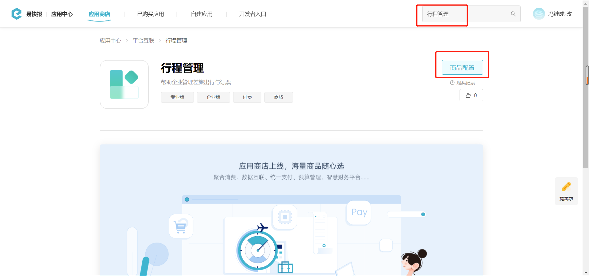
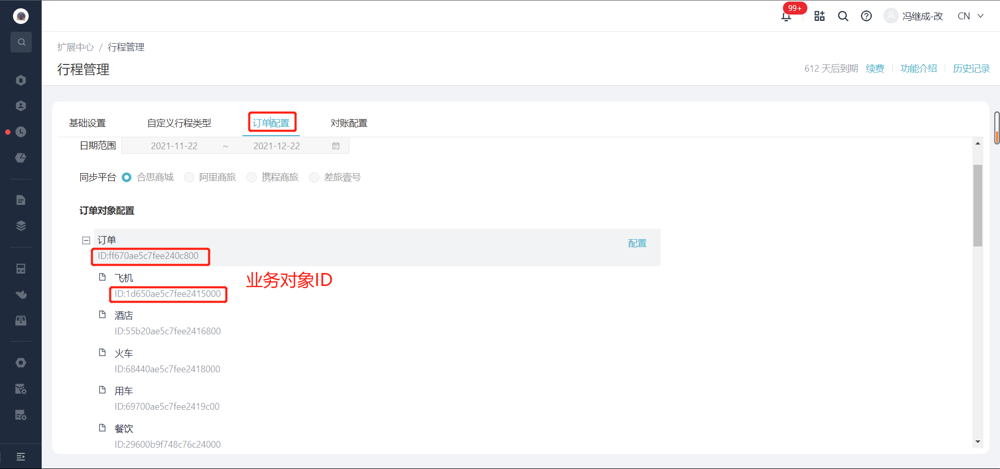
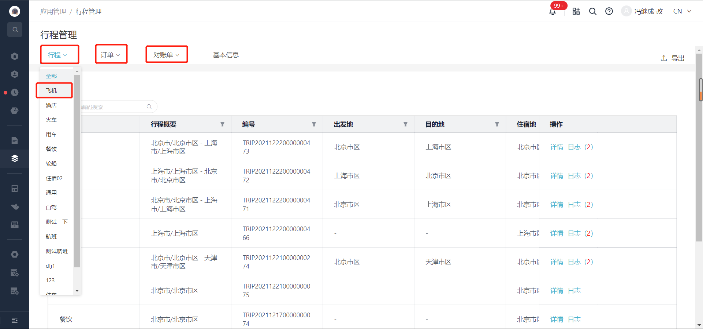

# 获取行程管理业务对象列表

import Control from "../../../components/Control";

<Control
method="POST"
url="/api/openapi/v2/datalink/TRAVEL_MANAGEMENT/searchOrders"
/>

## Query Parameters

| 名称 | 类型 | 描述 | 是否必填 | 默认值 | 备注 |
| :--- | :--- | :--- | :--- |:--- | :--- |
| **accessToken** | String | 认证token | 必填 | - | [通过授权接口获取](/docs/open-api/getting-started/auth) |

## Body Parameters

| 名称 | 类型 | 描述 | 是否必填 | 默认值 | 备注 |
| :--- | :--- | :--- | :--- |:--- | :--- |
| **entityId** | String | 行程管理的业务对象ID  | 必填 | - | 行程管理的业务对象ID |
| **start**    | Int    | 起始值              | 必填 | - | 从0开始搜索  |
| **count**    | Int    | 查询总数            | 必填 | - | 每批次查询总数不可大于100条 |

- 行程管理业务对象ID获取见下图

  

  

- 【行程管理】中行程、订单、对账单模块下为什么都有飞机、酒店这种分类？

  

:::tip
3个飞机的 `entityId` 不一样，里面的字段也不一样:
 - 1.行程里的飞机是申请单审批通过之后生成，然后传给商城。
 - 2.商城根据行程下完单后，会推送订单信息给费控，生成订单业务对象，一般来说报销单中需要关联的就是订单业务对象，订单中会有具体的订单信息，例如订单金额、改签费、服务费之类的字段。
 - 3.费控接收订单的时候，同时保存成订单和对账单，其数据大部分一致，飞机退改签时，会生成同一条订单，但是对账单是多个。
:::

## CURL
```json
curl --location --request POST 'https://app.ekuaibao.com/api/openapi/v2/datalink/TRAVEL_MANAGEMENT/searchOrders?accessToken=VQoc2fnagU8c00' \
--header 'content-type: application/json' \
--header 'Accept: application/json' \
--data-raw '{
    "entityId": "79180b9ed9cade87e000",
    "start": 0,
    "count": 100
}'
```

## 成功响应
```json
{
    "items": {
        "total": 2152,    //业务对象-总订单数
        "data": [
            {
                "dataLink": {     //订单业务对象
                    "id": "hQYc20Y4W8is00", 
                    "useCount": 0,          
                    "totalCount": 1,        
                    "ownerId": null,        
                    "visibility": {            //可见范围信息
                        "fullVisible": false,//是否全员可见(true=全部； false=部分)
                        "staff": [],         //员工ID集
                        "department": [],    //部门ID集
                        "role": []           //角色ID集
                    },
                    "E_79180b9ed9cade87e000_code": "14057744457",   //对象编码
                    "E_79180b9ed9cade87e000_name": "北京-北京站",    //对象名称
                    "E_79180b9ed9cade87e000_票号": "",
                    "E_79180b9ed9cade87e000_车型": "经济型",
                    "E_79180b9ed9cade87e000_出发地": "[{\"key\":\"1\",\"label\":\"北京市\"}]",
                    "E_79180b9ed9cade87e000_出行人": [],
                    "E_79180b9ed9cade87e000_到达地": "[{\"key\":\"1\",\"label\":\"北京市\"}]",
                    "E_79180b9ed9cade87e000_订单号": "14057744457",
                    "E_79180b9ed9cade87e000_订票人": null,
                    "E_79180b9ed9cade87e000_车牌号": "",
                    "E_79180b9ed9cade87e000_关联行程": null,
                    "E_79180b9ed9cade87e000_出发时间": 1607852526000,
                    "E_79180b9ed9cade87e000_出行类型": "因公",
                    "E_79180b9ed9cade87e000_到达时间": 1607856225000,
                    "E_79180b9ed9cade87e000_支付方式": "企业支付",
                    "E_79180b9ed9cade87e000_是否超标": "",
                    "E_79180b9ed9cade87e000_订单备注": "",
                    "E_79180b9ed9cade87e000_订单日期": 1607852526000,
                    "E_79180b9ed9cade87e000_订单状态": "已成交",
                    "E_79180b9ed9cade87e000_订单类型": "出票",
                    "E_79180b9ed9cade87e000_订单金额": {
                        "standard": "63.80",
                        "standardUnit": "元",
                        "standardScale": 2,
                        "standardSymbol": "¥",
                        "standardNumCode": "156",
                        "standardStrCode": "CNY"
                    },
                    "E_79180b9ed9cade87e000_订票平台": "携程商旅",
                    "E_79180b9ed9cade87e000_证件信息": "",
                    "E_79180b9ed9cade87e000_证件类型": "",
                    "E_79180b9ed9cade87e000_超标原因": "",
                    "E_79180b9ed9cade87e000_出行人类型": "",
                    "E_79180b9ed9cade87e000_申请单编号": "S20001080",
                    "E_79180b9ed9cade87e000_实际出发地点": "京荟广场(文化产业园)",
                    "E_79180b9ed9cade87e000_实际到达地点": "北京站",
                    "E_79180b9ed9cade87e000_用车出行方式": "马上用车",
                    "active": true,
                    "entityId": "5bc40b9edcc64ec0f400" 
                },
                "ledger": {},
                "planned": {},
                "plans": [],
                "ledgers": []
            },
            {
                "dataLink": {
                    "id": "KnMc20Y4W89o00",
                    "useCount": 0,
                    "totalCount": 1,
                    "ownerId": null,
                    "visibility": {
                        "fullVisible": false,
                        "staff": [],
                        "department": [],
                        "role": []
                    },
                    "E_79180b9ed9cade87e000_code": "14134420968",
                    "E_79180b9ed9cade87e000_name": "AECCHDE_463749_20201126",
                    "E_79180b9ed9cade87e000_票号": "876-4886784523",
                    "E_79180b9ed9cade87e000_出发地": "[{\"key\":\"1477\",\"label\":\"济南市\"}]",
                    "E_79180b9ed9cade87e000_出行人": [],
                    "E_79180b9ed9cade87e000_到达地": "[{\"key\":\"704\",\"label\":\"哈尔滨市\"}]",
                    "E_79180b9ed9cade87e000_航班号": "3U8689",
                    "E_79180b9ed9cade87e000_订单号": "14134420968",
                    "E_79180b9ed9cade87e000_订票人": null,
                    "E_79180b9ed9cade87e000_关联行程": null,
                    "E_79180b9ed9cade87e000_出发时间": 1607996100000,
                    "E_79180b9ed9cade87e000_出发机场": "遥墙机场",
                    "E_79180b9ed9cade87e000_出行类型": "-",
                    "E_79180b9ed9cade87e000_到达时间": 1608003900000,
                    "E_79180b9ed9cade87e000_到达机场": "太平机场",
                    "E_79180b9ed9cade87e000_支付方式": "企业支付",
                    "E_79180b9ed9cade87e000_是否超标": "",
                    "E_79180b9ed9cade87e000_航空公司": "",
                    "E_79180b9ed9cade87e000_舱位类型": "经济舱",
                    "E_79180b9ed9cade87e000_订单备注": "",
                    "E_79180b9ed9cade87e000_订单日期": 1607861432000,
                    "E_79180b9ed9cade87e000_订单状态": "出票",
                    "E_79180b9ed9cade87e000_订单类型": "出票",
                    "E_79180b9ed9cade87e000_订单金额": {
                        "standard": "517.00",
                        "standardUnit": "元",
                        "standardScale": 2,
                        "standardSymbol": "¥",
                        "standardNumCode": "156",
                        "standardStrCode": "CNY"
                    },
                    "E_79180b9ed9cade87e000_订票平台": "携程商旅",
                    "E_79180b9ed9cade87e000_证件信息": "239004**********32",
                    "E_79180b9ed9cade87e000_证件类型": "身份证",
                    "E_79180b9ed9cade87e000_超标原因": "",
                    "E_79180b9ed9cade87e000_出行人类型": "",
                    "E_79180b9ed9cade87e000_申请单编号": "S20001081",
                    "active": true,
                    "entityId": "61570b9edcc64ec09c00"
                },
                "ledger": {},
                "planned": {},
                "plans": [],
                "ledgers": []
            },
            {
                "dataLink": {
                    "id": "bqAc20Y4W88M00",
                    "useCount": 0,
                    "totalCount": 1,
                    "ownerId": null,
                    "visibility": {
                        "fullVisible": false,
                        "staff": [],
                        "department": [],
                        "role": []
                    },
                    "E_79180b9ed9cade87e000_code": "14131699836",
                    "E_79180b9ed9cade87e000_name": "AECCHDE_463749_20201126",
                    "E_79180b9ed9cade87e000_票号": "784-4860574401",
                    "E_79180b9ed9cade87e000_出发地": "[{\"key\":\"704\",\"label\":\"哈尔滨市\"}]",
                    "E_79180b9ed9cade87e000_出行人": [],
                    "E_79180b9ed9cade87e000_到达地": "[{\"key\":\"876\",\"label\":\"南京市\"}]",
                    "E_79180b9ed9cade87e000_航班号": "CZ3266",
                    "E_79180b9ed9cade87e000_订单号": "14131699836",
                    "E_79180b9ed9cade87e000_订票人": null,
                    "E_79180b9ed9cade87e000_关联行程": null,
                    "E_79180b9ed9cade87e000_出发时间": 1607931600000,
                    "E_79180b9ed9cade87e000_出发机场": "太平机场",
                    "E_79180b9ed9cade87e000_出行类型": "-",
                    "E_79180b9ed9cade87e000_到达时间": 1607942700000,
                    "E_79180b9ed9cade87e000_到达机场": "禄口机场",
                    "E_79180b9ed9cade87e000_支付方式": "企业支付",
                    "E_79180b9ed9cade87e000_是否超标": "",
                    "E_79180b9ed9cade87e000_航空公司": "",
                    "E_79180b9ed9cade87e000_舱位类型": "经济舱",
                    "E_79180b9ed9cade87e000_订单备注": "",
                    "E_79180b9ed9cade87e000_订单日期": 1607839276000,
                    "E_79180b9ed9cade87e000_订单状态": "出票",
                    "E_79180b9ed9cade87e000_订单类型": "出票",
                    "E_79180b9ed9cade87e000_订单金额": {
                        "standard": "1807.00",
                        "standardUnit": "元",
                        "standardScale": 2,
                        "standardSymbol": "¥",
                        "standardNumCode": "156",
                        "standardStrCode": "CNY"
                    },
                    "E_79180b9ed9cade87e000_订票平台": "携程商旅",
                    "E_79180b9ed9cade87e000_证件信息": "232127**********17",
                    "E_79180b9ed9cade87e000_证件类型": "身份证",
                    "E_79180b9ed9cade87e000_超标原因": "",
                    "E_79180b9ed9cade87e000_出行人类型": "",
                    "E_79180b9ed9cade87e000_申请单编号": "S20001096",
                    "active": true,
                    "entityId": "61570b9edcc64ec09c00"
                },
                "ledger": {},
                "planned": {},
                "plans": [],
                "ledgers": []
            }
        ]
    }
}
```

## 失败响应
```json
{
    "errorCode": 400,
    "errorMessage": "不支持的业务对象「TRAVEL」",
    "errorDetails": null,
    "code": null,
    "data": null
}
```

