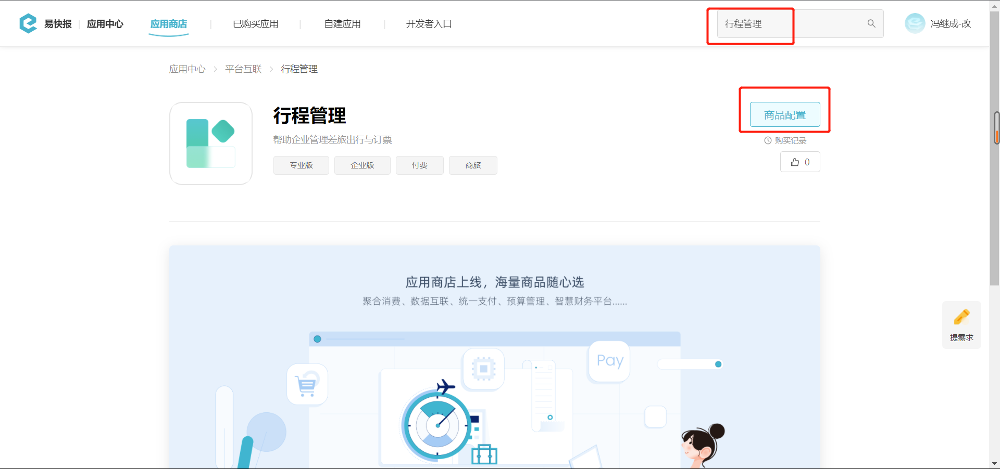
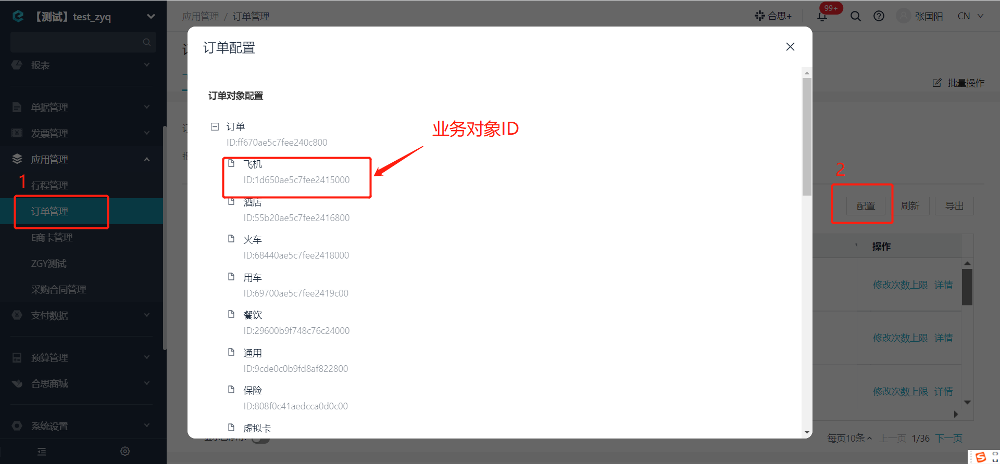

# 获取行程管理/订单管理业务对象列表

import Control from "@theme/Control";

<Control
method="POST"
url="/api/openapi/v2.1/datalink/TRAVEL_MANAGEMENT/searchOrders"
/>

<details>
  <summary><b>更新日志</b></summary>
  <div>

  [**1.17.0**](/updateLog/update-log#1170)&emsp;-> 🚀 接口升级 `v2.1` 版本，新增了 `startDate` 和 `endDate` 参数，根据 **创建时间** 过滤列表数据，并且返回值中增加 `createTime` 和 `updateTime` 参数。<br/>
  [**0.7.123**](/updateLog/update-log#07123) -> 🆕 新增了本接口。

  </div>
</details>

## Query Parameters

| 名称 | 类型 | 描述 | 是否必填 | 默认值 | 备注 |
| :--- | :--- | :--- | :--- |:--- | :--- |
| **accessToken** | String | 认证token | 必填 | - | 通过 [获取授权](/docs/open-api/getting-started/auth) 获取 `accessToken` |

## Body Parameters

| 名称 | 类型 | 描述 | 是否必填 | 默认值 | 备注 |
| :--- | :--- | :--- | :--- |:--- | :--- |
| **entityId** | String | 业务对象ID  | 必填 | - | 行程/订单管理的业务对象ID |
| **start**    | Int    | 起始值              | 必填 | - | 从 `0` 开始搜索  |
| **count**    | Int    | 查询总数            | 必填 | - | 最大不能超过 `100` 条 |
| **startDate**   | String | 查询开始时间 | 非必填 | - | 按数据 **创建时间** 查询，格式：yyyy-MM-dd HH:mm:ss |
| **endDate**     | String | 查询结束时间 | 非必填 | - | 按数据 **创建时间** 查询，格式：yyyy-MM-dd HH:mm:ss |

:::tip

- 【行程管理】、【订单管理】的“业务对象ID”获取见下图：

  

  

- 【行程管理】、【订单管理】中为什么都有”飞机“、”酒店“等这种分类？

  - 2种 **飞机** 的 `entityId`（业务对象ID） 不一样，里面的字段也不一样。
  - **”行程管理“**里的**”飞机“**是申请单审批通过之后生成，然后传给商城。
  - 商城根据行程下完单后，会推送**”订单信息“**给费控，生成订单业务对象，一般来说报销单中需要关联的就是订单业务对象，**”订单管理“**中会有具体的订单信息，例如订单金额、改签费、服务费之类的字段。
  - 费控接收订单的时候，保存在**”订单管理“**中，飞机退改签时，会生成同一条订单。
:::

## CURL
```json
curl --location --request POST 'https://app.ekuaibao.com/api/openapi/v2.1/datalink/TRAVEL_MANAGEMENT/searchOrders?accessToken=VQoc2fnagU8c00' \
--header 'content-type: application/json' \
--header 'Accept: application/json' \
--data-raw '{
    "entityId": "79180b9ed9cade87e000",
    "start": 0,
    "count": 100,
    "startDate":"2023-02-22 00:00:00",
    "endDate":"2023-04-22 23:59:59"
}'
```

## 成功响应
:::tip
- 响应数据是根据 `xxxxxxxxxxx_code`（编号）倒序进行排序。
:::

```json
{
    "items": {
        "total": 2152,                       //业务对象-总订单数
        "data": [
            {
                "dataLink": {                //订单业务对象
                    "id": "hQYc20Y4W8is00", 
                    "useCount": 0,          
                    "totalCount": 1,        
                    "ownerId": null,        
                    "visibility": {          //可见范围信息
                        "fullVisible": false,//是否全员可见(true=全部；false=部分)
                        "staff": [],         //员工ID集
                        "department": [],    //部门ID集
                        "role": []           //角色ID集
                    },
                    "E_79180b9ed9cade87e000_code": "14134724392",   //对象编码
                    "E_79180b9ed9cade87e000_name": "北京-北京站",    //对象名称
                    "E_79180b9ed9cade87e000_票号": "",
                    "E_79180b9ed9cade87e000_车型": "经济型",
                    "E_79180b9ed9cade87e000_出发地": "[{\"key\":\"1\",\"label\":\"北京市\"}]",
                    "E_79180b9ed9cade87e000_出行人": [],
                    "E_79180b9ed9cade87e000_到达地": "[{\"key\":\"1\",\"label\":\"北京市\"}]",
                    "E_79180b9ed9cade87e000_订单号": "14134724392",
                    "E_79180b9ed9cade87e000_订票人": null,
                    "E_79180b9ed9cade87e000_车牌号": "",
                    "E_79180b9ed9cade87e000_关联行程": null,
                    "E_79180b9ed9cade87e000_出发时间": 1607852526000,
                    "E_79180b9ed9cade87e000_出行类型": "因公",
                    "E_79180b9ed9cade87e000_到达时间": 1607856225000,
                    "E_79180b9ed9cade87e000_支付方式": "企业支付",
                    "E_79180b9ed9cade87e000_是否超标": "",
                    "E_79180b9ed9cade87e000_订单备注": "",
                    "E_79180b9ed9cade87e000_订单日期": 1607852526000,
                    "E_79180b9ed9cade87e000_订单状态": "已成交",
                    "E_79180b9ed9cade87e000_订单类型": "出票",
                    "E_79180b9ed9cade87e000_订单金额": {
                        "standard": "63.80",
                        "standardUnit": "元",
                        "standardScale": 2,
                        "standardSymbol": "¥",
                        "standardNumCode": "156",
                        "standardStrCode": "CNY"
                    },
                    "E_79180b9ed9cade87e000_订票平台": "携程商旅",
                    "E_79180b9ed9cade87e000_证件信息": "",
                    "E_79180b9ed9cade87e000_证件类型": "",
                    "E_79180b9ed9cade87e000_超标原因": "",
                    "E_79180b9ed9cade87e000_出行人类型": "",
                    "E_79180b9ed9cade87e000_申请单编号": "S20001080",
                    "E_79180b9ed9cade87e000_实际出发地点": "京荟广场(文化产业园)",
                    "E_79180b9ed9cade87e000_实际到达地点": "北京站",
                    "E_79180b9ed9cade87e000_用车出行方式": "马上用车",
                    "active": true,
                    "updateTime": 1677753063538,
                    "createTime": 1677753063532,
                    "entityId": "5bc40b9edcc64ec0f400" 
                },
                "ledger": {},
                "planned": {},
                "plans": [],
                "ledgers": []
            },
            {
                "dataLink": {
                    "id": "KnMc20Y4W89o00",
                    "useCount": 0,
                    "totalCount": 1,
                    "ownerId": null,
                    "visibility": {
                        "fullVisible": false,
                        "staff": [],
                        "department": [],
                        "role": []
                    },
                    "E_79180b9ed9cade87e000_code": "14134420968",
                    "E_79180b9ed9cade87e000_name": "AECCHDE_463749_20201126",
                    "E_79180b9ed9cade87e000_票号": "876-4886784523",
                    "E_79180b9ed9cade87e000_出发地": "[{\"key\":\"1477\",\"label\":\"济南市\"}]",
                    "E_79180b9ed9cade87e000_出行人": [],
                    "E_79180b9ed9cade87e000_到达地": "[{\"key\":\"704\",\"label\":\"哈尔滨市\"}]",
                    "E_79180b9ed9cade87e000_航班号": "3U8689",
                    "E_79180b9ed9cade87e000_订单号": "14134420968",
                    "E_79180b9ed9cade87e000_订票人": null,
                    "E_79180b9ed9cade87e000_关联行程": null,
                    "E_79180b9ed9cade87e000_出发时间": 1607996100000,
                    "E_79180b9ed9cade87e000_出发机场": "遥墙机场",
                    "E_79180b9ed9cade87e000_出行类型": "-",
                    "E_79180b9ed9cade87e000_到达时间": 1608003900000,
                    "E_79180b9ed9cade87e000_到达机场": "太平机场",
                    "E_79180b9ed9cade87e000_支付方式": "企业支付",
                    "E_79180b9ed9cade87e000_是否超标": "",
                    "E_79180b9ed9cade87e000_航空公司": "",
                    "E_79180b9ed9cade87e000_舱位类型": "经济舱",
                    "E_79180b9ed9cade87e000_订单备注": "",
                    "E_79180b9ed9cade87e000_订单日期": 1607861432000,
                    "E_79180b9ed9cade87e000_订单状态": "出票",
                    "E_79180b9ed9cade87e000_订单类型": "出票",
                    "E_79180b9ed9cade87e000_订单金额": {
                        "standard": "517.00",
                        "standardUnit": "元",
                        "standardScale": 2,
                        "standardSymbol": "¥",
                        "standardNumCode": "156",
                        "standardStrCode": "CNY"
                    },
                    "E_79180b9ed9cade87e000_订票平台": "携程商旅",
                    "E_79180b9ed9cade87e000_证件信息": "239004**********32",
                    "E_79180b9ed9cade87e000_证件类型": "身份证",
                    "E_79180b9ed9cade87e000_超标原因": "",
                    "E_79180b9ed9cade87e000_出行人类型": "",
                    "E_79180b9ed9cade87e000_申请单编号": "S20001081",
                    "active": true,
                    "updateTime": 1677753063538,
                    "createTime": 1677753063532,
                    "entityId": "61570b9edcc64ec09c00"
                },
                "ledger": {},
                "planned": {},
                "plans": [],
                "ledgers": []
            },
            {
                "dataLink": {
                    "id": "bqAc20Y4W88M00",
                    "useCount": 0,
                    "totalCount": 1,
                    "ownerId": null,
                    "visibility": {
                        "fullVisible": false,
                        "staff": [],
                        "department": [],
                        "role": []
                    },
                    "E_79180b9ed9cade87e000_code": "14131699836",
                    "E_79180b9ed9cade87e000_name": "AECCHDE_463749_20201126",
                    "E_79180b9ed9cade87e000_票号": "784-4860574401",
                    "E_79180b9ed9cade87e000_出发地": "[{\"key\":\"704\",\"label\":\"哈尔滨市\"}]",
                    "E_79180b9ed9cade87e000_出行人": [],
                    "E_79180b9ed9cade87e000_到达地": "[{\"key\":\"876\",\"label\":\"南京市\"}]",
                    "E_79180b9ed9cade87e000_航班号": "CZ3266",
                    "E_79180b9ed9cade87e000_订单号": "14131699836",
                    "E_79180b9ed9cade87e000_订票人": null,
                    "E_79180b9ed9cade87e000_关联行程": null,
                    "E_79180b9ed9cade87e000_出发时间": 1607931600000,
                    "E_79180b9ed9cade87e000_出发机场": "太平机场",
                    "E_79180b9ed9cade87e000_出行类型": "-",
                    "E_79180b9ed9cade87e000_到达时间": 1607942700000,
                    "E_79180b9ed9cade87e000_到达机场": "禄口机场",
                    "E_79180b9ed9cade87e000_支付方式": "企业支付",
                    "E_79180b9ed9cade87e000_是否超标": "",
                    "E_79180b9ed9cade87e000_航空公司": "",
                    "E_79180b9ed9cade87e000_舱位类型": "经济舱",
                    "E_79180b9ed9cade87e000_订单备注": "",
                    "E_79180b9ed9cade87e000_订单日期": 1607839276000,
                    "E_79180b9ed9cade87e000_订单状态": "出票",
                    "E_79180b9ed9cade87e000_订单类型": "出票",
                    "E_79180b9ed9cade87e000_订单金额": {
                        "standard": "1807.00",
                        "standardUnit": "元",
                        "standardScale": 2,
                        "standardSymbol": "¥",
                        "standardNumCode": "156",
                        "standardStrCode": "CNY"
                    },
                    "E_79180b9ed9cade87e000_订票平台": "携程商旅",
                    "E_79180b9ed9cade87e000_证件信息": "232127**********17",
                    "E_79180b9ed9cade87e000_证件类型": "身份证",
                    "E_79180b9ed9cade87e000_超标原因": "",
                    "E_79180b9ed9cade87e000_出行人类型": "",
                    "E_79180b9ed9cade87e000_申请单编号": "S20001096",
                    "active": true,
                    "updateTime": 1677753063538,
                    "createTime": 1677753063532,
                    "entityId": "61570b9edcc64ec09c00"
                },
                "ledger": {},
                "planned": {},
                "plans": [],
                "ledgers": []
            }
        ]
    }
}
```

## 失败响应

| HTTP状态码 | 错误码 | 描述 | 排查建议 |
| :--- | :--- | :--- | :--- |
| **400** | - | 不支持的业务对象「TRAVEL」 | 请确认接口路径中的 `TRAVEL_MANAGEMENT` 拼写是否正确，该参数为固定值  | 
| **400** | - | 业务对象模板不存在 | 请确认 `entityId`（行程管理的业务对象ID）是否存在  | 
| **400** | - | 单次查询总数不得大于100 | `count`（查询总数）不允许大于 `100`  | 


