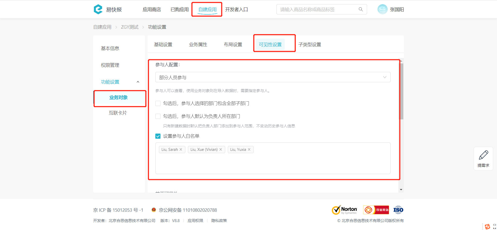
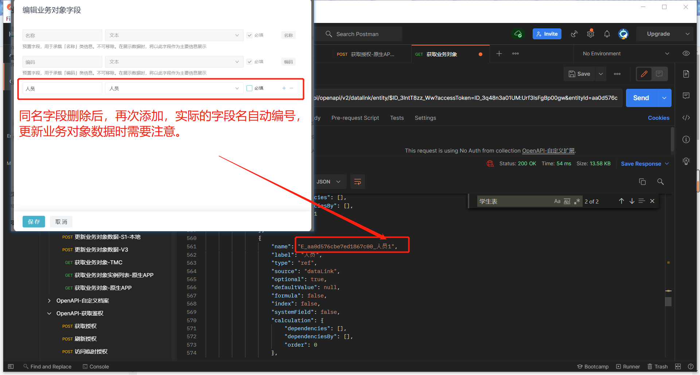

# 新增或更新业务对象数据
向指定业务对象添加或修改数据，以系统预制字段 `code` 为依据(业务对象下唯一)，不存在就新增数据，存在则更新数据。

import Control from "@theme/Control";

<Control
method="POST"
url="/api/openapi/v2/datalink/add"
/>

<details>
  <summary><b>更新日志</b></summary>
  <div>

  [**1.5.0**](/docs/open-api/notice/update-log#150) &emsp; -> 🆕 **金额** 类型字段支持多币种，使用此功能需要开通【**币种设置**】功能。<br/>
  [**1.4.0**](/docs/open-api/notice/update-log#140) &emsp; -> 🆕 新增了 `editFlag`（更新标志）参数，默认为 `cover`（全量覆盖）可配置为 `increment`（增量更新）。<br/>
  [**0.7.138**](/docs/open-api/notice/update-log#07138) -> 🆕 新增了各类型字段值传参示例。<br/>

  </div>
</details>

## Query Parameters

| 名称 | 类型 | 描述 | 是否必填 | 默认值 | 备注 |
| :--- | :--- | :--- | :--- |:--- | :--- |
| **accessToken** | String | 认证token | 必填 | - | [通过授权接口获取](/docs/open-api/getting-started/auth) |
| **editFlag**    | String | 更新标志   | 非必填 | cover | `increment` : 增量更新 &emsp; `cover` : 全量覆盖<br/>**只在更新数据时生效** |

## Body Parameters

| 名称 | 类型 | 描述 | 是否必填 | 默认值 | 备注 |
| :--- | :--- | :--- | :--- |:--- | :--- |
| **entityId**                                   | String  | 业务对象ID    | 必填   | -     | [业务对象ID获取](/docs/open-api/datalink/question-answer#问题一) |
| **importPart**                                 | Boolean | 是否部分导入   | 非必填 | false | 当有一条数据导入失败后，其他数据是否继续导入。<br/>**当导入附件时，此项必填为 `true`** |
| **dataLinks**                                  | Array   | 更新数据数组   | 必填  | -      | 要新增或修改的业务对象数据，**最大不能超过 `100` 条** |
| **&emsp; ∟ count**                             | Number  | 最大引用次数  | 非必填 | 0      | 限制引用次数时必填。若设置的值小于已引用次数，则易快报系统会自动修正到已引用次数  |
| **&emsp; ∟ disabled**                          | Boolean | 是否停用     | 非必填 | true   | `true` : 停用 &emsp; `false` : 启用|
| **&emsp; ∟ ownerId**                           | String  | 负责人ID     | 非必填 | -      | 值为 [员工ID](/docs/open-api/corporation/get-all-staffs) |
| **&emsp; ∟ data**                              | Object  | 字段值       | 必填   | -     | 格式为 { 字段名称 : 字段值 }。**字段名称** 是 [获取业务对象](/docs/open-api/datalink/get-entity-list) 返回值中 `fields` 里面的 `name` 值 |
| **&emsp; ∟ visible**                           | Object  | 参与人配置    | 非必填 | -      | 业务对象**”参与人配置“**为**”部分人员参与“**时此参数才 **有效**，为**“全员参与”**时此参数 **不生效** |
| **&emsp; &emsp; ∟ fullVisible**                | Boolean | 全员可见性    | 非必填 | false | `true` : 全部可见 &emsp; `false` : 参与人可见 |
| **&emsp; &emsp; ∟ staffs**                     | Array   | 参与人ID     | 非必填 | -     | 值为 [员工ID](/docs/open-api/corporation/get-all-staffs) |
| **&emsp; &emsp; ∟ roles**                      | Array   | 参与角色ID    | 非必填 | -     | 值为 [角色ID](/docs/open-api/corporation/get-roles-group) |
| **&emsp; &emsp; ∟ departments**                | Array   | 参与部门ID    | 非必填 | -     | 值为 [部门ID](/docs/open-api/corporation/get-departments) |
| **&emsp; &emsp; ∟ departmentsIncludeChildren** | Boolean | 子部门是否可见 | 非必填 | true   | `true` : 可见 &emsp; `false` : 不可见 |

:::caution
- 新增或更新业务对象数据最大不能超过 **100** 条。
- `dataLinks.data` 中的 `code` 字段值为必填字段，新增数据时，如果code设置为 `自动编号`，传 `""` 即可，如果为 `文本` 类型，表示手动传入编号，不可为空。
- 更新业务对象实例数据时注意事项：
  - 新增或更新业务对象实例数据，“**自动计算**”字段可传 `""` 或者不传该字段，字段值自动计算。
  - `editFlag` = `cover`，表示 `dataLinks.data` 中**必填字段**参数必传，不传的**非必填字段**清空对应字段值。
  - `editFlag` = `increment`，表示只更新 `dataLinks.data` 中传递的字段参数，不传的字段无变化。
- `dataLinks.visible` 参数需要配合业务对象”参与人配置“一起使用，只有”部分人员参与“时此参数才有效。

  
- 业务对象字段问题：业务对象增加一个字段，例如“姓名”，保存后删除这个字段，再保存后增加“姓名”字段，系统中实际字段名自动编号+1，这种字段新增和更新数据时要注意。

  
- 若需要关联其他业务对象、自定义档案等，传其对应 `id` 即可。
:::

## 各类型字段值传参示例
```text
- 文本 - "数据1"

- 日期 - "1528276414283"

- 日期范围 - "1528276414283-1528276414283"

- 数字 - "1.2234"

- 金额 - "12.35"

- 金额(多币种) - "USD12.35"   //拼接结构：货币字母代码+金额值，需要开通【币种设置】功能

- 开关 - true

- 附件（转义后的json格式字符串，多个附件时用 ";" 分隔）:
  "{\"key\": \"openapib9e51730-f778-4b81-b108-d6ca27d44ad9-登录密码.txt\", \"fileId\": \"zEIb-kGNMsoc00\", \"fileName\": \"登录密码.txt\"}"

- 人员(多选)：多个人员时用","分隔
  "Urf3lsFgBp00gw:Msy3lYjbQ103KM,Urf3lsFgBp00gw:mRI3oQU9lg02q0,Urf3lsFgBp00gw:Fmd3oQU9lg00q0"

- 业务对象(多选)：多个业务对象用","分隔  
  "ID_3Cy8NYL4rnM,ID_3Cy8NYL4BnM,ID_3Cy8NYL4wnM"
```

## CURL
根据业务对象的 **数据权限**、**停用方式** 配置不同，所需Body Parameters的数据结构略有差异，请根据配置选择合适的示例。


import Tabs from '@theme/Tabs';
import TabItem from '@theme/TabItem';

<Tabs>
<TabItem value="全员可见&限制次数" label="全员可见&限制次数" default>

```json
curl --location --request POST 'https://app.ekuaibao.com/api/openapi/v2/datalink/add?accessToken=cxEbrzNJSA3A00&editFlag=cover' \
--header 'Content-Type: application/json' \
--data-raw '{
    "entityId": "ea9d0b6e522a25878000",
    "dataLinks": [
        {
            "count": 1,              //限制引用次数 1
            "visible":{              //业务对象 “参与人配置” 为 “部分人员参与” 时此参数才有效，否则此参数设置不生效
                "fullVisible":true,  //全员可见，为true时，下面4个参数配置无效
                "staffs":[],         //参与人ID
                "roles":[],          //参与角色ID
                "departments":[],    //参与部门ID
                "departmentsIncludeChildren":true  //子部门是否可见
            },
            "disabled":false,        //true:停用 false:启用
            "ownerId":"",            //负责人ID，设置可以停启用此数据的人员
            "data": {
                "E_ea9d0b6e522a25878000_name":"数据名称1",
                "E_ea9d0b6e522a25878000_code":"1",  	//唯一ID
                "E_ea9d0b6e522a25878000_文本":"文本1",
                "E_ea9d0b6e522a25878000_日期":"1529393393795",
                "E_ea9d0b6e522a25878000_日期范围":"1476921600000-1529393393795",
                "E_ea9d0b6e522a25878000_小数":"2.03",
                "E_ea9d0b6e522a25878000_整数":"3",
                "E_ea9d0b6e522a25878000_金额":"10",
                "E_ea9d0b6e522a25878000_开关":false,
                "E_ea9d0b6e522a25878000_账号":"pko998ovFMe800",      //银行账号唯一ID
                "E_ea9d0b6e522a25878000_业务对象":"dgs9fzle3A1I00",  //关联业务实体对象ID
                "E_ea9d0b6e522a25878000_自定义档案":"6S49gt6c5E0w00" //关联自定义档案ID
            }
        }
    ]
}'

```
</TabItem>
<TabItem value="全员可见&管理员停启用" label="全员可见&管理员停启用">

```json
curl --location --request POST 'https://app.ekuaibao.com/api/openapi/v2/datalink/add?accessToken=cxEbrzNJSA3A00&editFlag=cover' \
--header 'Content-Type: application/json' \
--data-raw '{
    "entityId": "ea9d0b6e522a25878000",
    "dataLinks": [
        {
            "visible":{               //业务对象 “参与人配置” 为 “部分人员参与” 时此参数才有效，否则此参数设置不生效
                "fullVisible":true,   //全员可见，为true时，下面4个参数配置无效
                "staffs":[],          //参与人ID
                "roles":[],           //参与角色ID
                "departments":[],     //参与部门ID
                "departmentsIncludeChildren":true  //子部门是否可见
            },
            "disabled": false,                           //true:停用 false:启用
            "ownerId":"Urf3lsFgBp00gw:Fmd3oQU9lg00q0",   //负责人ID，设置可以停启用此数据的人员
            "data": {
                "E_ea9d0b6e522a25878000_name":"数据名称1",
                "E_ea9d0b6e522a25878000_code":"1",	     //唯一ID
                "E_ea9d0b6e522a25878000_文本":"文本1",
                "E_ea9d0b6e522a25878000_日期":"1529393393795",
                "E_ea9d0b6e522a25878000_日期范围":"1476921600000-1529393393795",
                "E_ea9d0b6e522a25878000_小数":"2.03",
                "E_ea9d0b6e522a25878000_整数":"3",
                "E_ea9d0b6e522a25878000_金额":"10",
                "E_ea9d0b6e522a25878000_开关":false,
                "E_ea9d0b6e522a25878000_账号":"pko998ovFMe800",        //银行账号唯一ID
                "E_ea9d0b6e522a25878000_业务对象":"dgs9fzle3A1I00",    //关联业务实体对象ID
                "E_ea9d0b6e522a25878000_自定义档案":"6S49gt6c5E0w00"   //关联自定义档案ID
            }
        }
    ]
}'
```
</TabItem>
<TabItem value="部分可见&限制次数" label="部分可见&限制次数">

```json
curl --location --request POST 'https://app.ekuaibao.com/api/openapi/v2/datalink/add?accessToken=cxEbrzNJSA3A00&editFlag=cover' \
--header 'Content-Type: application/json' \
--data-raw '{
    "entityId": "ea9d0b6e522a25878000",
    "dataLinks": [
        {
            "count": 1,                //限制引用次数 1
            "visible":{                //业务对象 “参与人配置” 为 “部分人员参与” 时此参数才有效，否则此参数设置不生效
                "fullVisible":false,   //部分可见，为false时，下面4个参数配置才有效
                "staffs":["Urf3lsFgBp00gw:Fmd3oQU9lg00q0","Urf3lsFgBp00gw:AvT3lntT8zzpWw"],  //参与人ID
                "roles":[],                        //参与角色ID
                "departments":[],                  //参与部门ID
                "departmentsIncludeChildren":true  //子部门是否可见
            },
            "disabled":false,                      //true:停用 false:启用
            "ownerId":"",                          //负责人ID，设置可以停启用此数据的人员
            "data": {
                "E_ea9d0b6e522a25878000_name":"数据名称1",
                "E_ea9d0b6e522a25878000_code":"1",	//唯一ID
                "E_ea9d0b6e522a25878000_文本":"文本1",
                "E_ea9d0b6e522a25878000_日期":"1529393393795",
                "E_ea9d0b6e522a25878000_日期范围":"1476921600000-1529393393795",
                "E_ea9d0b6e522a25878000_小数":"2.03",
                "E_ea9d0b6e522a25878000_整数":"3",
                "E_ea9d0b6e522a25878000_金额":"10",
                "E_ea9d0b6e522a25878000_开关":false,
                "E_ea9d0b6e522a25878000_账号":"pko998ovFMe800",       //银行账号唯一ID
                "E_ea9d0b6e522a25878000_业务对象":"dgs9fzle3A1I00",   //关联业务实体对象ID
                "E_ea9d0b6e522a25878000_自定义档案":"6S49gt6c5E0w00"  //关联自定义档案ID
            }
        }
    ]
}'
```
</TabItem>
<TabItem value="部分可见&管理员停启用" label="部分可见&管理员停启用">

```json
curl --location --request POST 'https://app.ekuaibao.com/api/openapi/v2/datalink/add?accessToken=cxEbrzNJSA3A00&editFlag=cover' \
--header 'Content-Type: application/json' \
--data-raw '{
    "entityId": "ea9d0b6e522a25878000",
    "dataLinks": [
        {
            "visible":{                   //业务对象 “参与人配置” 为 “部分人员参与” 时此参数才有效，否则此参数设置不生效
                "fullVisible":false,      //部分可见，为false时，下面4个参数配置才有效
                "staffs":["Urf3lsFgBp00gw:Fmd3oQU9lg00q0","Urf3lsFgBp00gw:AvT3lntT8zzpWw"],  //参与员工ID
                "roles":[],                        //参与角色ID
                "departments":[],                  //参与部门ID
                "departmentsIncludeChildren":true  //子部门是否可见
            },
            "disabled":false,                           //true:停用 false:启用
            "ownerId":"Urf3lsFgBp00gw:Fmd3oQU9lg00q0",  //负责人ID，设置可以停启用此数据的人员
            "data": {
                "E_ea9d0b6e522a25878000_name":"数据名称1",
                "E_ea9d0b6e522a25878000_code":"1",	    //唯一ID
                "E_ea9d0b6e522a25878000_文本":"文本1",
                "E_ea9d0b6e522a25878000_日期":"1529393393795",
                "E_ea9d0b6e522a25878000_日期范围":"1476921600000-1529393393795",
                "E_ea9d0b6e522a25878000_小数":"2.03",
                "E_ea9d0b6e522a25878000_整数":"3",
                "E_ea9d0b6e522a25878000_金额":"10",
                "E_ea9d0b6e522a25878000_开关":false,
                "E_ea9d0b6e522a25878000_账号":"pko998ovFMe800",        //银行账号唯一ID
                "E_ea9d0b6e522a25878000_业务对象":"dgs9fzle3A1I00",    //关联业务实体对象ID
                "E_ea9d0b6e522a25878000_自定义档案":"6S49gt6c5E0w00"   //关联自定义档案ID
            }
        }
    ]
}'
```
</TabItem>
</Tabs>

## 成功响应
```json
{
    "value": {
        "errorMsg": [
          "第1条数据导入成功"
        ],
        "dataLinkIds": {
            "004": "cagbsyR13Qok00"  //key表示code，value表示ID
        },
        "success": true
    }
}
```

## 失败响应

| HTTP状态码 | 错误码 | 描述 | 排查建议 |
| :--- | :--- | :--- | :--- |
| **400** | - | 第1条[编码]数据格式不正确,必填，不能为空 | `dataLinks.data` 中的 `code` 字段值不能为 `文本` 类型，且不可传 `""`   | 
| **400** | - | 第1条[自动编号]数据不正确 | 新增数据时，**自动编号** 类型字段必须传 `""`  | 
| **400** | - | 第1条[编码]数据不正确 | `importPart` 未设置或设置为 `false` 时，若导入过程中有数据导入失败，则后续数据停止导入并返回此报错  | 
| **400** | - | 第1条[单价]数据格式不正确,请填写正确币种 | 确认**金额** 类型字段填写的 **货币字母代码** 对应的币种信息在 **档案设置-币种设置** 中是否已配置  | 


    
