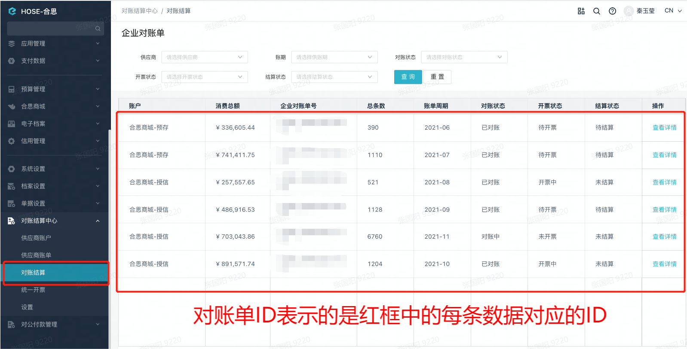
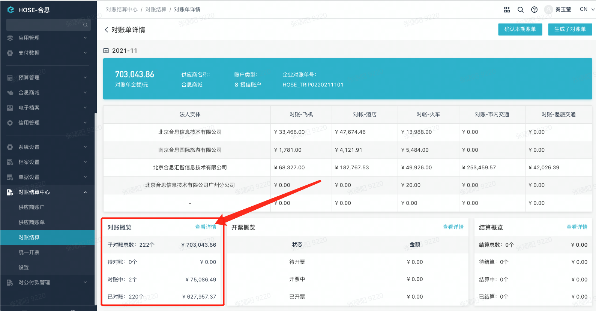
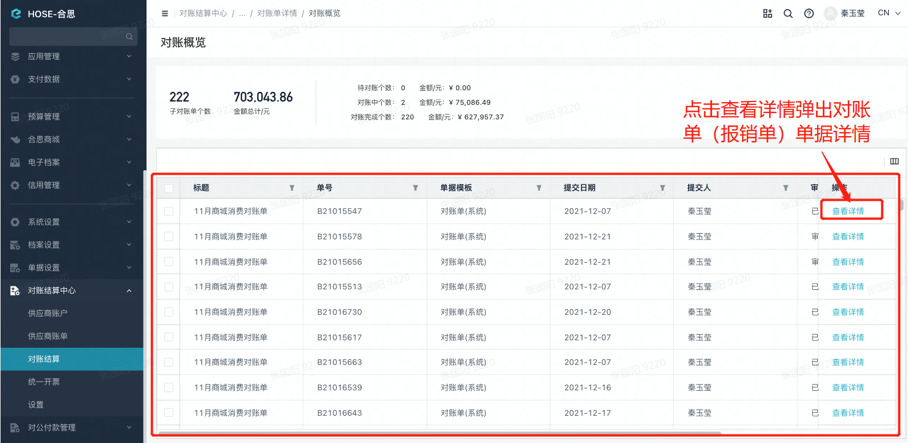

# 获取企业对账单管理的子对账单
根据对账单ID获取该对账单所管理的子对账单详情，子对账单就是一个个的报销单。

import Control from "@theme/Control";

<Control
method="GET"
url="/api/openapi/v1/getFlowByCheckingId"
/>

<details>
  <summary><b>更新日志</b></summary>
  <div>
    <a href="https://docs.ekuaibao.com/docs/open-api/notice/update-log" target="_blank"><b>0.7.139</b></a> -> 🆕 新增了本接口。<br/>
  </div>
</details>

:::caution
- 需要开通【**对账结算管理**】功能方可见【**对账结算中心**】模块。
:::

## Query Parameters

| 名称 | 类型 | 描述 | 是否必填 | 默认值 | 备注 |
| :--- | :--- | :--- | :--- |:--- | :--- |
| **accessToken**    | String | 认证token | 必填 | - | [通过授权接口获取](/docs/open-api/getting-started/auth) |
| **checkingBillId** | String | 对账单ID  | 必填 | - | 对账结算中心 -> [对账结算中每条数据对应的ID](/docs/open-api/flows/get-flow-by-checkingId#系统中对账单所在位置) |

## CURL
```shell
curl --location --request GET 'http://app.ekuaibao.com/api/openapi/v1/getFlowByCheckingId?checkingBillId=ID_3hCyl5N02eI&accessToken=FsYc5j4FlclU00' \
--header 'content-type: application/json' \
--header 'Accept: application/json'
```

## 成功响应
```json
{
    "items": [
        {
            "pipeline": 1, 
            "version": 4, 
            "active": true,
            "createTime": 1626336244716,           //创建时间
            "updateTime": 1626336244711,
            "corporationId": "NXAcoInh6A0000",     //企业ID
            "sourceCorporationId": null,
            "dataCorporationId": null,
            "form": {                              //单据详情
                "code": "B21000015",               //单据编号
                "title": "07月消费对账单",          //单据标题
                "details": [                       //表单明细数据
                    {
                        "feeTypeId": "ID_3h6EQYv0dfo",      //费用类型ID 通过【获取费用类型】接口可获得，通过【根据ID获取费用类型】查询类型详情
                        "feeTypeForm": {                    //费用类型数据明细
                            "amount": {                     //费用金额
                                "standard": "200.00",       //本位币
                                "standardUnit": "美元",     //本位币单位
                                "standardScale": "4",       //本位币精度
                                "standardSymbol": "$",      //本位币符号
                                "standardNumCode": "1560",  //本位币数字代码
                                "standardStrCode": "美无"   //本位币字母代码
                            },
                            "feeDate": 1622505660000,       //消费时间(毫秒级时间戳)
                            "detailId": "ID_3hCyl5N06cI",
                            "invoiceForm": {                //发票信息
                                "type": "unify",
                                "invoiceCorporationId": "ID_3h6s0Vv1B68"
                            },
                            "system_statement": "ID_3hCyl5N04fI"
                        },
                        "specificationId": "ID_3h6EQYv0dfo:expense:fc9c53be16af79f8bb2b1bf06d2ed61ab2a68892"
                    },
                    {
                        "feeTypeId1": "ID_3h6EQYv0dfo123",
                        "feeTypeForm": {
                            "amount": {
                                "standard22": "300.00",
                                "standardScale": "2",
                                "standardUnit2": "元",
                                "standardSymbol": "¥",
                                "standardNumCode": "156",
                                "standardStrCode": "CNY"
                            },
                            "feeDate": 1622505660000,
                            "detailId": "ID_3hCyl5N07do",
                            "invoiceForm": {
                                "type": "unify",
                                "invoiceCorporationId": "ID_3h6s0Vv1B68"
                            }
                        },
                        "specificationId2": "ID_3h6EQYv0dfo:expense:fc9c53be16af79f8bb2b1bf06d2ed61ab2a68892"
                    }
                ],
                "voucherNo": "",
                "printCount": "0",
                "printState": "noPrint",
                "submitDate": 1626336162283,                    //提交时间
                "submitterId": "NXAcoInh6A0000:v8IbsROYUw7c00", //提交人ID
                "expenseLinks": [],
                "expenseMoney": {                               //报销金额
                    "standard": "1730.00",
                    "standardUnit": "元",
                    "standardScale": 2,
                    "standardSymbol": "¥",
                    "standardNumCode": "156",
                    "standardStrCode": "CNY"
                },
                "voucherStatus": "未生成",
                "specificationId": "NXAcoInh6A0000:system:对账单:f5dcb4ed5447b79c55ed5c183602877659124fef", //单据模版ID
                "writtenOffMoney": {                  //核销金额
                    "standard": "0.00",
                    "standardUnit": "元",
                    "standardScale": 2,
                    "standardSymbol": "¥",
                    "standardNumCode": "156",
                    "standardStrCode": "CNY"
                },
                "voucherCreateTime": 0
            },
            "ownerId": "NXAcoInh6A0000:v8IbsROYUw7c00", //所属人ID
            "ownerDefaultDepartment": "NXAcoInh6A0000",
            "state": "draft",
            "flowType": "freeflow",               //流程类型
            "formType": "expense",                //单据类型
            "logs": [                             //审批记录
                {
                    "action": "freeflow.submit",  //动作名称
                    "state": "approving",         //操作后到流程状态
                    "operatorId": "NXAcoInh6A0000:v8IbsROYUw7c00", //操作人ID
                    "byDelegateId": null,
                    "operatorDefaultDepartment": "NXAcoInh6A0000", //操作人默认部门ID
                    "nextOperatorId": "ebot",                      //下一操作人ID
                    "nextOperatorIds": [],                         //会签时的下一批操作人ID
                    "time": 1626336177977,
                    "attributes": {
                        "nextId": "ID_3hCyCwP05cs",
                        "nodeId": "SUBMIT",
                        "comment": "",
                        "isUrgent": false,
                        "nextName": "费用标准检查",
                        "urgentReason": "",
                        "resubmitMethod": "FROM_START",
                        "nextCounterSign": false,
                        "sensitiveContent": "",
                        "resubmitOperatorIds": []
                    },
                    "modifyFlowLog": null,
                    "attachments": []
                },
                {
                    "action": "freeflow.agree",
                    "state": "paid",
                    "operatorId": "NXAcoInh6A0000:v8IbsROYUw7c00",
                    "byDelegateId": null,
                    "operatorDefaultDepartment": "NXAcoInh6A0000",
                    "nextOperatorId": null,
                    "nextOperatorIds": [],
                    "time": 1626336244711,
                    "attributes": {
                        "nextId": null,
                        "nodeId": "ID_3hCyCwP063M",
                        "comment": "同意",
                        "complete": true,
                        "nextName": null,
                        "nodeName": "主管审批",
                        "expressNum": null,
                        "isEbotNode": false,
                        "counterSign": false,
                        "isRecalNode": false,
                        "oldFlowPlanId": null,
                        "nextCounterSign": false,
                        "autographImageId": null
                    },
                    "modifyFlowLog": null,
                    "attachments": []
                }
            ],
            "actions": {
                "NXAcoInh6A0000:v8IbsROYUw7c00": [
                    "freeflow.archive",
                    "freeflow.copy"
                ]
            },
            "invoiceRemind": false,
            "id": "ID_3hCyl5N0gdg"
        }
    ]
}
```

## 失败响应
`checkingBillId`（对账单ID）错误或者不存在时，返回空数据：
```json
{
    "items": []
}
```

## 系统中对账单所在位置
- 企业对账单
 

- 子对账单概览
 

- 子对账单详情
 