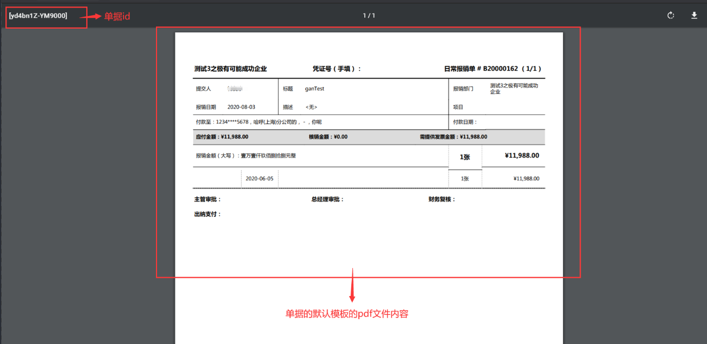

# 获取单据PDF文件流
根据单据id，获取单据根据打印模板生成的PDF文件流。

import Control from "../../../components/Control";

<Control
method="GET"
url="/api/openapi/v1/flowDetails/getFlowsPdf/[`ids`]"
/>

## Path Parameters

| 名称 | 类型 | 描述 | 是否必填 | 默认值 | 备注 |
| :--- | :--- | :--- | :--- |:--- | :--- |
| **ids** | Array | 单据id | 必填 | - | 通过其他api接口获取或者出站消息 |

:::tip
- ids的多个单据id请求时格式示例：[zKIbl2WX4I8I00,I8I00zKIbl2WX4,zKIbI00l2WX4I8]
- 打印的单据必须所属为同一员工
:::

## Query Parameters

| 名称 | 类型 | 描述 | 是否必填 | 默认值 | 备注 |
| :--- | :--- | :--- | :--- |:--- | :--- |
| **accessToken** | String | 认证token | 必填 | - | [通过授权接口获取](/docs/open-api/getting-started/auth) |

## CURL
```json
curl --location --request GET 'https://app.ekuaibao.com/api/openapi/v1/flowDetails/getFlowsPdf/[yd4bn1Z-YM9000]?accessToken=cWEbn1cA0kjU00'
```

## 成功响应

 一个pdf文件,文件名为单据id，例如下图：


