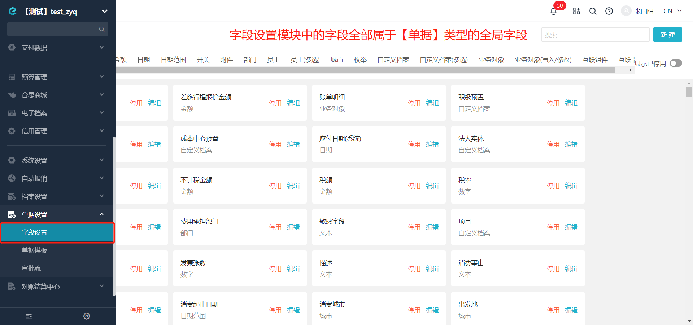
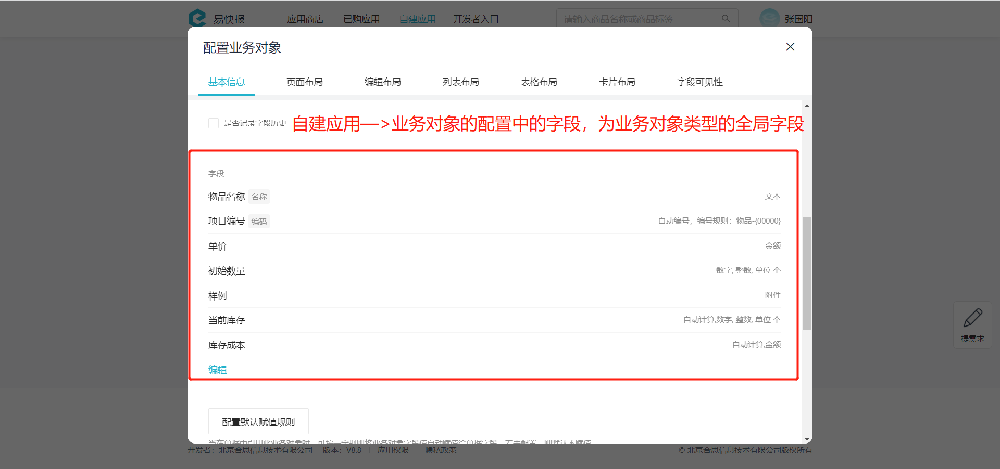
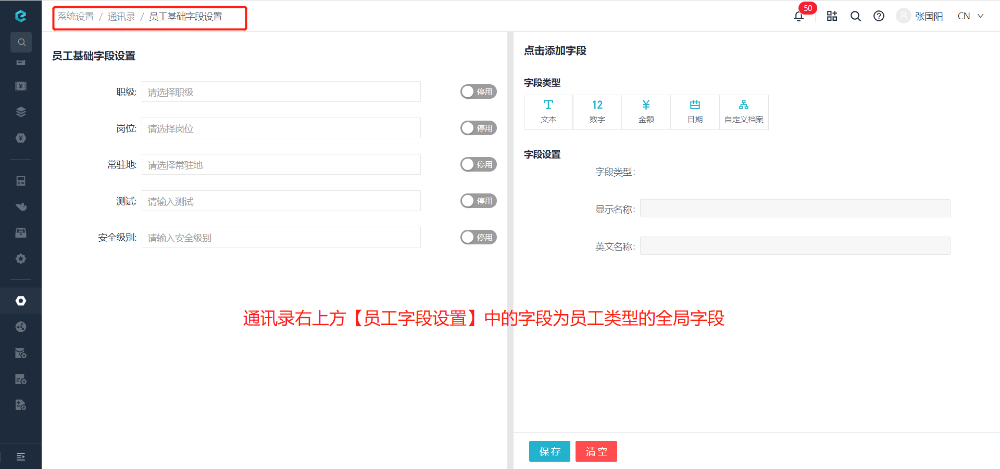

# 获取全局字段列表

import Control from "@theme/Control";

<Control
method="GET"
url="/api/openapi/v1.1/property"
/>

<details>
  <summary><b>更新日志</b></summary>
  <div>

  [**1.0.3**](/docs/open-api/notice/update-log#103) &emsp; -> 🚀 接口升级 `v1.1` 版本，新增对 `type`（全局字段类型）的参数校验，非备注类型时，报错 **”type参数不合法“**。<br/>
  [**0.7.131**](/docs/open-api/notice/update-log#07131) -> 🆕 新增了本接口。<br/>

  </div>
</details>

## Query Parameters

| 名称 | 类型 | 描述 | 是否必填 | 默认值 | 备注 |
| :--- | :--- | :--- | :--- |:--- | :--- |
| **accessToken** | String | 认证token  | 必填  | - | [通过授权接口获取](/docs/open-api/getting-started/auth) |
| **type**        | String | 全局字段类型 | 必填  | - | `flow.FlowForm` : 单据<br/>`datalink.form` : 业务对象<br/>`dimension.form` : 自定义档案<br/>`staff.form` : 员工<br/>`department.form` : 部门 | 

:::tip
 - 目前系统中存在 **单据**、**业务对象**、**人员** 类型的全局字段页面，**自定义档案**、**部门** 类型的全局字段无系统页面。
 - **单据** 类型全局字段位置：
   
 - **业务对象** 类型全局字段位置：
   
 - **员工** 类型全局字段位置：
   
:::

## CURL
```shell
curl --location --request GET 'http://app.ekuaibao.com/api/openapi/v1.1/property?accessToken=ID_3sNZ1zd0jTw:PCx3rwm3aA00qM&type=department.form' \
--header 'content-type: application/json' \
--header 'Accept: application/json'
```

## 成功响应
```json
{
   "items":[
      {
         "name":"costCenter",
         "label":"成本中心",
         "active":true,
         "canAsDimension":true,
         "ability":"",
         "dataType":{
            "type":"ref",
            "entity":"basedata.Dimension.成本中心预置"
         }
      },
      {
         "name":"legalEntity",
         "label":"法人实体",
         "active":true,
         "canAsDimension":true,
         "ability":"",
         "dataType":{
           "type":"ref",
           "entity":"basedata.Dimension.法人实体"
         }
      }
   ]
}
```

## 失败响应
`type` 参数不是备注中的固定值时，报错如下：
```json
{
   "errorCode": 412,
   "errorMessage": "type参数不合法",
   "errorDetails": null,
   "code": null,
   "data": null
}
```

