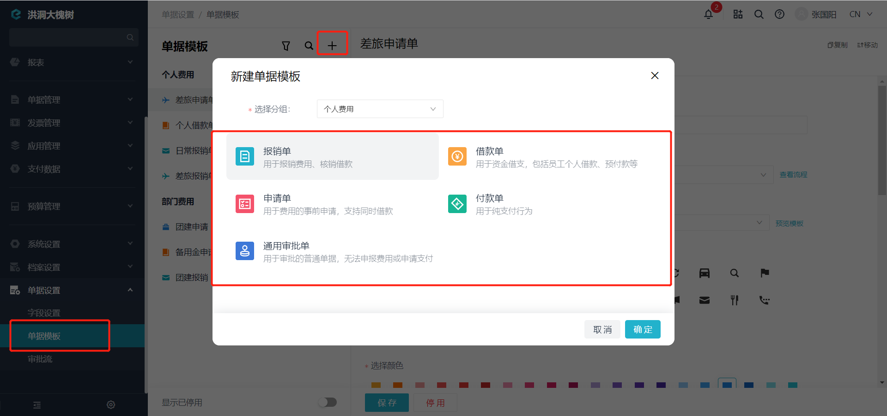
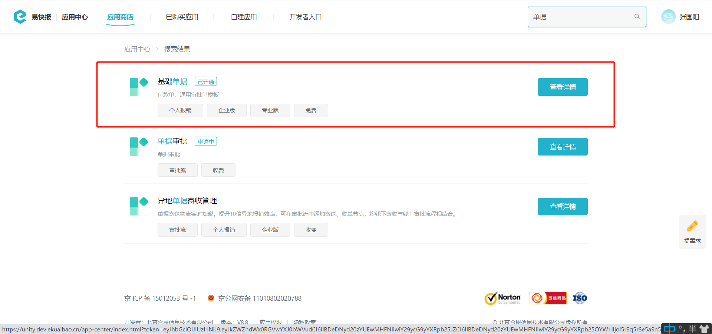
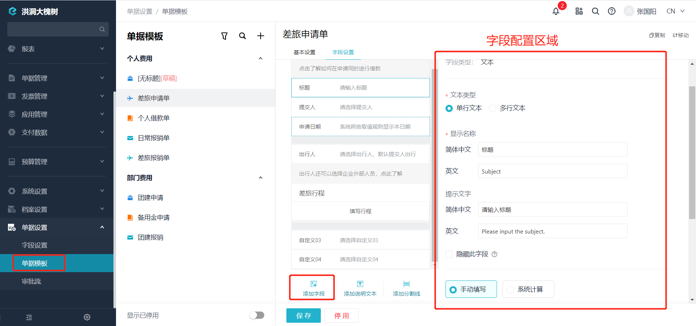

# 开始使用单据模板

---

## 概述
- 单据模板继承于基础模板。
- 单据模板需要实现基础模板没有实现的配置。
- 单据具有哪些能力取决于基础模板打包了哪些能力。

---
## 单据模板
创建单据使用的模板，分类有:报销单、借款单、申请单、付款单、通用审批单（其中付款单、通用审批单模板需要开通 [**基础单据**] 应用），位置如下：

     

---
## 字段设置
用于在模板下字段设置界面添加字段，修改字段配置信息，位置如下：

---
## 应用场景
- 企业管理员可以设置单据模板。
- 员工提交审批时，选择单据模板来生成单据并填写。

---

