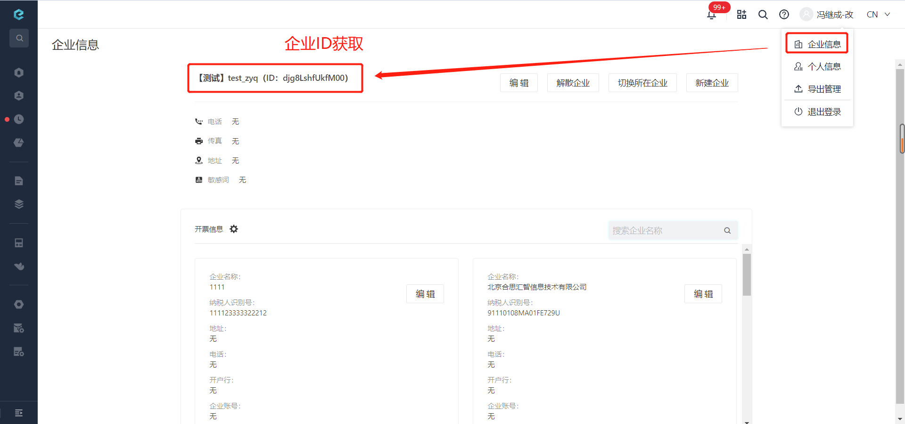

# 获取地址前缀
由于接口地址会根据易快报系统版本发生变动，故使用此接口来获取最新的地址前缀。

import Control from "../../../components/Control";

<Control
method="GET"
url="/api/openapi/v2/location"
/>

## Query Parameters

| 名称 | 类型 | 描述 | 是否必填 | 默认值 | 备注 |
| :--- | :--- | :--- | :--- |:--- | :--- |
| **corpId** | String |  企业Id  | 必填 | - | 通过易快报桌面端「我的企业信息」界面查看 |



## CURL
```
curl --location --request GET 'https://app.ekuaibao.com/api/openapi/v2/location?corpId=-yQbjbywbc640011'
```

> ⚠️注意：
> 
>不同平台获取前缀的方式不同。

| 平台 | 地址 |
| :--- | :--- |
| 易快报独立版     | ​https://app.ekuaibao.com |
| 钉钉           | ​https://dd2.ekuaibao.com |
| 企业微信        | ​https://wx2.ekuaibao.com |
| 云之家          | ​https://kdcloud2.ekuaibao.com |
| 钉钉企业自建应用  | ​https://ddenterprise.ekuaibao.com |
| 飞书            | ​https://feishu.ekuaibao.com |

## 成功响应
```json
{
    "value": "https://app.ekuaibao.com/"
}
```


