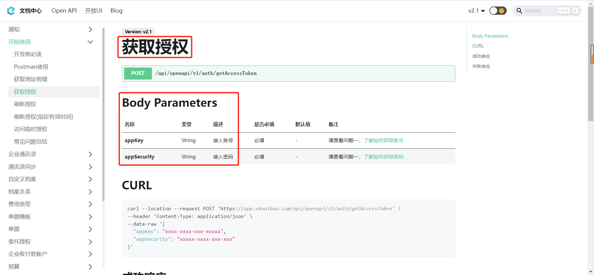
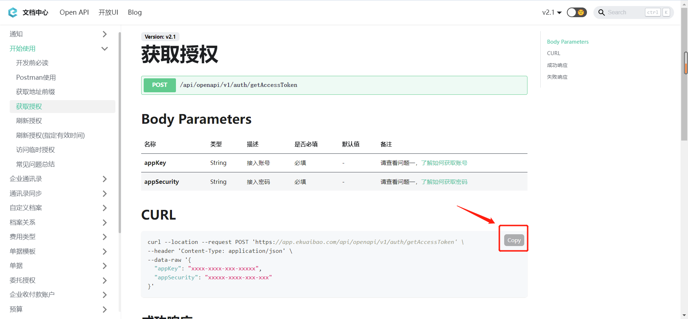
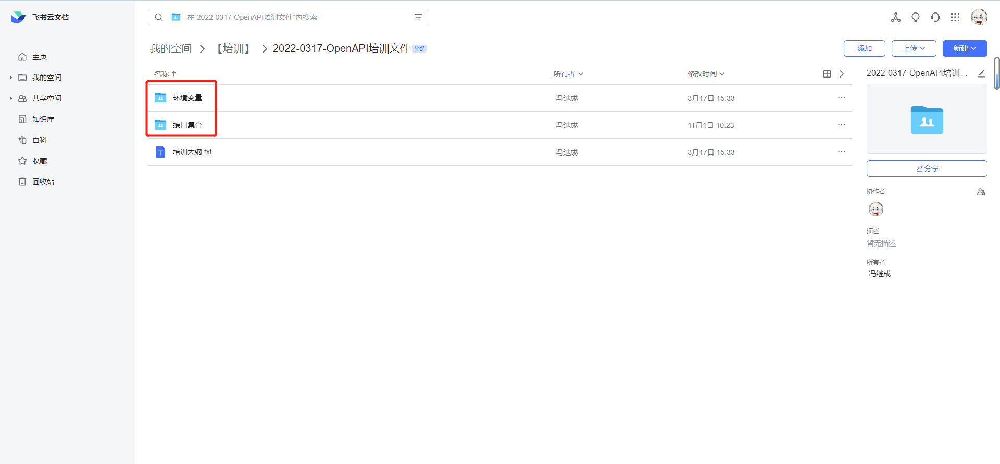
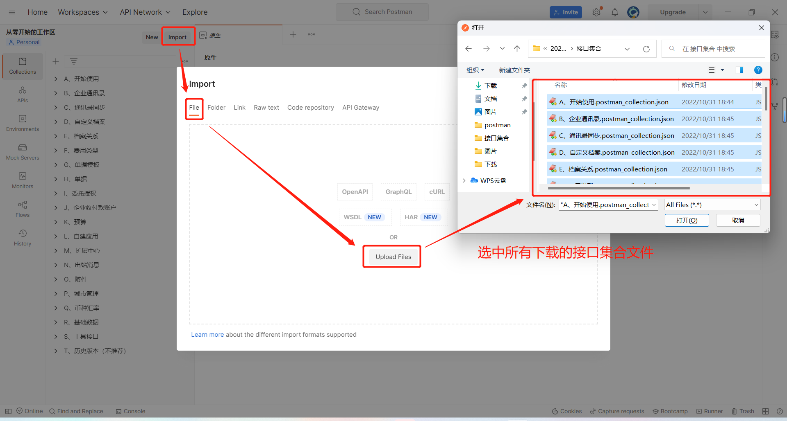
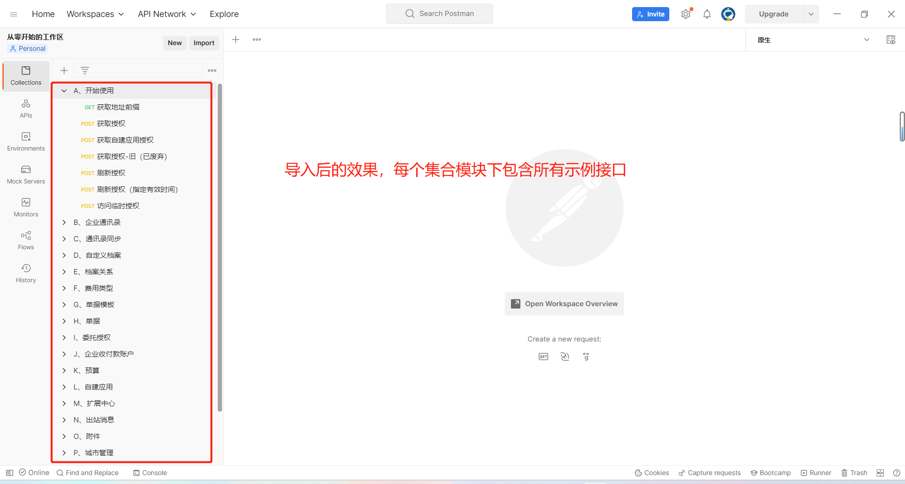
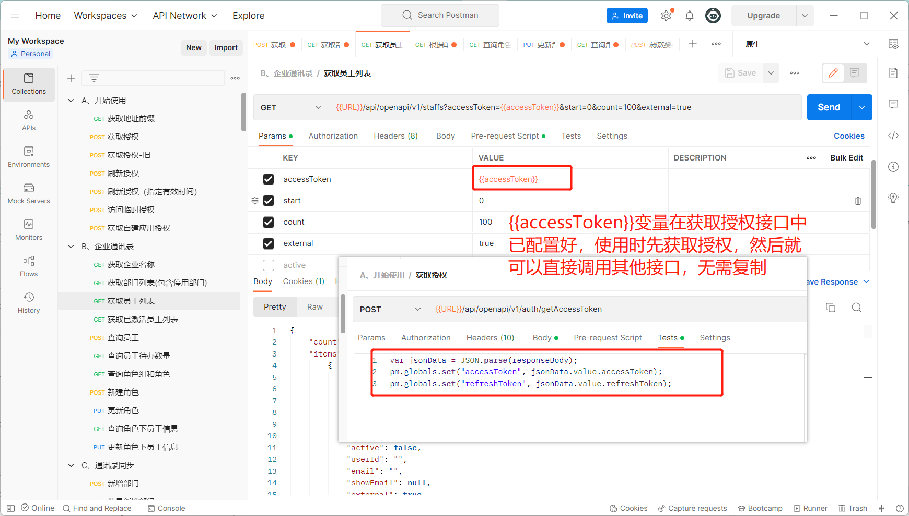
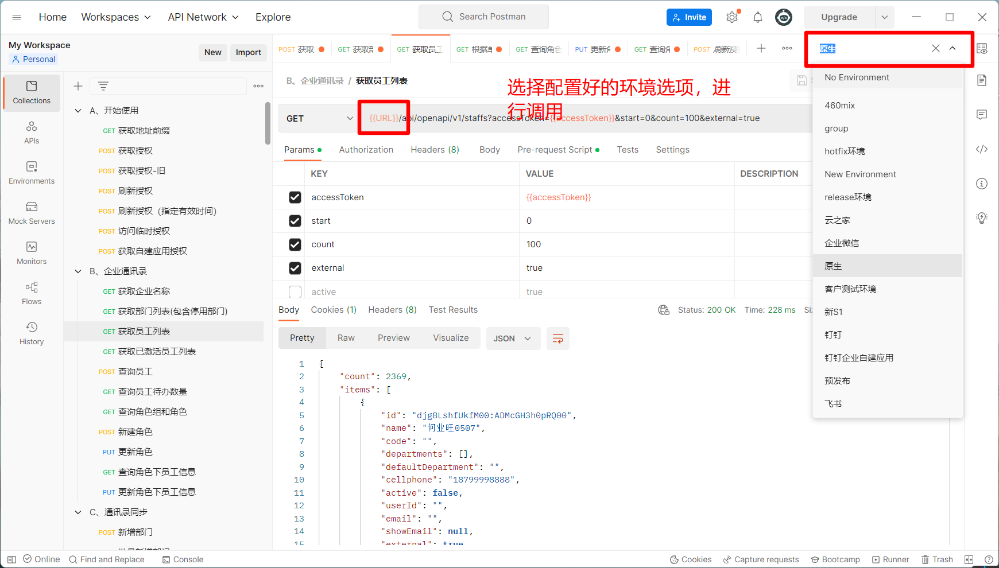

# Postman使用

---
## 什么是Postman？

Postman 是一个用于构建和使用 API 的 API 平台。Postman 简化了 API 生命周期的每个步骤并简化了协作，因此您可以更快地创建更好的 API。 
[Postman软件下载地址](https://www.postman.com)

---

## 如何使用Postman？

### 1.Postman的主界面

---

### 2.如何添加易快报OpenAPI接口进行测试？

#### 2.1 创建接口集合
 

---

#### 2.2 添加接口进行测试
##### （1）手动添加接口
 

 

&nbsp;&nbsp;&nbsp;&nbsp;以【获取授权】接口为例，手动添加接口 

---

##### （2）导入CURL添加接口
 

 

 

---

##### （3）接口参数注意事项
 

 

---

### 3.如何导出CURL给实施人员排查问题？

---

### 4.如何导入导出接口集合？
##### （1）导出接口集合

---

##### （2）导入接口集合

---
### 5.一键导入易快报接口集合并使用
##### （1）下载整理好的易快报【接口集合】和【环境变量】（[下载地址](https://hose2019.feishu.cn/drive/folder/fldcnQiqSXImHLrjL0Kld4Gutgg)）

---

##### （2）在Postman中导入易快报【接口集合】
 

---
##### （3）同上在Postman中导入【环境变量】

---
##### （4）开始调用
 

--- 
