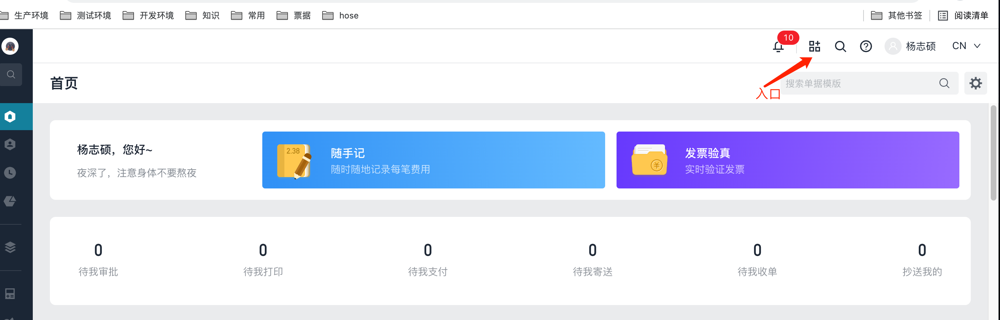
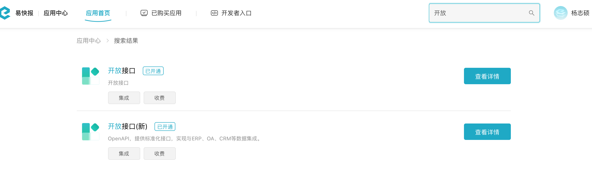
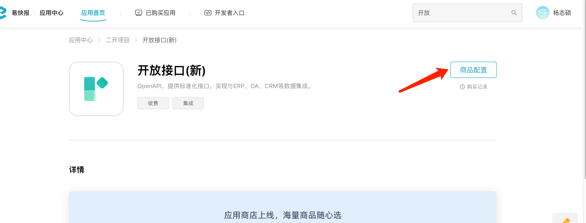
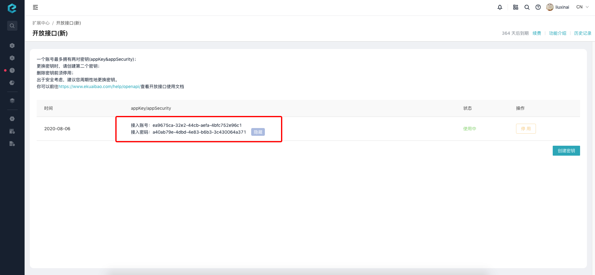
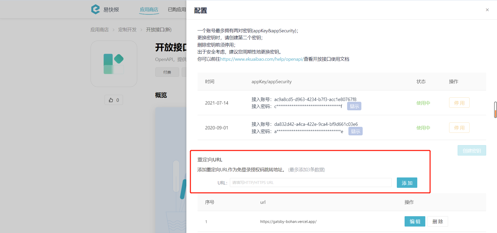

# 常见问题总结

## 问题一
Q: [获取授权](/docs/open-api/getting-started/auth)时如何获取接入账号和密码？

A: 需要进入【易快报】-【应用中心】-【开放接口(新)】，然后创建或查看密钥。具体操作步骤如下： 

（1）应用中心入口

（2）搜索开放接口

（3）击进入开放接口(新)详情

（4）点击商品配置，会进入原来的页面

*****

## 问题二

Q: 通过[访问临时授权](/docs/open-api/getting-started/temp-auth)接口取得的地址，跳转失败，显示404 Not Found 或者一直处于加载状态。

A: 请查看接口各个参数是否配置正确。`expireDate`是否过短，造成访问时已超过使用期限。该参数最大可传604800，可根据实际需求调整。并且需要同时指定`overdueTokenRedirect`，以防没有权限时重定向到指定页面。

*****

## 问题三

Q:【开放接口(新)】页面下的【重定向URL】是做什么用的？

A:此处设置的重定向URL为所有跳转链接的前站，一般为二开地址。支持添加多个链接，上限为3个，添加后的链接展示在输入框下方，支持重新编辑或删除。 
若企业设置了重定向URL则该企业用户每次点击站内所有可跳转链接时，将访问二开固定地址进行跳转授权。如企业没有设置重定向URL则所有跳转链接均不需加工，直接跳转。

