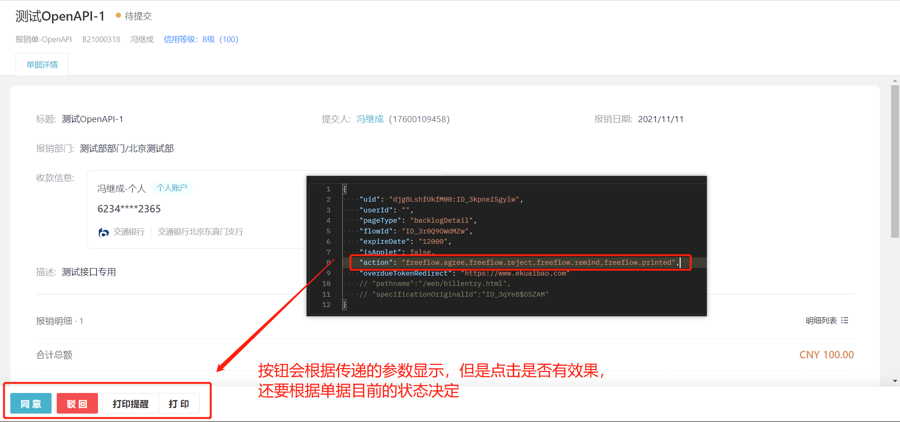

# 访问临时授权

import Control from "../../../components/Control";

<Control
method="POST"
url="/api/openapi/v1/provisional/getProvisionalAuth"
/>

## Query Parameters

| 名称 | 类型 | 描述 | 是否必填 | 默认值 | 备注 |
| :--- | :--- | :--- | :--- |:--- | :--- |
| **accessToken** | String | 认证token | 必填 | - | [通过授权接口获取](/docs/open-api/getting-started/auth) |

## Body Parameters

| 名称 | 类型 | 描述 | 是否必填 | 默认值 | 备注 |
| :--- | :--- | :--- | :--- |:--- | :--- |
| **uid**                     | String  | 员工ID           | 非必填 | - |  当`userId`非必填时`uid`必填  |
| **userId**                  | String  | 用户在第三方(钉钉、<br/>企业微信)中的id | 非必填 | - | 当`uid`非必填时`userId`必填。通过上次获取`accessToken`时返回的值 |
| **pageType**                | String  | 登录页面类型       | 必填  | - | `home`:我的单据<br/>`approve`:待办列表<br/>`form`:单据详情页<br/>`new`:新建单据<br/>`mall`:商城<br/>`backlogDetail`:查看待办详情，同时底部菜单显示指定审批按钮(不支持移动端) |
| **flowId**                  | String  | 单据id           | 非必填 | - | 当「`pageType`=`form`或`backlogDetail`」时必填，表示需要访问的单据详情页 |
| **expireDate**              | String  | 授权有效期        | 必填   | - |  单位：秒，最多只能指定7天内的秒数(604800秒)  |
| **isApplet**                | Boolean | 是否跳转app端     | 非必填 | `false` |  `true`：跳转app端<br/>`false`：跳转web端   |
| **action**                  | String  | 审批按钮类型      | 非必填 | - | 仅当「`pageType`=`form`或`backlogDetail`」时参数有效，表示审批代办时想要显示的按钮类型 |
| **overdueTokenRedirect**    | String  | 重定向url        | 非必填 | - | `expireDate`过期后重定向到该地址 |
| **pathname**                | String  | 授权路径         | 非必填 | - |  当`pageType`=`new`时，填值(/web/billentry.html)或者(/applet/thirdparty.html),视平台而定 |
| **specificationOriginalId** | String  | 单据模板ID       | 非必填 | - |  当`pageType`=`new`(新增单据)时该值必填 |

> ⚠️注意：
> 
> - `uid`与`userId`只需要填写一个即可，若都填写，以`uid`为准进行操作。
> - 当`pageType`=`form`时，`flowId`参数必填；
> - 当`pageType`=`new`时，`pathname`、`specificationOriginalId`参数必填。
> - 当`pageType`=`mall`时，用户必须已开通商城，否则该接口会返回错误提示。<br/>
    &nbsp;&nbsp;&nbsp;&nbsp;且只需要传递`uid`（或者`userId`）、`isApplet`和`expireDate`3个参数即可，其他均可忽略不传。
> - 当`pageType`=`backlogDetail`时，`isApplet`=`false`（不支持移动端）,`flowId`参数必填，`action`参数选填（不传显示默认的审批按钮），多个值用“,”分隔。
>
> 
> 
> 

<br/>

审批按钮类型`action`的值如下（不支持移动端）:

| action | 说明 |
| :--- | :--- |
| **freeflow.agree**        | 同意       |
| **freeflow.reject**       | 驳回       | 
| **freeflow.remind**       | 打印提醒    |
| **freeflow.printed**      | 打印       | 
| **freeflow.addnode**      | 转交       | 
| **freeflow.back**         | 回退       | 
| **freeflow.comment**      | 评论       | 
| **freeflow.modify**       | 修改       |  
| **freeflow.activate**     | 激活       | 
| **freeflow.receive**      | 确认收单    | 
| **freeflow.nullify**      | 作废       |
| **freeflow.pay**          | 支付       |
| **freeflow.addExpress**   | 添加寄送信息 |
| **freeflow.jumpExpress**  | 跳过寄送    |
| **freeflow.shiftApprove** | 转交审批    |
| **freeflow.addSignNode**  | 加签审批    |

## CURL
```
curl --location --request POST 'https://app.ekuaibao.com/api/openapi/v1/provisional/getProvisionalAuth?accessToken=cxEbrzNJSA3A00' \
--header 'Content-Type: application/json' \
--data-raw '{
    "uid": "34A73EyI8A0w00:Kh0bnmDTrU9g00",
    "userId": "",
    "pageType": "home",
    "flowId": "",
    "expireDate": "120",
    "isApplet": true,
    "action": "",
    "overdueTokenRedirect": "https://www.ekuaibao.com"
}'
```

## 成功响应
```json
{
    "value": {
      "message": "https://app.ekuaibao.com/applet/thirdparty.html?accessToken=SGYqVpXcuhIIYQJkd0w2G0&ekbCorpId=34A73EyI8A0w00&pageType=home&overdueTokenRedirect=[https://www.ekuaibao.com](https://www.ekuaibao.com)", //第三方临时访问易快报URL
      "code": "true" // 请求状态
    }
}
```
跳转商城返回信息：
```json
{
    "value": {
        "message": "https://mall-app.ekuaibao.com/wportal/?token={商城token}",
        "code": "true"
    }
}
```

## 失败响应
`expireDate` 最大仅支持7天的秒数，即604800秒，若大于604800秒则返回以下信息：
```json
{
    "value": {
        "code": "false",
        "message": "expireDate最多只能指定7天内的秒数！"
    }
}
```
