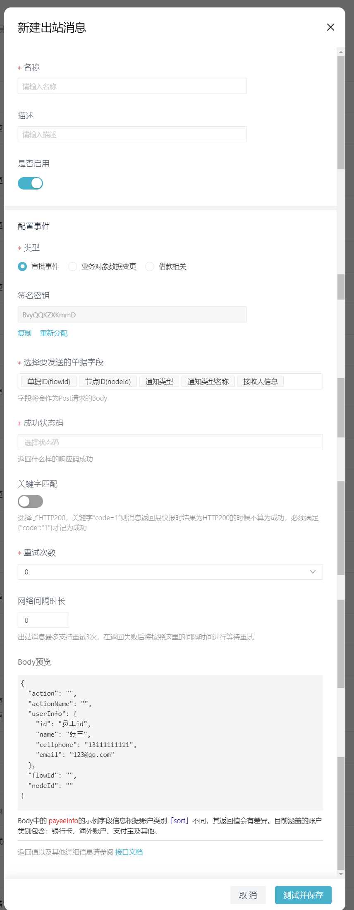

# 配置出站消息

---
## 定义

- 出站消息：能够自动执行业务流程的一种触发器，以实现自动化传递信息（如通知消息、业务数据等）；
- 订阅事件：相当于触发条件，当满足某种订阅事件时，执行某种行为；
- 行为：当满足某种订阅事件时，执行调用接口传递信息的动作。

---
## 出站消息的触发方式

| 订阅事件 | 满足某种条件 | 触发方式 |
|:--- |:--- |:--- |
| **审批事件**        | 触发配置的审批事件动作  审批事件类型：【待审批】、【待寄送】、【待收单】、【待支付】、 【被驳回】、【支付中】、【已支付/审批完成】、【催办】、【超时提醒】、 【审批通过（已开通【差旅管理】的用户）】、【抄送】、【评论】、 【被@】、【打印提醒】、【单据撤回】、【单据删除】、【待办已处理】、 【申请单变更】 | 触发出站消息 |
| **业务对象数据变更** | 新增或修改业务对象数据 | 触发出站消息 |
| **消息中心**        | 满足消息中心配置的通知触发条件 | 触发出站消息 |
| **EBot**          | 到达此节点 | 触发出站消息，可触发出站失败后配置 |
| **借款相关**        | 触发配置的还款事件 还款事件类型：【发起手动还款】、【手动还款被确认收款】、 【手动还款驳回】、【还款提醒】、【手动还款冲销】 | 触发出站消息 |
| **站内信**        | 用户收到站内信消息 | 触发出站消息 |

---
## 界面交互

### （1）出站消息展示与管理界面

---
### （2）新建出站消息界面

---
### （3）新建/编辑出站消息--审批事件
:::caution
- 审批事件支持多选，每个审批事件可被不同出站消息重复配置。
:::

---
### （4）新建/编辑出站消息--业务对象数据变更

---
### （5）新建/编辑出站消息--EBot
:::caution
- 在审批流EBot节点上新建此类型。
:::

---
### （6）新建/编辑出站消息--消息中心

---
### （7）新建/编辑出站消息--借款相关

---
### （8）新建/编辑出站消息--站内信

---
## 配置说明

出站消息的属性说明：

| 属性 | 说明 |
|:--- |:--- |
| **名称**       | 企业内唯一，20字以内，中文数字字母组合 |
| **描述**       | 出站消息描述信息 |
| **是否启用**    | 是否启用 |
| **配置事件**    | 审批事件、业务对象数据变更、EBot、借款相关 |   
| **调用Url**    | 目标站点的URL | 
| **签名秘钥**    | 由易快报系统签发，用于接口鉴定，不可修改，可以重新分配。 打开「新建出站消息」页面时，自动分配。 | 
| **字段选择**    | 可以从全局字段中选择，例如:【单据ID】、【节点ID】等。 支持的类型参见本文档后半部分。|
| **成功状态码**  | 返回什么样的响应码表示成功，支持多选 【HTTP204】【HTTP200】【HTTP201】|
| **关键字匹配**  | 关键字匹配作为成功状态码的补充条件，默认关闭。 例如：选择了【HTTP200】和关键字“code=1” 则出站接口URL返回为 【HTTP200】且{"code":"1"}时才算作成功。 |
| **重试次数**    | 默认为0次，不重试。 出站消息最多支持重试3次，在返回失败后将按照配置的间隔时间进行等待重试。 |
| **网络间隔时长** | 默认为0秒，可在1-10秒内做选择。 用户设置等待间隔后出站消息失败后不会立即重试，会按照这里的间隔时间进行等待。 |
| **测试并保存**   | 点击「测试并保存」，测试成功后将保存该出站消息。   测试时易快报将向出站URL传送示例数据，目标服务器响应配置的成功状态码，例如：204，方认为测试通过。|

---
## 支持字段

目前支持的字段类型有：

| 字段类型 | Body预览示例 | 说明 |
|:--- |:--- |:--- |
| **文本**                |  "字段名": "xxxx" |   |
| **日期**                |  "字段名": 1484498318241 | 毫秒时间戳 |
| **日期范围**             |  "字段名": { &nbsp;&nbsp;&nbsp;&nbsp;"from": 1484498318241,  &nbsp;&nbsp;&nbsp;&nbsp;"to": 1484498318398  } | 毫秒时间戳 |
| **数字**                |  "字段名": 23.4   |  |
| **金额**                |  "字段名": { &nbsp;&nbsp;&nbsp;&nbsp;"currency": "CNY", //本位币币种 &nbsp;&nbsp;&nbsp;&nbsp;"amount": "10.00", //本位币金额 &nbsp;&nbsp;&nbsp;&nbsp;/* 如果金额是本位币，则无下列字段 */ &nbsp;&nbsp;&nbsp;&nbsp;"foreignCurrency": "USD", //外币币种 &nbsp;&nbsp;&nbsp;&nbsp;"foreignAmount": "68.80", //外币金额 &nbsp;&nbsp;&nbsp;&nbsp;"exchangeRate": "6.88"  &nbsp;&nbsp;&nbsp;&nbsp;//汇率 = 外币金额 ÷ 本位币金额 } |  |
| **开关**                |  "字段名": true |  |
| **部门/自定义档案**       | "字段名": {&nbsp;&nbsp;&nbsp;&nbsp;//部门、自定义档案 &nbsp;&nbsp;&nbsp;&nbsp;"id": "档案值id", &nbsp;&nbsp;&nbsp;&nbsp;"path": "AAA/BBB/CCC", &nbsp;&nbsp;&nbsp;&nbsp;"name": "CCC", &nbsp;&nbsp;&nbsp;&nbsp;"code": "0902" } |  |
| **自定义档案（多选）**     | "字段名": \[  { &nbsp;&nbsp;&nbsp;&nbsp;"id": "档案值id", &nbsp;&nbsp;&nbsp;&nbsp;"path": "AAA/BBB/CCC", &nbsp;&nbsp;&nbsp;&nbsp;"name": "CCC", &nbsp;&nbsp;&nbsp;&nbsp;"code": "0902" },{ &nbsp;&nbsp;&nbsp;&nbsp;"id": "档案值id", &nbsp;&nbsp;&nbsp;&nbsp;"path": "AAA/BBB/CCC", &nbsp;&nbsp;&nbsp;&nbsp;"name": "CCC", &nbsp;&nbsp;&nbsp;&nbsp;"code": "0902" } \] | Ebot、审批事件类型支持 |
| **人员**                |  "字段名": { &nbsp;&nbsp;&nbsp;&nbsp;"id": "员工ID", //这里的ID是易快报的员工ID &nbsp;&nbsp;&nbsp;&nbsp;"name": "姓名" } |   |
| **自定义扩展业务对象**     | "字段名": { &nbsp;&nbsp;&nbsp;&nbsp;"id": "x2y34", &nbsp;&nbsp;&nbsp;&nbsp;"name": "xxxx", &nbsp;&nbsp;&nbsp;&nbsp;"code": "1234" } | &#8195; |
| **收款信息_银行卡**       | "字段名": { &nbsp;&nbsp;&nbsp;&nbsp;"sort": "BANK", &nbsp;&nbsp;&nbsp;&nbsp;"type": "PERSONAL", &nbsp;&nbsp;&nbsp;&nbsp;"name": "杨平", &nbsp;&nbsp;&nbsp;&nbsp;"nameSpell": "YANGPING", &nbsp;&nbsp;&nbsp;&nbsp;"cardNo":"6214000123123028888", &nbsp;&nbsp;&nbsp;&nbsp;"bank":"招商银行", &nbsp;&nbsp;&nbsp;&nbsp;"province":"江苏省"， &nbsp;&nbsp;&nbsp;&nbsp;"city":"南京市"， &nbsp;&nbsp;&nbsp;&nbsp;"branch":"招商银行南京中央路支行"， &nbsp;&nbsp;&nbsp;&nbsp;"certificateType":"03", &nbsp;&nbsp;&nbsp;&nbsp;"certificateNo":"134322222343", &nbsp;&nbsp;&nbsp;&nbsp;"bankLinkNo":"308301006211" } | 需根据单据中的收款信息ID，联查相关字段 |
| **收款信息_海外账户**     | "字段名": { &nbsp;&nbsp;&nbsp;&nbsp;"sort": "OVERSEABANK", &nbsp;&nbsp;&nbsp;&nbsp;"name": "杨平", &nbsp;&nbsp;&nbsp;&nbsp;"type": "PERSONAL", &nbsp;&nbsp;&nbsp;&nbsp;"owner": "INDIVIDUAL", &nbsp;&nbsp;&nbsp;&nbsp;"cardNo":"9984000123123028888", &nbsp;&nbsp;&nbsp;&nbsp;"bankCode":"BankCode001"， &nbsp;&nbsp;&nbsp;&nbsp;"bankName":"BankName001"， &nbsp;&nbsp;&nbsp;&nbsp;"nameSpell": "YANGPING", &nbsp;&nbsp;&nbsp;&nbsp;"swiftCode":"SwiftCode001", &nbsp;&nbsp;&nbsp;&nbsp;"branchCode":"BranchCode001" } |  |
| **收款信息_支付宝**       | "字段名": { &nbsp;&nbsp;&nbsp;&nbsp;"sort": "ALIPAY", &nbsp;&nbsp;&nbsp;&nbsp;"name": "杨平", &nbsp;&nbsp;&nbsp;&nbsp;"type": "PERSONAL", &nbsp;&nbsp;&nbsp;&nbsp;"owner": "INDIVIDUAL", &nbsp;&nbsp;&nbsp;&nbsp;"cardNo":"13900001111", &nbsp;&nbsp;&nbsp;&nbsp;"nameSpell": "YANGPING"} |  |
| **收款信息_其他**         | "字段名": { &nbsp;&nbsp;&nbsp;&nbsp;"sort": "OTHER", &nbsp;&nbsp;&nbsp;&nbsp;"name": "杨平", &nbsp;&nbsp;&nbsp;&nbsp;"type": "PERSONAL", &nbsp;&nbsp;&nbsp;&nbsp;"cardNo":"13900001111", &nbsp;&nbsp;&nbsp;&nbsp;"nameSpell": "YANGPING"  &nbsp;&nbsp;&nbsp;&nbsp;"certificateType":"03", &nbsp;&nbsp;&nbsp;&nbsp;"certificateNo":"134322222343" } |  |
| **通知类出站消息类别**	  |  "action": "flow.rejected"   |  注意：通知类出站消息才会有的固定字段，流程中没有。 类别: &nbsp;&nbsp;&nbsp;&nbsp;flow.rejected 被驳回 &nbsp;&nbsp;&nbsp;&nbsp;freeflow.ticketReserve 审批通过（已开通【差旅管理】的用户） &nbsp;&nbsp;&nbsp;&nbsp;backlog.sending 待寄送 &nbsp;&nbsp;&nbsp;&nbsp;backlog.receiving 待收单 &nbsp;&nbsp;&nbsp;&nbsp;flow.paid 已支付/审批完成 &nbsp;&nbsp;&nbsp;&nbsp;urgent.remind 加急审批 &nbsp;&nbsp;&nbsp;&nbsp;freeflow.mention 被@ &nbsp;&nbsp;&nbsp;&nbsp;freeflow.print 打印提醒 &nbsp;&nbsp;&nbsp;&nbsp;backlog.paying 待支付 &nbsp;&nbsp;&nbsp;&nbsp;freeflow.comment 评论 &nbsp;&nbsp;&nbsp;&nbsp;backlog.approving 待审批 &nbsp;&nbsp;&nbsp;&nbsp;freeflow.remind 催办 &nbsp;&nbsp;&nbsp;&nbsp;timeout.remind 超时提醒 &nbsp;&nbsp;&nbsp;&nbsp;freeflow.carbonCopy 抄送|
| **通知类出站消息类别名称**  |  "actionName": "被驳回"  | 注意：通知类出站消息才会有的固定字段，流程中没有。 |
| **通知类出站消息消息接收人** |  "userInfo": { &nbsp;&nbsp;&nbsp;&nbsp;"id": "7hw8MheAgo0g00:I6A8MlHIQM0000", &nbsp;&nbsp;&nbsp;&nbsp;"name": "张三", &nbsp;&nbsp;&nbsp;&nbsp;"cellphone": "13111111111", &nbsp;&nbsp;&nbsp;&nbsp;"email": "123456@163.com" }&nbsp;&nbsp;&nbsp;&nbsp;| 注意：通知类出站消息才会有的固定字段，流程中没有。 |
| **站内信消息类型** |  "internalMessageNameType": "freeflow:autoSubmit"| 注意：站内信出站消息才会有的固定字段，流程中没有。 类别: &nbsp;&nbsp;&nbsp;&nbsp;freeflow:autoSubmit 自动提报提醒 &nbsp;&nbsp;&nbsp;&nbsp;owner:freeflow.pay 支付完成 &nbsp;&nbsp;&nbsp;&nbsp;owner:freeflow.pay:expense 支付完成-报销单 &nbsp;&nbsp;&nbsp;&nbsp;owner:freeflow.pay:loan 支付完成-借款单 &nbsp;&nbsp;&nbsp;&nbsp;owner:freeflow.pay:requisition 支付完成-申请单 &nbsp;&nbsp;&nbsp;&nbsp;paymentbatch 支付批次通知 &nbsp;&nbsp;&nbsp;&nbsp;staff:apply 员工申请加入消息 &nbsp;&nbsp;&nbsp;&nbsp;staff:dimission 员工离职消息 &nbsp;&nbsp;&nbsp;&nbsp;budget:alert 预算执行达到预警值 &nbsp;&nbsp;&nbsp;&nbsp;account:register 用户注册短信 &nbsp;&nbsp;&nbsp;&nbsp;asyncExport:success 异步导出完成提醒 &nbsp;&nbsp;&nbsp;&nbsp;asyncPrint:success 异步打印完成提醒 &nbsp;&nbsp;&nbsp;&nbsp;invoice:replenish:text 一键交发票提醒-文本 &nbsp;&nbsp;&nbsp;&nbsp;invoice:replenish 一键交发票提醒 &nbsp;&nbsp;&nbsp;&nbsp;creditPointUpdate 信用分变更通知 &nbsp;&nbsp;&nbsp;&nbsp;ticket:CREATE 协助平台工单协助 &nbsp;&nbsp;&nbsp;&nbsp;staff:nonCompleteRoute 未完成行程通知 &nbsp;&nbsp;&nbsp;&nbsp;owner:freeflow.agree 申请通过通知-同意 &nbsp;&nbsp;&nbsp;&nbsp;owner:freeflow.receive 申请通过通知-收单 &nbsp;&nbsp;&nbsp;&nbsp;owner:freeflow.send 申请通过通知-寄送 &nbsp;&nbsp;&nbsp;&nbsp;comment 评论通知 &nbsp;&nbsp;&nbsp;&nbsp;mention 评论提醒 &nbsp;&nbsp;&nbsp;&nbsp;batch:owner:freeflow.pay 批量支付完成 &nbsp;&nbsp;&nbsp;&nbsp;batch:owner:freeflow.receive批量通过通知-收单 &nbsp;&nbsp;&nbsp;&nbsp;batch:owner:freeflow.send 批量通过通知-寄送 &nbsp;&nbsp;&nbsp;&nbsp;batch:owner:freeflow.agree 批量申请通过通知 &nbsp;&nbsp;&nbsp;&nbsp;freeflow:print:batch 批量打印单据提醒 &nbsp;&nbsp;&nbsp;&nbsp;freeflow:print:batch_bak 批量打印单据提醒 &nbsp;&nbsp;&nbsp;&nbsp;batch:freeflow.remind 批量催办单据 &nbsp;&nbsp;&nbsp;&nbsp;pwdExpire 密码过期提醒 &nbsp;&nbsp;&nbsp;&nbsp;loan:EXPIRE 借款提醒 &nbsp;&nbsp;&nbsp;&nbsp;corporation:dismiss 解散企业短信 &nbsp;&nbsp;&nbsp;&nbsp;repayment:APPROVE 还款申请 &nbsp;&nbsp;&nbsp;&nbsp;repayment:AGREE 还款确认 &nbsp;&nbsp;&nbsp;&nbsp;repayment:REJECT 还款驳回 &nbsp;&nbsp;&nbsp;&nbsp;transfer:start 管理员发起借款转交提醒 &nbsp;&nbsp;&nbsp;&nbsp;share:start 管理员发起借款共享提醒 &nbsp;&nbsp;&nbsp;&nbsp;requisition:close 关闭申请单提醒 &nbsp;&nbsp;&nbsp;&nbsp;batch:owner:freeflow.reject 动态通知-批量驳回 &nbsp;&nbsp;&nbsp;&nbsp;owner:freeflow.reject 动态通知-驳回 &nbsp;&nbsp;&nbsp;&nbsp;owner:freeflow.reject:expense 动态通知-驳回 &nbsp;&nbsp;&nbsp;&nbsp;owner:freeflow.reject:loan 动态通知-驳回 &nbsp;&nbsp;&nbsp;&nbsp;owner:freeflow.reject:requisition 动态通知-驳回 &nbsp;&nbsp;&nbsp;&nbsp;tpp:remind:text 第三方管理通知-文本 &nbsp;&nbsp;&nbsp;&nbsp;invoice:REMIND 待开发票提醒 &nbsp;&nbsp;&nbsp;&nbsp;freeflow.paying 待办通知-支付 &nbsp;&nbsp;&nbsp;&nbsp;freeflow.agree 待办通知-同意单据 &nbsp;&nbsp;&nbsp;&nbsp;freeflow.submit 待办通知-提交单据 &nbsp;&nbsp;&nbsp;&nbsp;batch:freeflow.agree 待办通知-批量同意单据 &nbsp;&nbsp;&nbsp;&nbsp;batch:freeflow.receive 待办通知-批量接收单据 &nbsp;&nbsp;&nbsp;&nbsp;batch:freeflow.addnode 待办通知-批量加签单据 &nbsp;&nbsp;&nbsp;&nbsp;batch:freeflow.send 待办通知-批量寄送单据 &nbsp;&nbsp;&nbsp;&nbsp;freeflow.receive 待办通知-接收单据 &nbsp;&nbsp;&nbsp;&nbsp;freeflow.addnode 待办通知-加签单据 &nbsp;&nbsp;&nbsp;&nbsp;freeflow.send 待办通知-寄送单据 &nbsp;&nbsp;&nbsp;&nbsp;orderConfirm 待办通知-订单确认待办 &nbsp;&nbsp;&nbsp;&nbsp;requistion 待办通知 &nbsp;&nbsp;&nbsp;&nbsp;freeflow:print 打印单据提醒 &nbsp;&nbsp;&nbsp;&nbsp;freeflow.remind 催办单据 &nbsp;&nbsp;&nbsp;&nbsp;corporation:create 创建企业短信 &nbsp;&nbsp;&nbsp;&nbsp;chargeAgainst 冲销还款完成提醒 &nbsp;&nbsp;&nbsp;&nbsp;carbonCopy 抄送提醒 &nbsp;&nbsp;&nbsp;&nbsp;datalink:CREATE 参与人白名单更新结果 &nbsp;&nbsp;&nbsp;&nbsp;transfer:confirm 被转交人确认转交提醒 &nbsp;&nbsp;&nbsp;&nbsp;share:confirm 被共享人确认共享提醒 &nbsp;&nbsp;&nbsp;&nbsp;openapi:remind:text openapi通知-文本|

---
## 出站消息日志

### （1）审批事件

审批事件消息日志字段如下：

| 字段 | 描述 |
|:--- |:--- |
| **名称**    | 出站消息配置名称 |
| **消息类型** | 出站消息类型，消息通知 |
| **日志类型** | 日志类型，出战消息调用外部服务、外部服务回调 |
| **单据编号** | 单据编号，右上角搜索框可根据单据编号搜索出站消息日志 |
| **事件名称** | 事件名称取自创建出站消息时的事件名称，如：待审批 |
| **消息状态** | 出站消息调用状态，成功、失败 |
| **时间**    | 出站消息调用时间 |
| **操作**    | 参数：出站消息报文信息，request和response 重试：无论出站消息成功与否，均可点击手动触发一次出站消息 |

---
### （2）业务对象变更

业务对象变更消息日志字段如下：

| 字段 | 描述 |
|:--- |:--- |
| **名称**       | 出站消息配置名称 |
| **消息类型**    | 出站消息类型，业务对象变更 |
| **日志类型**    | 日志类型，出战消息调用外部服务、外部服务回调 |
| **业务对象名称** | 业务对象名称，右上角搜索框可根据业务对象名称搜索出站消息日志 |
| **消息状态**    | 出站消息调用状态，成功、失败 |
| **时间**       | 出站消息调用时间 |
| **操作**       | 参数：出站消息报文信息，request和response 重试：无论出站消息成功与否，均可点击手动触发一次出站消息 |

---
### （3）消息中心

消息中心消息日志字段如下：

| 字段 | 描述 |
|:--- |:--- |
| **名称**    | 出站消息配置名称 |
| **消息类型** | 出站消息类型，消息中心 |
| **日志类型** | 日志类型，出战消息调用外部服务、外部服务回调 |
| **事件名称** | 事件名称取自创建出站消息时所选择的消息，如：自定义测试 |
| **消息状态** | 出站消息调用状态，成功、失败 |
| **时间**    | 出站消息调用时间 |
| **操作**    | 参数：出站消息报文信息，request和response 重试：无论出站消息成功与否，均可点击手动触发一次出站消息 |

---
### （4）借款事件

借款事件消息日志字段如下：

| 字段 | 描述 |
|:--- |:--- |
| **名称**    | 出站消息配置名称 |
| **消息类型** | 出站消息类型，借款相关 |
| **日志类型** | 日志类型，出战消息调用外部服务、外部服务回调 |
| **单据编号** | 单据编号，右上角搜索框可根据单据编号搜索出站消息日志 |
| **事件名称** | 事件名称取自创建出站消息时的事件名称，如：发起手动还款 |
| **消息状态** | 出站消息调用状态，成功、失败 |
| **时间**    | 出站消息调用时间 |
| **操作**    | 参数：出站消息报文信息，request和response 重试：无论出站消息成功与否，均可点击手动触发一次出站消息 |

---
### （5）EBot事件

EBot事件消息日志字段如下：

| 字段 | 描述 |
|:--- |:--- |
| **名称**    | 出站消息配置名称 |
| **消息类型** | 出站消息类型，EBOT事件 |
| **日志类型** | 日志类型，出战消息调用外部服务、外部服务回调 |
| **单据编号** | 单据编号，右上角搜索框可根据单据编号搜索出站消息日志 |
| **消息状态** | 出站消息调用状态，成功、失败 |
| **时间**    | 出站消息调用时间 |
| **操作**    | 参数：出站消息报文信息，request和response 重试：无论出站消息成功与否，均可点击手动触发一次出站消息 |

---
### （6）站内信

站内信消息日志字段如下：

| 字段 | 描述 |
|:--- |:--- |
| **名称**    | 出站消息配置名称 |
| **消息类型** | 出站消息类型，站内信 |
| **日志类型** | 日志类型，出战消息调用外部服务、外部服务回调 |
| **事件名称** | 事件名称取自创建出站消息时的事件名称，如：自动提报提醒 |
| **消息状态** | 出站消息调用状态，成功、失败 |
| **时间**    | 出站消息调用时间 |
| **操作**    | 参数：出站消息报文信息，request和response 重试：无论出站消息成功与否，均可点击手动触发一次出站消息 |

---