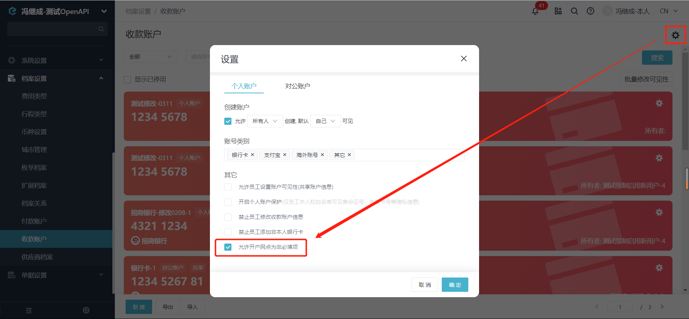

# 新增收款账户

import Control from "@theme/Control";

<Control
method="POST"
url="/api/openapi/v2.1/payeeInfos"
/>

<details>
  <summary><b>更新日志</b></summary>
  <div>

  [**1.14.0**](/docs/open-api/notice/update-log#1140) -> 🐞 新增了 `nationCode`（银行所在地区代码）参数描述。<br/>
  [**1.6.3**](/docs/open-api/notice/update-log#163)&emsp;-> 🚀 接口升级 `v2.1` 版本，新增了 `sort`（账号类别）参数，额外支持新增 **支付宝**、**海外账号**、**微信**、**其他** 4种类型收款账户。<br/>

  </div>
</details>

## Query Parameters

| 名称 | 类型 | 描述 | 是否必填 | 默认值 | 备注 |
| :--- | :--- | :--- | :--- |:--- | :--- |
| **accessToken** | String | 认证token | 必填 | - | 通过 [获取授权](/docs/open-api/getting-started/auth) 获取 `accessToken` |

## Body Parameters

| 名称 | 类型 | 描述 | 是否必填 | 默认值 | 备注 |
| :--- | :--- | :--- | :--- |:--- | :--- |
| **sort**            | String | 账号类别    | 非必填 | BANK | `BANK` : 银行卡<br/>`ALIPAY` : 支付宝<br/>`OVERSEABANK` : 海外账号<br/>`WEIXIN` : 微信<br/>`OTHER` : 其他 |
| **type**            | String | 账户类型    | 必填 | -| `PUBLIC` : 对公账户 &emsp; `PERSONAL` : 个人账户 |
| **owner**           | String | 所有者类型   | 必填 | - | `INDIVIDUAL` : 个人 &emsp; `CORPORATION` : 企业 |
| **staffId**         | String | 所有者ID    | 非必填 | - | 当 `owner` = `INDIVIDUAL` 时 **必填**<br/>当 `owner` = `CORPORATION` 时 **非必填**<br/>通过 [获取员工列表](/docs/open-api/corporation/get-all-staffs) 获取 |
| **name**            | String | 开户名称    | 必填 | - | 开户名称 |
| **cardNo**          | String | 账号       | 必填 | - | 银行卡号<br/>支付宝账号<br/>银行账号(Account No.)<br/>微信账号<br/>账号 |
| **bank**            | String | 银行名称<br/>**『银行卡』专属参数**    | 非必填 | - | **可通过 `branch` 或 `bankLinkNo` 自动回填，<br/>需保证 `branch` 在 [开户网点](/docs/open-api/pay/get-all-branch) 内** |
| **branch**          | String | 开户网点<br/>**『银行卡』专属参数**    | 必填 | - | **`sort` = `BANK` 时，必填**。获取 [开户网点](/docs/open-api/pay/get-all-branch)<br/>可通过系统配置改为 ”**非必填**“，见下方**TIP** |
| **bankLinkNo**      | String | 银联号<br/>**『银行卡』专属参数**      | 非必填 | - | **当开户网点与合思系统不匹配时，<br/>可通过银联号匹配** |
| **province**        | String | 银行所在省<br/>**『银行卡』专属参数**   | 非必填 | - | **可通过 `branch` 或 `bankLinkNo` 自动回填，<br/>需保证 `branch` 在 [开户网点](/docs/open-api/pay/get-all-branch) 内** |
| **city**            | String | 银行所在城市<br/>**『银行卡』专属参数** | 非必填 | - | **可通过 `branch` 或 `bankLinkNo` 自动回填，<br/>需保证 `branch` 在 [开户网点](/docs/open-api/pay/get-all-branch) 内** |
| **bankName**        | String | 银行名称<br/>**『海外账号』专属参数** | 非必填 | - | 银行名称(Bank Name) |
| **swiftCode**       | String | 银行国际代码<br/>**『海外账号』专属参数** | 必填 | - | 银行国际代码(Swift Code) |
| **nationCode**      | String | 银行所在地区代码<br/>**『海外账号』专属参数** | 必填 | - | 银行所在地区代码(Nation Code)<br/>传参为 [国家地区代码](https://baike.baidu.com/item/%E4%B8%96%E7%95%8C%E5%90%84%E5%9B%BD%E5%92%8C%E5%9C%B0%E5%8C%BA%E5%90%8D%E7%A7%B0%E4%BB%A3%E7%A0%81/6560023?fromtitle=%E5%9B%BD%E5%AE%B6%E5%9C%B0%E5%8C%BA%E4%BB%A3%E7%A0%81&fromid=52038508&fr=aladdin#2 ) 的国家数字代码 |
| **routingNumber**   | String | 汇款路线号码<br/>**『海外账号』专属参数** | 非必填 | - | 汇款路线号码(Routing No.) |
| **bankCode**        | String | 联行号<br/>**『海外账号』专属参数** | 非必填 | - | 联行号(Bank Code) |
| **branchCode**      | String | 支行号<br/>**『海外账号』专属参数** | 非必填 | - | 支行号(Branch Code) |
| **certificateType** | String | 证件类型    | 非必填 | - | 详细信息见下方【[证件类型对照表](/docs/open-api/pay/new-payeeInfo#证件类型对照表)】|
| **certificateNo**   | String | 证件号码    | 非必填 | - | 证件号码 |
| **remark**          | String | 备注信息    | 非必填 | - | 备注信息 |
| **visibility**                          | Object   | 可见范围       | 非必填 | - | 可见范围对象 |
| **&emsp; ∟ fullVisible**                | Boolean | 是否全员可见    | 必填 | - | `true` : 全员可见 &emsp; `false` : 部分可见<br/>部分可见则仅有白名单中可见 |
| **&emsp; ∟ roles**                      | Array   | 角色白名单      | 必填 | - | 通过 [查询角色组和角色](/docs/open-api/corporation/get-roles-group) 获取 |
| **&emsp; ∟ staffs**                     | Array   | 员工白名单      | 必填 | - | 通过 [获取员工列表](/docs/open-api/corporation/get-all-staffs) 获取 |
| **&emsp; ∟ departments**                | Array   | 部门白名单      | 必填 | - | 通过 [获取部门列表](/docs/open-api/corporation/get-departments) 获取 |
| **&emsp; ∟ departmentsIncludeChildren** | Boolean | 下属子部门是否可见 | 必填 | - | `true` : 可见 &emsp; `false` : 不可见 |

:::tip
- 当 `branch`（开户网点）不确定且必填时，可填写 ”1“（branch不可为null），并保证 `bankLinkNo`（银联号）正确，系统会根据银联号自动回填开户网点。
- 当不需要线上支付时，可通过系统配置，关闭 “**开户网点**” 必填。

  
:::

### 证件类型对照表
#### 【个人账户】可选的证件类型
| 证件类型 | code |
| :--- | :--- |
| **居民身份证**                | 01 |
| **临时身份证**                | 02 |
| **护照**                     | 03 |
| **户口簿**                   | 04 |
| **军人身份证**                | 05 |
| **武装警察身份证**             | 06 |
| **港澳台居民往来内地通行证**     | 07 |
| **外交人员身份证**             | 08 |
| **外国人居留许可证**            | 09 |
| **边民出入境通行证**            | 10 |
| **其它**                     | 11 |
| **澳居民来往内地通行证(香港)**   | 47 |
| **港澳居民来往内地通行证(澳门)** | 48 |
| **湾居民来往大陆通行证**        | 49 |
| **纳税人识别号(TIN)**          | 54 |

#### 【对公账户】可选的证件类型
| 证件类型 | code |
| :--- | :--- |
| **其它**                     | 11 |
| **纳税人识别号(TIN)**          | 54 |

## CURL
import Tabs from '@theme/Tabs';
import TabItem from '@theme/TabItem';

<Tabs>
<TabItem value="银行卡" label="银行卡" default>

```json
curl --location --request POST 'https://app.ekuaibao.com/api/openapi/v2.1/payeeInfos?accessToken=ID_3I3Ln1Q0ZWg:bwa3wajigF0WH0' \
--header 'Content-Type: application/json' \
--data-raw '{
    "sort":"BANK",                        //账号类别        
    "type":"PERSONAL",                    //账户类型  
    "owner":"INDIVIDUAL",                 //所有者类型
    "staffId":"bwa3wajigF0WH0:ID_3lokDfb1p5w", //所有者ID                                              
    "name":"银行卡-测试",                      //开户名称  
    "cardNo":"06091",                          //银行卡号    
    //"bank":"工商银行",                       //银行名称，此示例为通过“bankLinkNo”（银联号）自动回填                              
    "branch":"1",                              //开户网点，此示例为通过“bankLinkNo”（银联号）自动回填  
    "bankLinkNo":"402100007331",               //银联号
    //"province":"北京市",                     //银行所在省，此示例为通过“bankLinkNo”（银联号）自动回填          
    //"city":"北京市",                         //银行所在城市，此示例为通过“bankLinkNo”（银联号）自动回填              
    "certificateType":"11",                    //证件类型            
    "certificateNo":"110110198512042345",      //证件号码   
    "remark":"银行卡备注",                     //备注信息          
    "visibility":{                                      //可见性
        "fullVisible":false,                            //是否全员可见（true：全部可见，false：指定人员可见）
        "roles":["bwa3wajigF0WH0:leader"],              //可见角色ID
        "staffs":["bwa3wajigF0WH0:ID_3lokDfb1p5w"],     //可见员工ID
        "departments":["bwa3wajigF0WH0:ID_3E8KASS75ag"],//可见部门ID
        "departmentsIncludeChildren":true               //可见部门是否包含子部门（true：是，false：否）
    }
}'
```
</TabItem>
<TabItem value="支付宝" label="支付宝">

```json
curl --location --request POST 'https://app.ekuaibao.com/api/openapi/v2.1/payeeInfos?accessToken=ID_3I3Ln1Q10Wg:bwa3wajigF0WH0' \
--header 'Content-Type: application/json' \
--data-raw '{
    "sort":"ALIPAY",                      //账号类别        
    "type":"PERSONAL",                    //账户类型  
    "owner":"INDIVIDUAL",                 //所有者类型
    "staffId":"bwa3wajigF0WH0:ID_3lokDfb1p5w", //所有者ID                                              
    "name":"支付宝-测试",                      //开户名称  
    "cardNo":"88131234",                       //支付宝账号
    "certificateType":"11",                    //证件类型            
    "certificateNo":"110110198512042345",      //证件号码   
    "remark":"支付宝备注",                     //备注信息          
    "visibility":{                                      //可见性
        "fullVisible":false,                            //是否全员可见（true：全部可见，false：指定人员可见）
        "roles":["bwa3wajigF0WH0:leader"],              //可见角色ID
        "staffs":["bwa3wajigF0WH0:ID_3lokDfb1p5w"],     //可见员工ID
        "departments":["bwa3wajigF0WH0:ID_3E8KASS75ag"],//可见部门ID
        "departmentsIncludeChildren":true               //可见部门是否包含子部门（true：是，false：否）
    }
}'
```
</TabItem>
<TabItem value="海外账号" label="海外账号">

```json
curl --location --request POST 'https://app.ekuaibao.com/api/openapi/v2.1/payeeInfos?accessToken=ID_3I5vT_J04b0:bwa3wajigF0WH0' \
--header 'Content-Type: application/json' \
--data-raw '{
    "sort":"OVERSEABANK",                 //账号类别        
    "type":"PERSONAL",                    //账户类型  
    "owner":"INDIVIDUAL",                 //所有者类型
    "staffId":"bwa3wajigF0WH0:ID_3lokDfb1p5w", //所有者ID                                              
    "name":"海外账号",                         //开户名称  
    "cardNo":"77131234",                       //银行账号(Account No.)
    "bankName": "海外银行名称",                //银行名称(Bank Name)
    "swiftCode": "海外银行国际代码",           //银行国际代码(Swift Code)
    "nationCode": "840",                      //银行所在地区代码(Nation Code)，传参为国家数字代码，840：美国
    "routingNumber": "99999",                 //汇款路线号码(Routing No.)
    "bankCode": "88888",                      //联行号(Bank Code)
    "branchCode": "777777",                   //支行号(Branch Code)
    "certificateType":"11",                   //证件类型            
    "certificateNo":"110110198512042345",     //证件号码  
    "remark":"海外账号备注",                   //备注信息          
    "visibility":{                                      //可见性
        "fullVisible":false,                            //是否全员可见（true：全部可见，false：指定人员可见）
        "roles":["bwa3wajigF0WH0:leader"],              //可见角色ID
        "staffs":["bwa3wajigF0WH0:ID_3lokDfb1p5w"],     //可见员工ID
        "departments":["bwa3wajigF0WH0:ID_3E8KASS75ag"],//可见部门ID
        "departmentsIncludeChildren":true               //可见部门是否包含子部门（true：是，false：否）
    }
}'
```
</TabItem>
<TabItem value="微信" label="微信">

```json
curl --location --request POST 'https://app.ekuaibao.com/api/openapi/v2.1/payeeInfos?accessToken=ID_3I5vT_J04b0:bwa3wajigF0WH0' \
--header 'Content-Type: application/json' \
--data-raw '{
    "sort":"WEIXIN",                      //账号类别        
    "type":"PERSONAL",                    //账户类型  
    "owner":"INDIVIDUAL",                 //所有者类型
    "staffId":"bwa3wajigF0WH0:ID_3lokDfb1p5w", //所有者ID                                              
    "name":"微信-测试",                        //开户名称  
    "cardNo":"18712341234",                   //微信账号
    "certificateType":"11",                   //证件类型            
    "certificateNo":"110110198512042345",     //证件号码   
    "remark":"微信备注",                      //备注信息          
    "visibility":{                                      //可见性
        "fullVisible":false,                            //是否全员可见（true：全部可见，false：指定人员可见）
        "roles":["bwa3wajigF0WH0:leader"],              //可见角色ID
        "staffs":["bwa3wajigF0WH0:ID_3lokDfb1p5w"],     //可见员工ID
        "departments":["bwa3wajigF0WH0:ID_3E8KASS75ag"],//可见部门ID
        "departmentsIncludeChildren":true               //可见部门是否包含子部门（true：是，false：否）
    }
}'
```
</TabItem>
<TabItem value="其他" label="其他">

```json
curl --location --request POST 'https://app.ekuaibao.com/api/openapi/v2.1/payeeInfos?accessToken=ID_3I5vT_J04b0:bwa3wajigF0WH0' \
--header 'Content-Type: application/json' \
--data-raw '{
    "sort":"OTHER",                       //账号类别        
    "type":"PERSONAL",                    //账户类型  
    "owner":"INDIVIDUAL",                 //所有者类型
    "staffId":"bwa3wajigF0WH0:ID_3lokDfb1p5w", //所有者ID                                              
    "name":"其他-测试",                        //开户名称  
    "cardNo":"18712341234",                   //账号
    "certificateType":"11",                   //证件类型            
    "certificateNo":"110110198512042345",     //证件号码   
    "remark":"其他备注",                      //备注信息          
    "visibility":{                                      //可见性
        "fullVisible":false,                            //是否全员可见（true：全部可见，false：指定人员可见）
        "roles":["bwa3wajigF0WH0:leader"],              //可见角色ID
        "staffs":["bwa3wajigF0WH0:ID_3lokDfb1p5w"],     //可见员工ID
        "departments":["bwa3wajigF0WH0:ID_3E8KASS75ag"],//可见部门ID
        "departmentsIncludeChildren":true               //可见部门是否包含子部门（true：是，false：否）
    }
}'
```
</TabItem>
</Tabs>

## 成功响应
```json
{
    "id": "wfo9tKSDNc0000"  //新增的收款账户ID
}
```

## 失败响应
| HTTP状态码 | 错误码 | 描述 | 排查建议 |
| :--- | :--- | :--- | :--- |
| **400** | - | 该账户已存在，无法创建 | 请确认 `name`（开户名称）和 `cardNo`（账号）在系统中是否存在  |
| **400** | - | 缺少staffId参数 | `owner` = `INDIVIDUAL` 时，请确认`staffId`（所有者ID）是否传入 |
| **400** | - | 缺少开户行网点参数 | 请确认系统中是否勾选【允许开户网点为非必填项】，未勾选则该参数必填 |
| **400** | - | 开行网点不存在, 请联系管理员补充! | 请确认 `branch`（开户网点）是否正确或者是否在 [开户网点](/docs/open-api/pay/get-all-branch) 中 |
| **400** | - | 证件类型输入有误 | 请确认 `certificateType`（证件类型）是否在【[证件类型对照表](/docs/open-api/pay/new-payeeInfo#证件类型对照表)】中 |