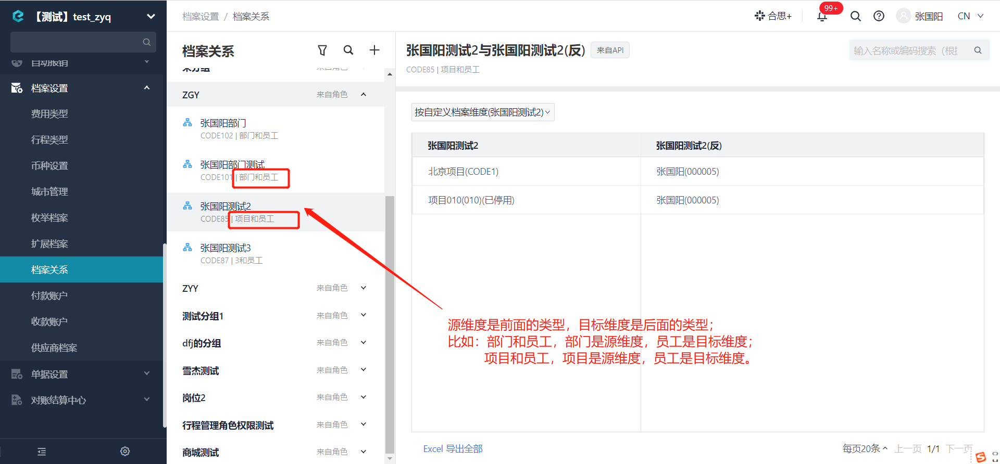

# 新增某档案关系下的档案项数据

import Control from "../../../components/Control";

<Control
method="POST"
url="/api/openapi/v2/recordLink/add/$`id`"
/>

## Path Parameters

| 名称 | 类型 | 描述 | 是否必填 | 默认值 | 备注 |
| :--- | :--- | :--- | :--- |:--- | :--- |
| **id** | String | 档案关系ID | 必填 | - | [获取企业下档案关系列表](/docs/open-api/recordLink/get-dimension-relation) | 

## Query Parameters

| 名称 | 类型 | 描述 | 是否必填 | 默认值 | 备注 |
| :--- | :--- | :--- | :--- |:--- | :--- |
| **accessToken** | String | 认证token | 必填 | - | [通过授权接口获取](/docs/open-api/getting-started/auth) |

## Body Parameters

| 名称 | 类型 | 描述 | 是否必填 | 默认值 | 备注 |
| :--- | :--- | :--- | :--- |:--- | :--- |
| **sourceValues**  | Array  | 源维度值	| 必填  | - | 源维度值 |
| **purposeValues** | Array  | 目标维度值	| 必填  | - | 目标维度值 |

:::tip
- 关于源维度值和目标维度值的区分：

:::

## CURL
```json
curl --location --request POST 'http://app.ekuaibao.com/api/openapi/v2/recordLink/add/$qyMbXMvgBgaU00?accessToken=73QbYDmzCc6I00' \
--header 'content-type: application/json' \
--header 'Accept: application/json' \
--data-raw '{
      "sourceValues": [   //例如 “项目和预算项”的档案关系，源维度值传“项目”分类下的项目id
            "ltAbQUtfE03k00:taxi","ltAbQUtfE03k00:communication"  
      ],
      "purposeValues": [  //例如 “项目和预算项”的档案关系，目标维度值传“预算项”分类下的预算项id
            "ltAbQUtfE03k00:dIEbu2mgTs6o00","ltAbQUtfE03k00:NU8bdZALSsts00"
      ]
}'
```

## 成功响应
```text
关系新增成功
```

## 失败响应
当sourceValue与purposeValue参数输入错误或者写反时，会报如下错误：
```json
{
    "errorCode": 412,
    "errorMessage": "没有可用的sourceValue与purposeValue！",
    "errorDetails": null,
    "code": null,
    "data": null
}
```

