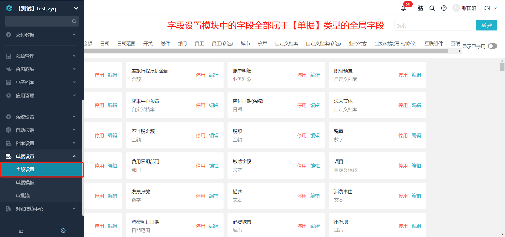
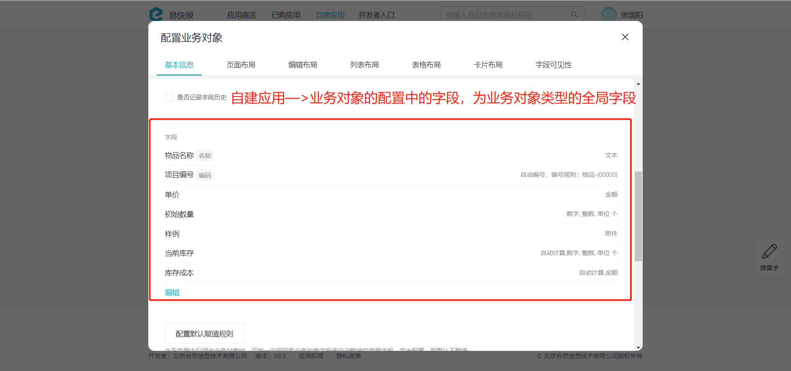
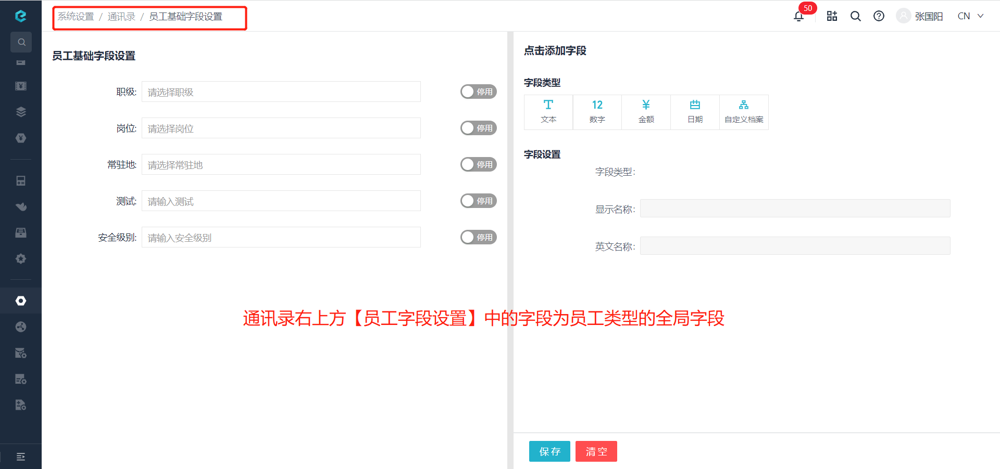

# 查询全局字段是否存在
根据传入的全局字段名称和全局字段类型，查询此名称是否被占用。

import Control from "@theme/Control";

<Control
method="GET"
url="/api/openapi/v1/property/checkProperty"
/>

## Query Parameters

| 名称 | 类型 | 描述 | 是否必填 | 默认值 | 备注 |
| :--- | :--- | :--- | :--- |:--- | :--- |
| **accessToken**  | String | 认证token  | 必填  | - | 通过 [获取授权](/docs/open-api/getting-started/auth) 获取 `accessToken` |
| **type**         | String | 全局字段类型 | 必填  | STAFF | `STAFF` : 所有类型<br/>`flow.FlowForm` : 单据<br/>`datalink.form` : 业务对象<br/>`dimension.form` : 自定义档案<br/>`staff.form` : 员工<br/>`department.form` : 部门 | 
| **propertyName** | String | 全局字段名称 | 必填  | - | 要查询的字段名称 |

:::tip
 - 目前系统中存在 **单据**、**业务对象**、**人员** 类型的全局字段页面，**自定义档案**、**部门** 类型的全局字段无系统页面。
 - **单据** 类型全局字段位置：
   
 - **业务对象** 类型全局字段位置：
   
 - **员工** 类型全局字段位置：
   
:::

## CURL
```shell
curl --location --request GET 'https://app.ekuaibao.com/api/openapi/v1/property/checkProperty?accessToken=ID_3xonnTw94KM:djg8LshfUkfM00&type=flow.FlowForm&propertyName=标题'
```

## 成功响应
`propertyName`（全局字段名称）在对应类型下 **已存在** 时，返回 `true`:
```json
{
   "value": true
}
```

`propertyName`（全局字段名称）在对应类型下 **不存在** 时，返回 `false`:
```json
{
   "value": false
}
```
## 失败响应

| HTTP状态码 | 错误码 | 描述 | 排查建议 |
| :--- | :--- | :--- | :--- |
| **412** | - | 请求参数不正确 | 请确认 `propertyName`（全局字段名称）是否正确 |
