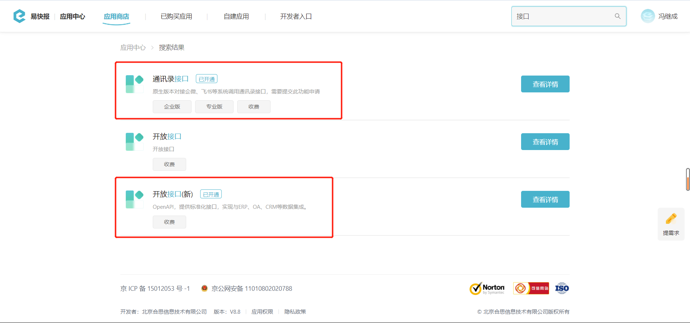

# 开始使用通讯录同步

---
## 概念
由于合思的轻应用（钉钉版、云之家版、企业微信版）已经接入了平台的通讯录，因此无法使用此接口。如果需要在这些平台的合思与自有系统之间同步通讯录数据，您可以使用平台（钉钉、云之家、企业微信）提供的通讯录同步接口。

:::danger
- **此套接口仅可用于合思独立版。**  
- 开通 **【通讯录接口】** 功能后，您将 **无法在合思界面上维护通讯录（新增部门和员工等）**，只能通过接口更新和删除。
:::

---
## 应用场景
通讯录同步接口用于将外部系统的员工、组织架构信息自动同步到合思，以便企业只需维护一套组织架构数据即可。  

---
## 使用前提
在使用这套接口之前，请确保企业已经开启了 【**开放接口(新)**】 与 【**通讯录接口**】 功能。   
您可以联系您的实施顾问来开通此功能，也可以拨打客服热线 **400-999-8293** 获取更多支持。
 

---