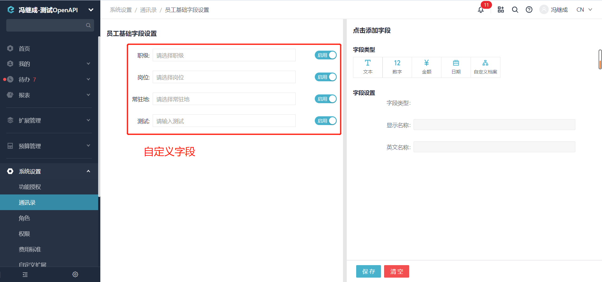
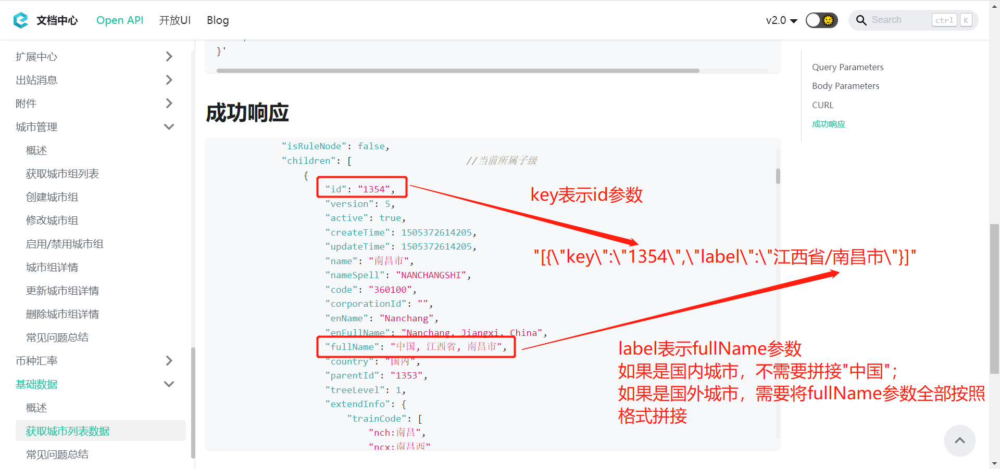

# 修改员工自定义字段(所有平台)

import Control from "@theme/Control";

<Control
method="PUT"
url="/api/openapi/v1/staffs/$`staffId`/customFields"
/>

## Path Parameters

| 名称 | 类型 | 描述 | 是否必填 | 默认值 | 备注 |
| :--- | :--- | :--- | :--- |:--- | :--- |
| **staffId** | String | 员工ID | 必填 | - | 可以通过[获取员工列表](/docs/open-api/corporation/get-all-staffs)获取 | 

## Query Parameters

| 名称 | 类型 | 描述 | 是否必填 | 默认值 | 备注 |
| :--- | :--- | :--- | :--- |:--- | :--- |
| **accessToken** | String | 认证token | 必填  | - | [通过授权接口获取](/docs/open-api/getting-started/auth) |

## Body Parameters

| 名称 | 类型 | 描述 | 是否必填 | 默认值 | 备注 |
| :--- | :--- | :--- | :--- |:--- | :--- |
| **rankType** | String | 职级	    | 非必填 | - | [获取自定义档案项](/docs/open-api/dimensions/get-dimension-items) |
| **postType** | String | 岗位	    | 非必填 | - | [获取自定义档案项](/docs/open-api/dimensions/get-dimension-items) |
| **base**     | String | 常驻地     | 非必填 | - | 参考格式 : "[{\"key\":\"8\",\"label\":\"北京市/海淀区\"}]" |
| **u_字段名**  | String | 自定义字段	| 非必填 | - | 自定义字段，格式为"u\_字段名"，例如 : u\_项目 |

:::tip
- 员工自定义字段为“员工基础字段设置”里面的字段。
  
- base参数拼接说明：<br/>
  通过**[获取城市列表数据](/docs/open-api/basedata/get-basedata-city)**接口获取数据后，找到对应城市，`id`对应`key`，`fullName`对应`label`。
  如果是国内城市吗，不需要拼接“中国”，如果是国外城市，需要将`fullName`参数全部按照格式拼接。
  
:::

## CURL
```json
curl --location --request PUT 'https://app.ekuaibao.com/api/openapi/v1/staffs/$djg8LshfUkfM00:ID_3kpneISgylw/customFields?accessToken=ID_3pp881GQaxM:djg8LshfUkfM00' \
--header 'Content-Type: application/json' \
--data-raw '{
    "rankType": "ID_3jO67GBsl3I",  //职级
    "postType": "ID_3pp9B5CUgPg",  //岗位
    "base": "[{\"key\":\"8\",\"label\":\"北京市/海淀区\"}]",//常驻地
    "u_测试": "测试修改"            //员工自定义字段
}'
```

## 成功响应
```json
{
    "value": {
        "id": "djg8LshfUkfM00:ID_3kpneISgylw",  //员工ID
        "name": "冯继成",                       //员工姓名
        "code": "",                             //员工工号
        "departments": [                        //所在部门
            "djg8LshfUkfM00"
        ],
        "defaultDepartment": "djg8LshfUkfM00",  //默认部门id
        "cellphone": "17600109458",             //手机号
        "active": true,                         //是否停用
        "userId": "ID_3kpneISgylw",             //第三方ID
        "email": "",                            //邮箱
        "external": false,                      //是否外部人员
        "note": null,                           //备注
        "staffCustomForm": {                    //员工自定义字段集合
            "rankType": "ID_3jO67GBsl3I",       //职级
            "postType": "ID_3pp9B5CUgPg",       //岗位
            "base": "[{\"key\":\"8\",\"label\":\"北京市/海淀区\"}]",  //常驻地
            "u_测试": "测试修改"                 //员工自定义字段
        }
    }
}
```

## 失败响应
```json
{
    "errorCode": 400,
    "errorMessage": "字段rankType不合法，没有找到对应的数据",
    "errorDetails": null,
    "code": null,
    "data": null
}
```