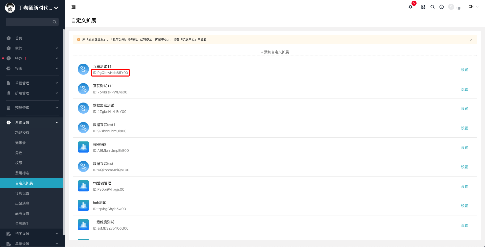
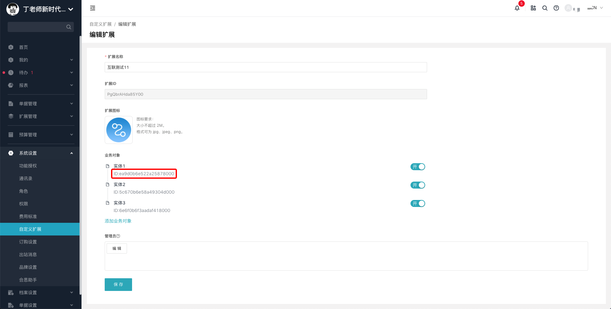
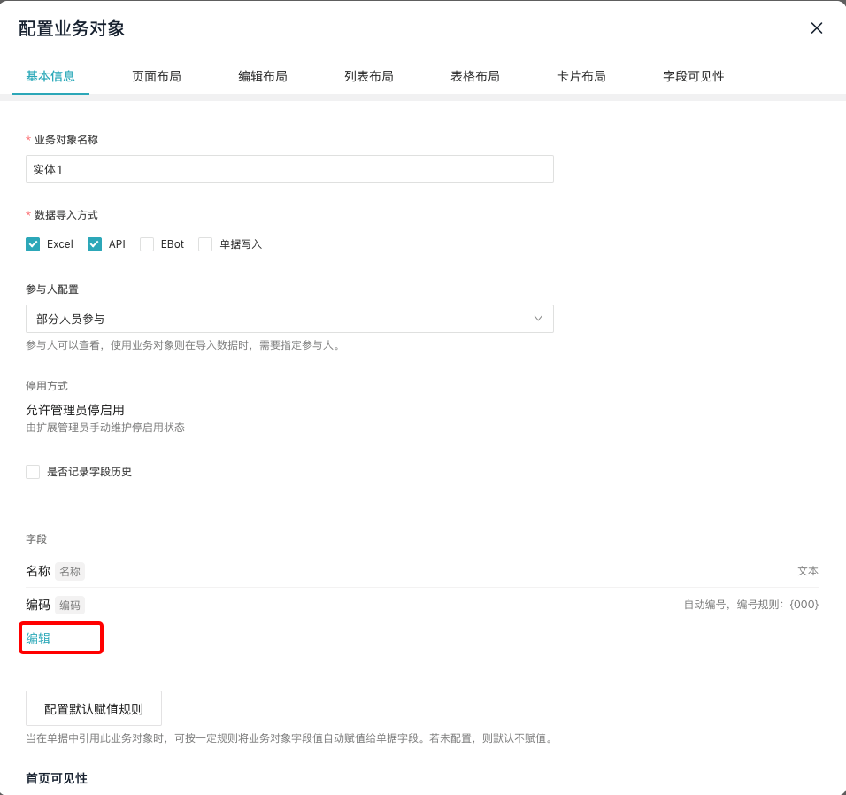
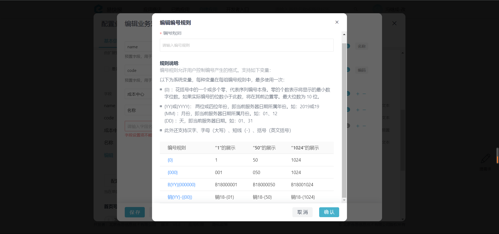
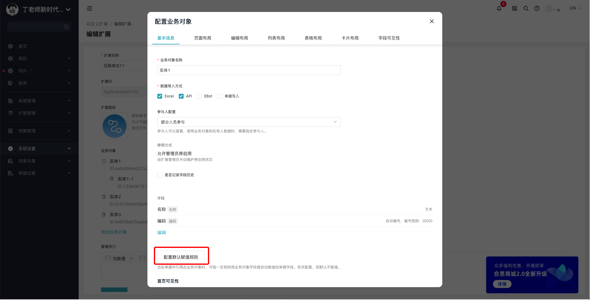
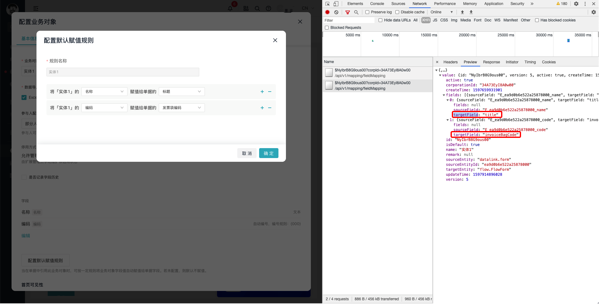

# 常见问题总结

---
## 问题一

Q：如何获取 `自定义扩展id` 或 `业务对象id` ？

A：`自定义扩展id` 可在易快报【系统设置】-【自定义扩展】页面查看（需管理员权限）。

点击具体某一扩展的配置，进入扩展详情页可查看 `业务对象id` （需管理员权限）。

---
## 问题二

Q：如何获取一个业务对象数据的详情？

A：目前暂不支持通过 `业务对象id` 获取其具体详情。

---
## 问题三

Q：编辑自定义扩展接口想要修改 `name` ，但是返回还是原来的值。

A：该接口目前只支持修改管理员，但是同时依然需要传 `name` 值。

---
## 问题四

Q：如何查看业务对象字段不同 `type` 的具体参数，比如自动编码?

A：【系统设置】-【自定义扩展】-【自定义扩展】设置 -【业务对象实体】配置 -【字段】编辑，然后添加“自动编码”类型的字段，点击查看编码规则。

---
## 问题五

Q：配置默认赋值规则时，如何获取目标字段值?

A：目前并不支持对外接口调用获取，可在易快报企业端对应页面通过操作返回数据查看 `targetField`。

---