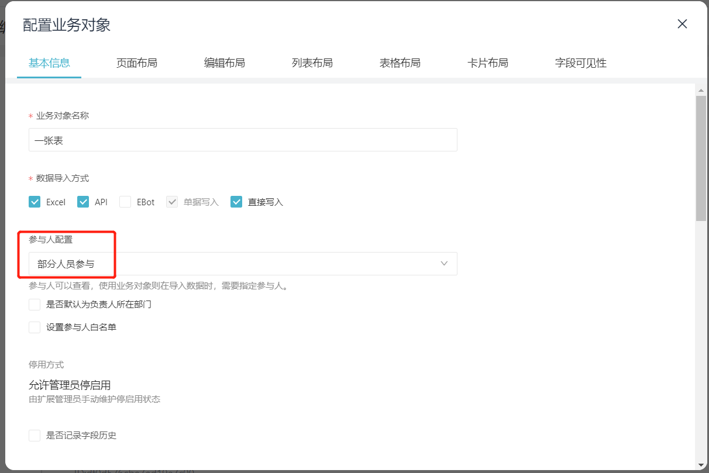

# 新增或更新业务对象数据
向指定业务对象添加或修改数据，以系统预制字段 `code` 为依据(业务对象下唯一)，不存在就新增数据，存在则更新数据。

import Control from "@theme/Control";

<Control
method="POST"
url="/api/openapi/v2/datalink/add"
/>

## Query Parameters

| 名称 | 类型 | 描述 | 是否必填 | 默认值 | 备注 |
| :--- | :--- | :--- | :--- |:--- | :--- |
| **accessToken** | String | 认证token | 必填 | - | [通过授权接口获取](/docs/open-api/getting-started/auth) |

## Body Parameters

| 名称 | 类型 | 描述 | 是否必填 | 默认值 | 备注 |
| :--- | :--- | :--- | :--- |:--- | :--- |
| **entityId**                                   | String  | 业务对象ID    | 必填   | -     | [业务对象ID获取](/docs/open-api/datalink/question-answer#问题一) |
| **importPart**                                 | Boolean | 是否部分导入   | 非必填 | false | 当有一条数据导入失败后，其他数据是否继续导入。<br/>**当导入附件时，此项必填为 `true`** |
| **dataLinks**                                  | Array   | 更新数据数组   | 必填  | -      | 要新增或修改的业务对象数据 |
| **&emsp; ∟ count**                             | Number  | 最大引用次数  | 非必填 | 0      | 限制引用次数时必填。若设置的值小于已引用次数，则易快报系统会自动修正到已引用次数  |
| **&emsp; ∟ disabled**                          | Boolean | 是否停用     | 非必填 | true   | `true` : 停用 &emsp; `false` : 启用|
| **&emsp; ∟ ownerId**                           | String  | 负责人ID     | 非必填 | -      | 值为[员工ID](/docs/open-api/corporation/get-all-staffs) |
| **&emsp; ∟ data**                              | Object  | 字段值       | 必填   | -     | 格式为 {字段名称 : 字段值}。 `字段名称` 是[获取业务对象](/docs/open-api/datalink/get-entity-list)返回值中 `fields` 里面的 `name` 值|
| **&emsp; ∟ visible**                           | Object  | 可见性       | 非必填 | -      | 业务对象”参与人配置“为”部分人员参与“时此参数才有效，为“全员参与”时此参数不生效 |
| **&emsp; &emsp; ∟ fullVisible**                | Boolean | 全员可见性    | 非必填 | false | `true` : 全部可见 &emsp; `false` : 指定员工可见 |
| **&emsp; &emsp; ∟ staffs**                     | Array   | 可见员工ID    | 非必填 | -     | 值为[员工ID](/docs/open-api/corporation/get-all-staffs) |
| **&emsp; &emsp; ∟ roles**                      | Array   | 可见角色ID    | 非必填 | -     | 值为[角色ID](/docs/open-api/corporation/get-roles-group) |
| **&emsp; &emsp; ∟ departments**                | Array   | 可见部门ID    | 非必填 | -     | 值为[部门ID](/docs/open-api/corporation/get-departments) |
| **&emsp; &emsp; ∟ departmentsIncludeChildren** | Boolean | 子部门是否可见 | 非必填 | true   | `true` : 可见 &emsp; `false` : 不可见 |

:::caution
- `dataLinks.data` 中的 `code` 字段值为必填字段，新增数据时，如果code设置为 `自动编号`，传 `""` 即可，如果为 `文本` 类型，表示手动传入编号，不可为空。
- 更新业务对象实例数据时，`dataLinks.data` 中不传的字段，表示清空该字段的值，要格外注意。
- `dataLinks.visible` 参数需要配合业务对象”参与人配置“一起使用，只有”部分人员参与“时此参数才有效。

  
- 业务对象字段问题：业务对象增加一个字段，例如“姓名”，保存后删除这个字段，再保存后增加“姓名”字段，系统中实际字段名自动编号+1，这种字段新增和更新数据时要注意。

  
- 若需要关联其他业务对象、自定义档案等，传其对应 `id` 即可。
:::

## 各类型字段值示例
```text
- 文本 - "数据1"
- 日期 - "1528276414283"
- 日期范围 - "1528276414283-1528276414283"
- 数字 - "1.2234"
- 金额 - "12.35"
- 开关 - true
- 附件（转义后的json格式字符串，多个附件时用 ";" 分隔）:
  "{\"key\": \"openapib9e51730-f778-4b81-b108-d6ca27d44ad9-登录密码.txt\", \"fileId\": \"zEIb-kGNMsoc00\", \"fileName\": \"登录密码.txt\"}"
- 人员（人员多选类型，多个人时用","分隔）:
  "Urf3lsFgBp00gw:Msy3lYjbQ103KM,Urf3lsFgBp00gw:mRI3oQU9lg02q0,Urf3lsFgBp00gw:Fmd3oQU9lg00q0"
```

## CURL
根据业务对象的 `数据权限`、`停用方式` 配置不同，所需Body Parameters的数据结构略有差异，请根据配置选择合适的示例。


import Tabs from '@theme/Tabs';
import TabItem from '@theme/TabItem';

<Tabs>
<TabItem value="全员可见&限制次数" label="全员可见&限制次数" default>

```json
curl --location --request POST 'https://app.ekuaibao.com/api/openapi/v2/datalink/add?accessToken=cxEbrzNJSA3A00' \
--header 'Content-Type: application/json' \
--data-raw '{
    "entityId": "ea9d0b6e522a25878000",
    "dataLinks": [
        {
            "count": 1,              //限制引用次数 1
            "visible":{              //业务对象”参与人配置“为”部分人员参与“时此参数才有效，否则此参数设置不生效
                "fullVisible":true,  //全员可见，为true时，下面4个参数配置无效
                "staffs":[],         //可见员工ID
                "roles":[],          //可见角色ID
                "departments":[],    //可见部门ID
                "departmentsIncludeChildren":true  //子部门是否可见
            },
            "disabled":false,        //true:停用 false:启用
            "ownerId":"",            //负责人ID
            "data": {
                "E_ea9d0b6e522a25878000_name":"数据名称1",
                "E_ea9d0b6e522a25878000_code":"1",  	//唯一ID
                "E_ea9d0b6e522a25878000_文本":"文本1",
                "E_ea9d0b6e522a25878000_日期":"1529393393795",
                "E_ea9d0b6e522a25878000_日期范围":"1476921600000-1529393393795",
                "E_ea9d0b6e522a25878000_小数":"2.03",
                "E_ea9d0b6e522a25878000_整数":"3",
                "E_ea9d0b6e522a25878000_金额":"10",
                "E_ea9d0b6e522a25878000_开关":false,
                "E_ea9d0b6e522a25878000_账号":"pko998ovFMe800",      //银行账号唯一ID
                "E_ea9d0b6e522a25878000_业务对象":"dgs9fzle3A1I00",  //关联业务实体对象ID
                "E_ea9d0b6e522a25878000_自定义档案":"6S49gt6c5E0w00" //关联自定义档案ID
            }
        }
    ]
}'

```
</TabItem>
<TabItem value="全员可见&管理员停启用" label="全员可见&管理员停启用">

```json
curl --location --request POST 'https://app.ekuaibao.com/api/openapi/v2/datalink/add?accessToken=cxEbrzNJSA3A00' \
--header 'Content-Type: application/json' \
--data-raw '{
    "entityId": "ea9d0b6e522a25878000",
    "dataLinks": [
        {
            "visible":{               //业务对象”参与人配置“为”部分人员参与“时此参数才有效，否则此参数设置不生效
                "fullVisible":true,   //全员可见，为true时，下面4个参数配置无效
                "staffs":[],          //可见员工ID
                "roles":[],           //可见角色ID
                "departments":[],     //可见部门ID
                "departmentsIncludeChildren":true  //子部门是否可见
            },
            "disabled": false,                           //true:停用 false:启用
            "ownerId":"Urf3lsFgBp00gw:Fmd3oQU9lg00q0",   //负责人ID，设置可以停启用此数据的人员
            "data": {
                "E_ea9d0b6e522a25878000_name":"数据名称1",
                "E_ea9d0b6e522a25878000_code":"1",	     //唯一ID
                "E_ea9d0b6e522a25878000_文本":"文本1",
                "E_ea9d0b6e522a25878000_日期":"1529393393795",
                "E_ea9d0b6e522a25878000_日期范围":"1476921600000-1529393393795",
                "E_ea9d0b6e522a25878000_小数":"2.03",
                "E_ea9d0b6e522a25878000_整数":"3",
                "E_ea9d0b6e522a25878000_金额":"10",
                "E_ea9d0b6e522a25878000_开关":false,
                "E_ea9d0b6e522a25878000_账号":"pko998ovFMe800",        //银行账号唯一ID
                "E_ea9d0b6e522a25878000_业务对象":"dgs9fzle3A1I00",    //关联业务实体对象ID
                "E_ea9d0b6e522a25878000_自定义档案":"6S49gt6c5E0w00"   //关联自定义档案ID
            }
        }
    ]
}'
```
</TabItem>
<TabItem value="部分可见&限制次数" label="部分可见&限制次数">

```json
curl --location --request POST 'https://app.ekuaibao.com/api/openapi/v2/datalink/add?accessToken=cxEbrzNJSA3A00' \
--header 'Content-Type: application/json' \
--data-raw '{
    "entityId": "ea9d0b6e522a25878000",
    "dataLinks": [
        {
            "count": 1,                //限制引用次数 1
            "visible":{                //业务对象”参与人配置“为”部分人员参与“时此参数才有效，否则此参数设置不生效
                "fullVisible":false,   //部分可见，为false时，下面4个参数配置才有效
                "staffs":["Urf3lsFgBp00gw:Fmd3oQU9lg00q0","Urf3lsFgBp00gw:AvT3lntT8zzpWw"],  //可见员工ID
                "roles":[],                        //可见角色ID
                "departments":[],                  //可见部门ID
                "departmentsIncludeChildren":true  //子部门是否可见
            },
            "disabled":false,                      //true:停用 false:启用
            "ownerId":"",                          //负责人ID
            "data": {
                "E_ea9d0b6e522a25878000_name":"数据名称1",
                "E_ea9d0b6e522a25878000_code":"1",	//唯一ID
                "E_ea9d0b6e522a25878000_文本":"文本1",
                "E_ea9d0b6e522a25878000_日期":"1529393393795",
                "E_ea9d0b6e522a25878000_日期范围":"1476921600000-1529393393795",
                "E_ea9d0b6e522a25878000_小数":"2.03",
                "E_ea9d0b6e522a25878000_整数":"3",
                "E_ea9d0b6e522a25878000_金额":"10",
                "E_ea9d0b6e522a25878000_开关":false,
                "E_ea9d0b6e522a25878000_账号":"pko998ovFMe800",       //银行账号唯一ID
                "E_ea9d0b6e522a25878000_业务对象":"dgs9fzle3A1I00",   //关联业务实体对象ID
                "E_ea9d0b6e522a25878000_自定义档案":"6S49gt6c5E0w00"  //关联自定义档案ID
            }
        }
    ]
}'
```
</TabItem>
<TabItem value="部分可见&管理员停启用" label="部分可见&管理员停启用">

```json
curl --location --request POST 'https://app.ekuaibao.com/api/openapi/v2/datalink/add?accessToken=cxEbrzNJSA3A00' \
--header 'Content-Type: application/json' \
--data-raw '{
    "entityId": "ea9d0b6e522a25878000",
    "dataLinks": [
        {
            "visible":{                   //业务对象”参与人配置“为”部分人员参与“时此参数才有效，否则此参数设置不生效
                "fullVisible":false,      //部分可见，为false时，下面4个参数配置才有效
                "staffs":["Urf3lsFgBp00gw:Fmd3oQU9lg00q0","Urf3lsFgBp00gw:AvT3lntT8zzpWw"],  //可见员工ID
                "roles":[],                        //可见角色ID
                "departments":[],                  //可见部门ID
                "departmentsIncludeChildren":true  //子部门是否可见
            },
            "disabled":false,                           //true:停用 false:启用
            "ownerId":"Urf3lsFgBp00gw:Fmd3oQU9lg00q0",  //负责人ID,设置可以停启用此数据的人员
            "data": {
                "E_ea9d0b6e522a25878000_name":"数据名称1",
                "E_ea9d0b6e522a25878000_code":"1",	    //唯一ID
                "E_ea9d0b6e522a25878000_文本":"文本1",
                "E_ea9d0b6e522a25878000_日期":"1529393393795",
                "E_ea9d0b6e522a25878000_日期范围":"1476921600000-1529393393795",
                "E_ea9d0b6e522a25878000_小数":"2.03",
                "E_ea9d0b6e522a25878000_整数":"3",
                "E_ea9d0b6e522a25878000_金额":"10",
                "E_ea9d0b6e522a25878000_开关":false,
                "E_ea9d0b6e522a25878000_账号":"pko998ovFMe800",        //银行账号唯一ID
                "E_ea9d0b6e522a25878000_业务对象":"dgs9fzle3A1I00",    //关联业务实体对象ID
                "E_ea9d0b6e522a25878000_自定义档案":"6S49gt6c5E0w00"   //关联自定义档案ID
            }
        }
    ]
}'
```
</TabItem>
</Tabs>

## 成功响应
```json
{
    "value": {
        "errorMsg": [
          "第1条数据导入成功"
        ],
        "dataLinkIds": {
            "004": "cagbsyR13Qok00"  //key表示code，value表示id
        },
        "success": true
    }
}
```

## 失败响应

当 `dataLinks.data` 中的 `code` 字段值为 `文本` 类型，且传 `""` 时返回如下响应：
```json
{
    "value": {
        "errorMsg": [
            "第1条[编码]数据格式不正确,必填，不能为空"
        ],
        "dataLinkIds": {},
        "success": false
    }
}
```

当 `importPart` 并未设置或设置为 `false` 时，若导入过程中有数据导入失败，则后续数据停止导入并返回如下：
```json
{
    "value": {
        "errorMsg": [
            "第1条[编码]数据不正确"
        ],
        "dataLinkIds": {},
        "success": false
    }
}
```

当 `importPart` 设置为 `true` 时，即使有数据导入失败，其他数据依然会继续导入并返回如下：
```json
{
    "value": {
        "errorMsg": [
            "第1条[编码]数据不正确",
            "第2条数据导入成功"
        ],
        "dataLinkIds": {   //导入成功的数据列表
            "068": "yXUbszrwDg1Y00"
        },
        "success": false
    }
}
```


    
