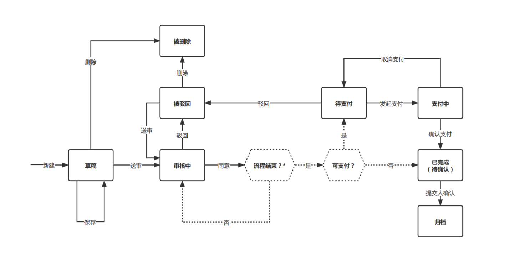
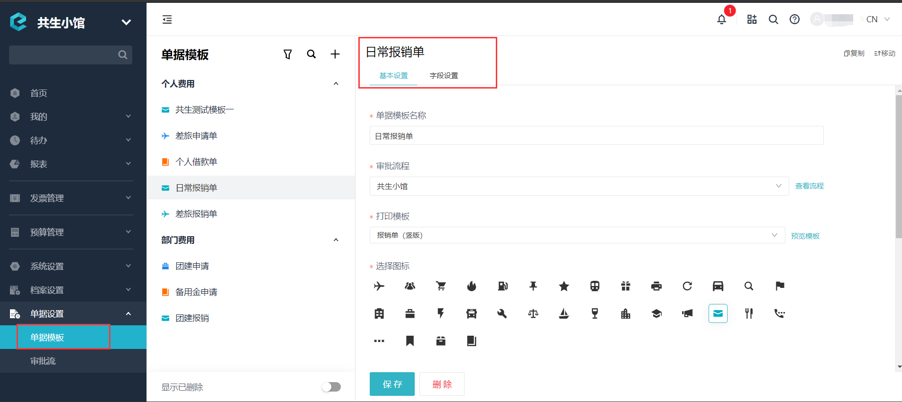
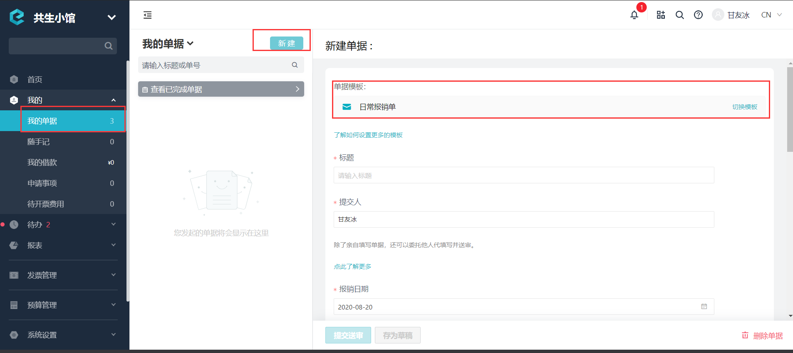
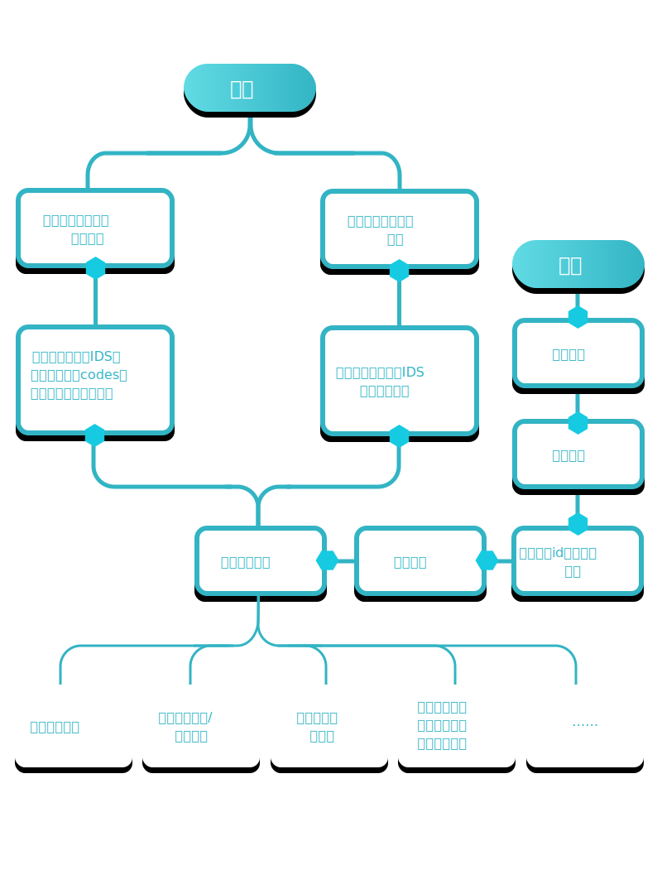

# 开始使用单据

---
## 概念

单据是合思系统中业务的发起者或触发器。

---
### 1）对于单据有两个视角

- 配置视角：操作的是单据模板。即企业管理员配置单据模板、设置单据行为。
- 应用视角：操作的是单据实例。即员工编辑单据、审批人审批单据、出纳支付单据。

---

### 2）单据模板的产生过程

- 合思将不同单据能力与组件组成基础模板，单据实例通过单据模板生成。
- 用户（企业管理员）以基础模板为原型，制作单据模板。

下图为单据的创建具体页面。

---

## 创建单据流程图

## 使用前提
在使用单据相关接口前，请确保您的企业已经开启了 **【开放接口（新）】** 与 **【单据审批】** 功能。

您可以联系您的实施顾问来开通此功能，也可以拨打客服热线 **400-999-8293** 获取更多支持。

---

