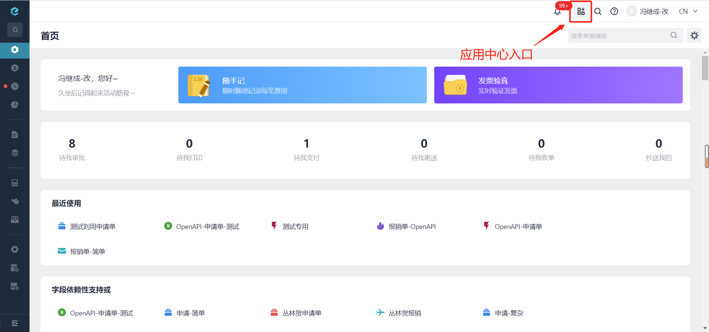
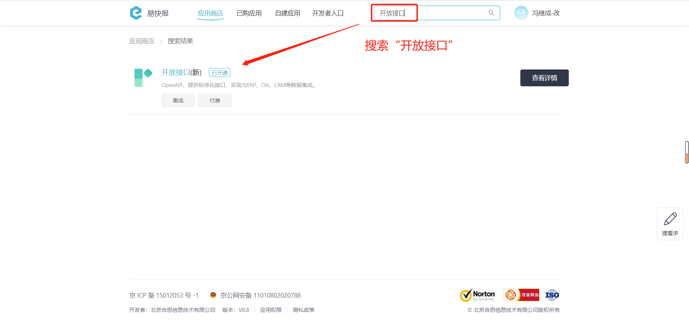
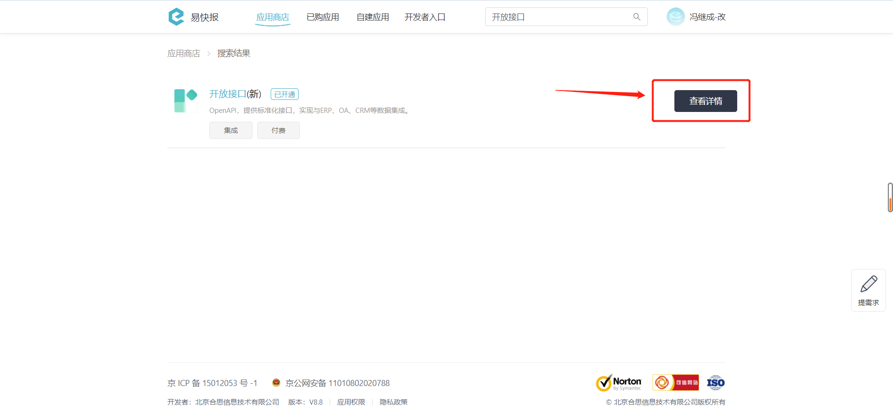
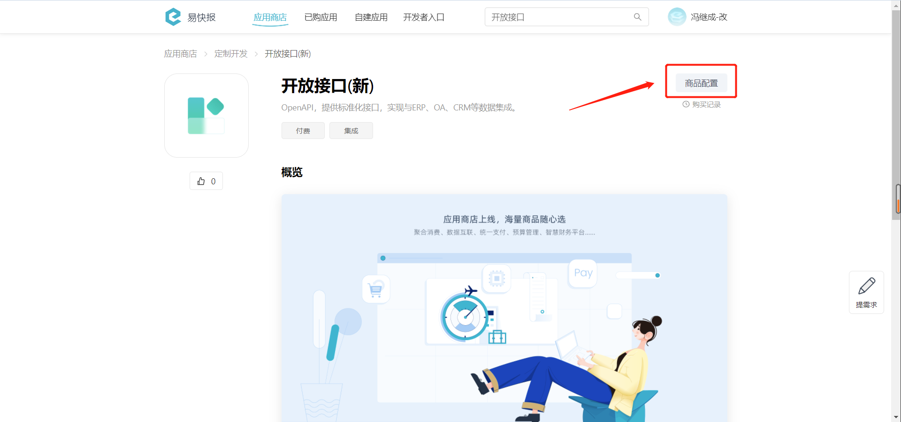
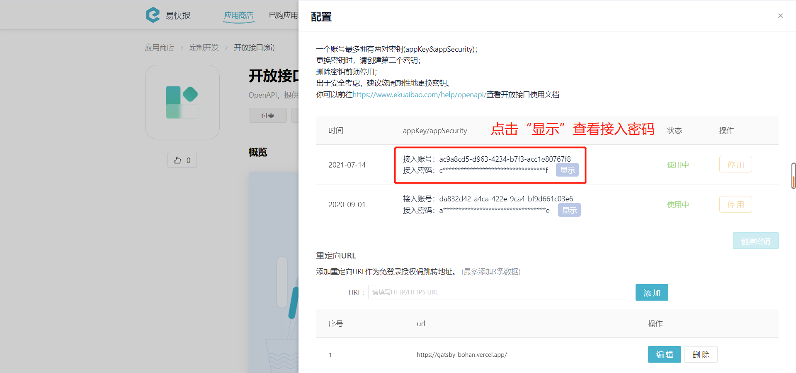
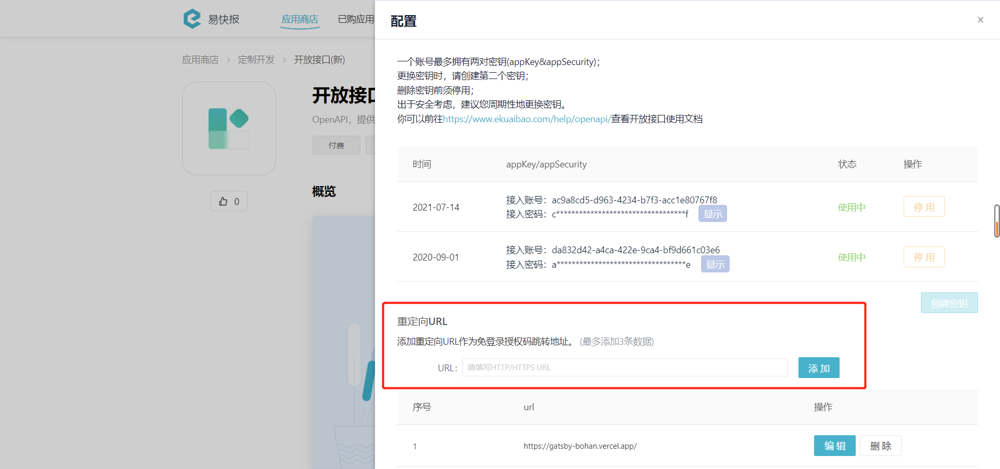

# 常见问题总结

---
## 问题一
### Q: [获取授权](/docs/open-api/getting-started/auth)时如何获取接入账号和密码？

A：需要进入【合思】-【应用中心】-【开放接口(新)】，然后创建或查看密钥。具体操作步骤如下： 

#### （1）应用中心入口

#### （2）搜索“开放接口”

#### （3）点击查看详情

#### （4）点击商品配置，查看接入账号和密码

---

## 问题二

### Q：通过[访问临时授权](/docs/open-api/getting-started/temp-auth)接口取得的地址，跳转失败，显示 “404 Not Found” 或者一直处于加载状态。

A：请查看接口各个参数是否配置正确。`expireDate` 是否过短，造成访问时已超过使用期限。该参数最大可传604800秒，可根据实际需求调整。另外可以指定 `overdueTokenRedirect`，以防授权过期时重定向到指定页面。

---

## 问题三

### Q：【开放接口(新)】页面下的【重定向URL】是做什么用的？

A：此处设置的重定向URL为所有跳转链接的前站，一般为二开地址。支持添加多个链接，上限为3个，添加后的链接展示在输入框下方，支持重新编辑或删除。 
- 若企业设置了重定向URL则该企业用户每次点击站内所有可跳转链接时，将访问二开固定地址进行跳转授权。
- 如企业没有设置重定向URL则所有跳转链接均不需加工，直接跳转。

---
