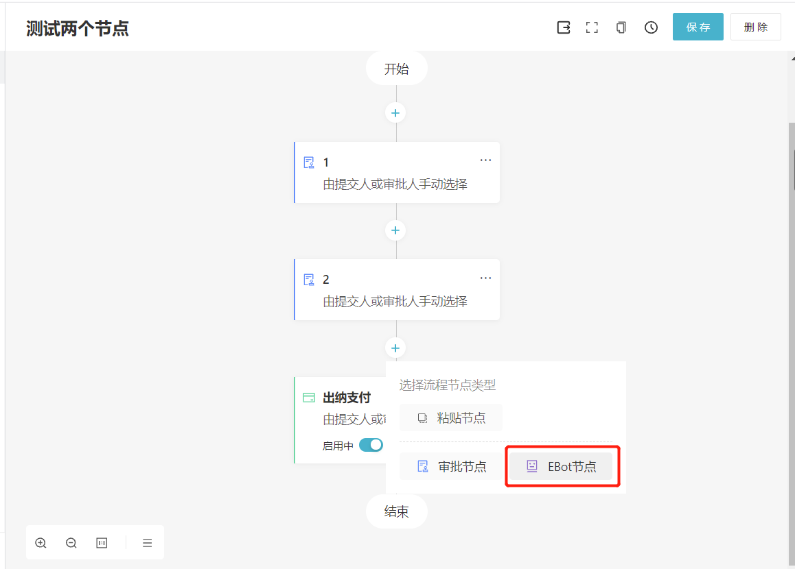
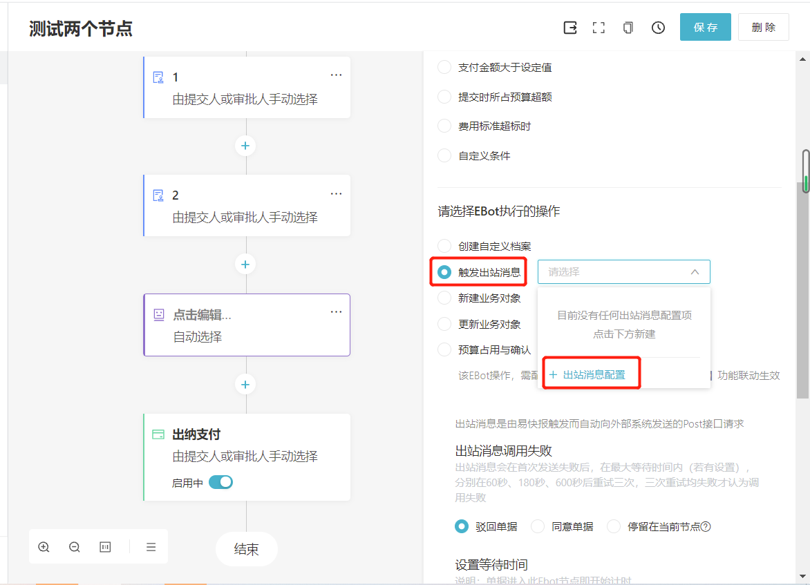
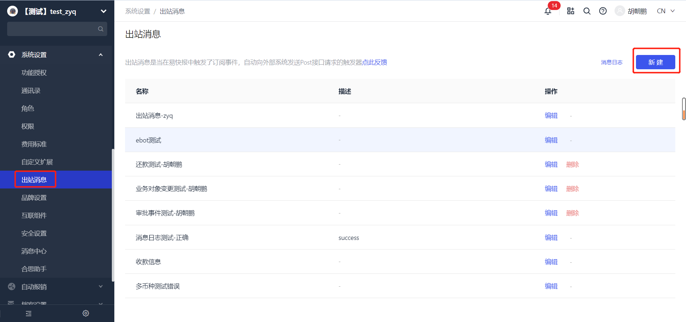

# 概述

---
## 概念
出站消息是由“合思”触发，并且自动向外部系统发送的Post接口请求，用于解决“合思”与外部系统(如OA系统)的自动对接。 
当前出站消息支持【Ebot节点触发】、【单据流转时触发】、【业务对象数据变更触发】、【还款事件触发】四种类型。

:::tip
- 出站消息受到charge控制。如果是通过Ebot触发，则需要配合Ebot charge同时开通使用。
- 如果出站消息charge授权关闭：
  - 无法新建出站消息；
  - EBot上无法继续配置出站消息；
  - 已经配置好的出站消息不受影响。
:::

---
## 使用前提
在使用出站消息接口前，请确保您的企业已经开启了 `出站消息` 与 `E-Bot` 功能。

您可以联系您的实施顾问来开通此功能，也可以拨打客服热线 `400-999-8293` 获取更多支持。

---
## 使用场景
### 1.如何在Ebot节点添加“出站消息”？

（1）在企业管理的后台配置审批流时，添加"Ebot节点"。

（2）点击编辑节点，选择Ebot执行的操作为"触发出站消息"。 
（3）在下拉框中选择"出站消息配置"，进行配置。

---
### 2.如何在单据流转时添加“出站消息”？

管理员可在"系统设置-出站消息"下，选择不同的通知类型触发消息。

注意：通知类出站消息支持更多字段类型，请在'配置出站消息'中查看。

---

