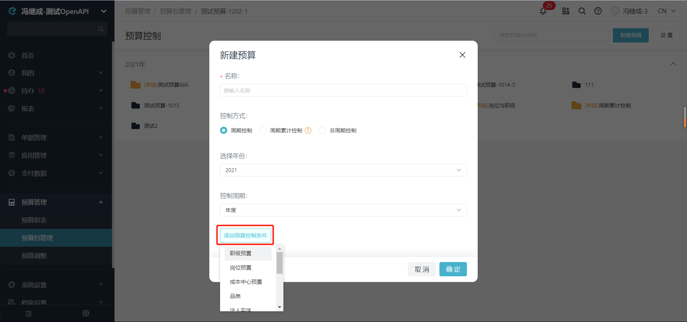
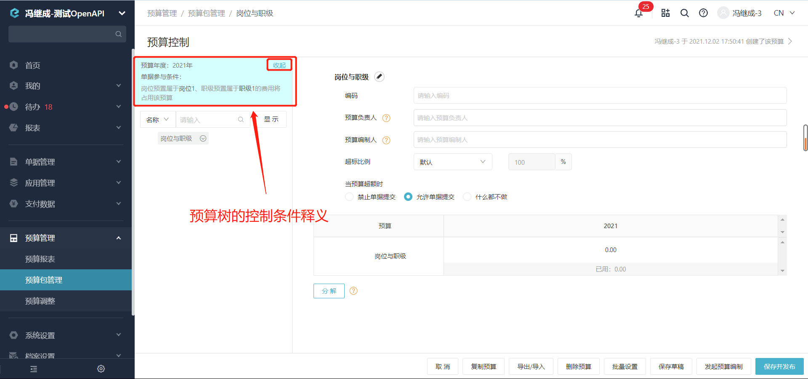

# 新增预算包

import Control from "@theme/Control";

<Control
method="POST"
url="/api/openapi/v2.1/budgets/create"
/>

<details>
  <summary><b>更新日志</b></summary>
  <div>

  [**1.8.0**](/docs/open-api/notice/update-log#180) -> 🐞 修复了新增预算包同一层级节点是不同的自定义档案维度时可以调用成功的BUG。<br/>
  [**1.5.0**](/docs/open-api/notice/update-log#150) -> 🚀 接口升级 `v2.1` 版本，新增 `type` 类型参数，支持 `id` 或 `code` 传参。<br/>

  </div>
</details>

## Query Parameters

| 名称 | 类型 | 描述 | 是否必填 | 默认值 | 备注 |
| :--- | :--- | :--- | :--- |:--- | :--- |
| **accessToken** | String | 认证token | 必填 | - | 通过 [获取授权](/docs/open-api/getting-started/auth) 获取 `accessToken` |
| **type**        | String | 参数类型   | 非必填 | id | `id` : 传id值 &emsp; `code` : 传code值<br/>**请保证 `code` 唯一，『员工』和『部门』的 `code` 在系统上允许为空和重复** |

## Body Parameters

| 名称 | 类型 | 描述 | 是否必填 | 默认值 | 备注 |
| :--- | :--- | :--- | :--- |:--- | :--- |
|**budgetInfo**                     | Object  | 预算包信息               | 必填   | - | 预算包信息 |
|**&emsp; ∟ active**               | Boolean | 是否激活                 | 必填   | false | `true` : 发布 &emsp; `false` : 草稿 | 
|**&emsp; ∟ name**                 | String  | 预算包名称               | 必填   | - | 预算包名称 | 
|**&emsp; ∟ corporationId**        | String  | 企业ID                  | 必填   | - | [企业ID如何获取](/docs/open-api/getting-started/origin#query-parameters) | 
|**&emsp; ∟ isCustom**             | Boolean | 是否自定义区间            | 必填   | false | `true` : 自定义时间区间（需要 `period（控制周期）`= `null` ）<br/> `false` : 周期控制，周期累计控制均为 **false** | 
|**&emsp; ∟ isRollCalc**           | Boolean | 是否滚动预算             | 必填   | false | `true` : 周期累计控制 &emsp; `false` : 周期控制 | 
|**&emsp; ∟ period**               | Object  | 预算年度                | 必填   | - | 预算年度 | 
|**&emsp; &emsp; ∟ annual**        | String  | 年份                   | 必填   | - | 例如 : 2022 | 
|**&emsp; &emsp; ∟ period**        | String  | 控制周期                | 必填   | - | 年度内分割方式：<br/> `YEAR` : 年度<br/>`HALF_YEAR` : 半年度<br/>`SEASON` : 季度<br/> `MONTH` : 月度<br/>`null` : 非周期控制 | 
|**&emsp; &emsp; ∟ startTime**     | Long    | 非周期控制开始时间        | 非必填 | - | 毫秒级时间戳，是否自定义区间参数：<br/> `isCustom` = `true` 时必填，`isCustom` = `false` 时传 `null` | 
|**&emsp; &emsp; ∟ endTime**       | Long    | 非周期控制结束时间        | 非必填 | - | 毫秒级时间戳，是否自定义区间参数：<br/> `isCustom` = `true` 时必填，`isCustom` = `false` 时传 `null` | 
|**addNodes**                       | Array   | 追加节点信息            | 必填   | - | 添加预算包下子预算项 | 
|**&emsp; ∟ id**                   | String  | 预算节点ID              | 必填   | - | 不重复的唯一ID，例如：可用毫秒级时间戳作为节点ID | 
|**&emsp; ∟ code**                 | String  | 节点编码                | 必填   | - | 可传 `""`，**长度不能超过20个字符** | 
|**&emsp; ∟ content**              | Array   | 节点维度                | 必填   | - | 预算分解依据，例如根据"费用类型"、"部门"分解<br/>**只有根节点允许有多个维度，其他子级节点有且仅有一个维度信息** | 
|**&emsp; &emsp; ∟ dimensionType** | String  | 维度种类                | 必填   | - | `DEPART` : 费用承担部门<br/>`PROJECT` : 扩展档案<br/>`FEE_TYPE` : 费用类型<br/>`STAFF` : 员工 | 
|**&emsp; &emsp; ∟ dimensionId**   | String  | 维度种类的标识ID         | 必填   | - | 参数为冒号之后的部分：<br/>DEPART : `expenseDepartment`<br/>FEE_TYPE : `feeTypeId`<br/>PROJECT : 通过 [获取全局字段列表](/docs/open-api/forms/get-customs-param) 获取，见下方 **TIP**<br/>STAFF : `submitterId` | 
|**&emsp; &emsp; ∟ mustLeaf**      | Boolean | 维度是否必定为叶子节点(本部) | 必填   | false | `true` : 非本级 &emsp; `false` : 本级<br/>[什么是“维度是否必定为叶子节点(本部)”？](/docs/open-api/budget/question-answer#问题一) | 
|**&emsp; &emsp; ∟ contentId**     | String  | 维度内容ID              | 必填   | - | 对应维度种类下实例项的 **ID** 或 **CODE**，**与 `type` 参数保持一致**<br/>例如：部门维度就是 **部门ID/CODE**，扩展档案维度就是 **档案项ID/CODE** | 
|**&emsp; ∟ moneys**               | Array   | 节点金额信息             | 必填   | - | 子预算项对应的预算金额 | 
|**&emsp; &emsp; ∟ budgetMoney**   | String  | 预算金额                | 必填   | - | [周期](/docs/open-api/budget/question-answer#问题二) 预算金额，非最末级节点传 `null` 即可，由系统自动累加此维度下子预算额度求和 | 
|**&emsp; &emsp; ∟ nodeId**        | String  | 预算节点ID              | 必填   | - | 与上面预算节点ID保持一致，即一个预算节点下包含 **节点信息** 和 **预算金额** 两部分属性 | 
|**&emsp; &emsp; ∟ periodTime**    | String  | 第几个周期               | 必填   | - | 年度和自定义区间: `1`<br/>半年度: `1`、`2`<br/>季度: `1`、`2`、`3`、`4`<br/>月度: `1~12`<br/>根据控制周期类型填写，例如：预算包控制周期是 **季度** 类型，每个子预算节点的 `moneys` 数组数据，就包含4个对象，表示每个季度对应的预算金额 | 
|**&emsp; ∟ overControllerRate**   | String  | 超标比例                | 非必填  | 100 | 预算超标比例（百分比），`1` ≤ 传参 ≤ `1000` | 
|**&emsp; ∟ control**              | String  | 节点控制方式             | 必填   | ALLOW | 当预算超额时的控制方式<br/> `ALLOW` : 允许单据提交，并显示警告<br/>`FORBID` : 禁止提交单据<br/>`IGNORED` : 允许单据提交，不显示警告 | 
|**&emsp; ∟ nodeId**               | String  | 预算节点ID              | 必填   | - | 与上面预算节点ID保持一致 | 
|**&emsp; ∟ parentId**             | String  | 父节点ID                | 非必填 | - | 父节点ID，传 `""` 表示根节点 | 
|**visibilities**                   | Array   | 节点负责人              | 非必填 | - | 负责人能在相关报销单和预算报表中查看该预算节点的进度 |
|**&emsp; ∟ nodeId**               | String  | 预算节点ID              | 非必填 | - | 与上面预算节点ID保持一致 |
|**&emsp; ∟ staffIds**             | Array   | 员工ID                 | 非必填 | - | **员工ID** 或 **CODE**，**与 `type` 参数保持一致**<br/>通过 [获取员工列表](/docs/open-api/corporation/get-all-staffs) 获取 |
|**&emsp; ∟ roleDefIds**           | Array   | 角色ID                 | 非必填 | - | **角色ID** 或 [CODE](/docs/open-api/corporation/question-answer#问题三)，**与 `type` 参数保持一致**<br/>通过 [查询角色组和角色](/docs/open-api/corporation/get-roles-group) 获取 |
|**editInChargers**                 | Array   | 预算编制负责人           | 非必填 | - | 负责该节点的预算编制，如不填写则默认与上级节点相同<br/>需开通【**预算编制**】功能方可见此字段 |
|**&emsp; ∟ nodeId**               | String  | 预算节点ID              | 非必填 | - | 与上面预算节点ID保持一致 |
|**&emsp; ∟ staffIds**             | Array   | 员工ID                 | 非必填 | - | **员工ID** 或 **CODE**，**与 `type` 参数保持一致**<br/>通过 [获取员工列表](/docs/open-api/corporation/get-all-staffs) 获取 |
|**&emsp; ∟ roleDefIds**           | Array   | 角色ID                 | 非必填 | - | **角色ID** 或 [CODE](/docs/open-api/corporation/question-answer#问题三)，**与 `type` 参数保持一致**<br/>通过 [查询角色组和角色](/docs/open-api/corporation/get-roles-group) 获取 |
|**version**                       | Long    | 预算包版本               | 非必填 | 1 | 不填写此参数默认为 `1` |

:::tip
 - **节点维度** 如下图所示，是预算节点的划分依据<br/>
 &emsp; `dimensionType（维度种类）` 传参见参数介绍，四种类型固定；<br/>
 &emsp; `dimensionId（维度种类的标识ID）` 传参为对应维度种类的 [全局字段名称](/docs/open-api/forms/get-customs-param)；例如：<br/>
 &emsp; &emsp; - 职级预置 : `E_system_rank` <br/>
 &emsp; &emsp; - 岗位预置 : `E_system_post` <br/>
 &emsp; &emsp; - 成本中心预置 : `E_system_costcenter `<br/>
 &emsp; &emsp; - 品类 : `品类` <br/>
 &emsp; &emsp; - 法人实体 : `法人实体` <br/>
 &emsp; &emsp; - 项目 : `项目` <br/>
 &emsp; &emsp; - 提交人 : `submitterId` <br/>
 &emsp; &emsp; - 费用承担部门 : `expenseDepartment` <br/>
 &emsp; &emsp; - 费用类型 : `feeTypeId` <br/>
 &emsp; &emsp; - 自建的扩展档案字段，例如“国家”，传参为 `u_国家` <br/>

  

 - 如果只是创建预算包，不增加预算节点 `addNodes` 对象参数可不传，系统自动创建预算包根节点。
 - 系统中新建预算时 **“添加预算控制条件”** 表示预算包根节点的节点维度信息。**示例见请求CURL**。

 

 
:::

## CURL
import Tabs from '@theme/Tabs';
import TabItem from '@theme/TabItem';

<Tabs>
<TabItem value="id" label="id" default>

```json
curl --location --request POST 'https://app.ekuaibao.com/api/openapi/v2.1/budgets/create?accessToken=ID_3D$9pAVgeG0:bwa3wajigF0WH0' \
--header 'Content-Type: application/json' \
--data-raw '{
    "budgetInfo": {                         //预算包信息
        "active": true,                     //是否激活 true : 发布  false : 草稿
        "name": "测试预算-1",               //预算包名称
        "corporationId": "bwa3wajigF0WH0",  //企业ID
        "isCustom": false,                  //是否自定义区间 true : 自定义时间区间（需要 period（控制周期）= null ） false : 周期控制，周期累计控制均为 false
        "isRollCalc": false,                //是否滚动预算  true : 周期累计控制   false : 周期控制
        "period": {                         //预算年度 
            "annual": "2022",               //控制年度
            "period": "SEASON",             //年度内分割方式，SEASON: 按季度, MONTH: 按月份, HALF_YEAR: 半年, YEAR: 整年, null: 非周期控制。
            "startTime": null,              //非周期控制开始时间
            "endTime": null                 //非周期控制结束时间
        }
    },
    "addNodes": [                //追加节点
        {
            "id": "20220419",    //不重复的唯一ID，例如：可用毫秒级时间戳作为节点ID
            "code": "根节点",    //节点编码
            "content": [         //节点维度信息，根节点可传空，也可添加预算包控制条件，根节点允许传多个
                {
                    "dimensionType": "STAFF",            //维度种类，员工类型
                    "dimensionId": "submitterId",        //维度种类的标识ID 
                    "mustLeaf": true,                    //维度是否必定为叶子节点(本部) true : 非本级   false : 本级
                    "contentId": "bwa3wajigF0WH0:ID_3lokDfb1p5w"  //维度内容ID
                },
                {
                    "dimensionType": "PROJECT",        //维度种类，扩展档案
                    "dimensionId": "E_system_rank",    //维度种类的标识ID，系统字段示例：E_system_rank 职级预置  E_system_post 岗位预置
                    "mustLeaf": true,                  //维度是否必定为叶子节点(本部) true : 非本级   false : 本级
                    "contentId": "ID_3Ah8fh60CEg"      //维度内容ID
                }
            ],
            "moneys": [                  //子预算项对应的预算金额
                {
                    "budgetMoney": null, //根节点传空，由系统自动累加子预算额度合计
                    "nodeId": "20220419",//预算节点ID
                    "periodTime": "1"    //第几个周期，因为是按季度划分，所以有4个周期，即每个季度的预算金额
                },
                {
                    "budgetMoney": null, //根节点传空，由系统自动累加子预算额度合计
                    "nodeId": "20220419",
                    "periodTime": "2"
                },
                {
                    "budgetMoney": null, //根节点传空，由系统自动累加子预算额度合计
                    "nodeId": "20220419",
                    "periodTime": "3"
                },
                {
                    "budgetMoney": null, //根节点传空，由系统自动累加子预算额度合计
                    "nodeId": "20220419",
                    "periodTime": "4"
                }
            ],
            "control": "ALLOW",        //当预算超额时，控制方式(ALLOW：允许提交单据 FORBID：禁止提交单据 IGNORED：什么都不做)
            "nodeId": "20220419",      //与上面预算节点ID保持一致
            "parentId": ""             //父节点ID,传""表示根节点
        },
        {
            "id": "20220419-1",        //不重复的唯一ID，例如：可用毫秒级时间戳作为节点ID
            "code": "维度-1", 
            "content": [               //非根节点有且仅有一个维度信息
                {
                    "dimensionType": "PROJECT",   //DEPART：费用承担部门，PROJECT：扩展档案，FEE_TYPE：费用类型，STAFF：员工
                    "dimensionId": "项目",        //DEPART：expenseDepartment，PROJECT：项目（档案名称，例如：项目、法人实体），FEE_TYPE：feeTypeId，STAFF：submitterId，参数为冒号之后的部分
                    "mustLeaf": true,             //true：非本级，false：本级
                    "contentId": "ID_3yrzERx0Rf0" //对应维度种类下实例项的ID，例如：部门维度就是部门ID，扩展档案维度就是档案项ID
                }
            ],
            "moneys": [
                {
                    "budgetMoney": null, //非最末级节点传空即可，由系统自动累加此维度下子预算额度合计
                    "nodeId": "20220419-1",
                    "periodTime": "1"    //第几个周期，因为是按季度划分，所以有4个周期，即每个季度的预算金额
                },
                {
                    "budgetMoney": null, //非最末级节点传空即可，由系统自动累加此维度下子预算额度合计
                    "nodeId": "20220419-1",
                    "periodTime": "2"
                },
                {
                    "budgetMoney": null, //非最末级节点传空即可，由系统自动累加此维度下子预算额度合计
                    "nodeId": "20220419-1",
                    "periodTime": "3"
                },
                {
                    "budgetMoney": null, //非最末级节点传空即可，由系统自动累加此维度下子预算额度合计
                    "nodeId": "20220419-1",
                    "periodTime": "4"
                }
            ],
            "control": "FORBID",    //当预算超额时，控制方式(ALLOW：允许提交单据 FORBID：禁止提交单据 IGNORED：什么都不做)
            "nodeId": "20220419-1", //节点ID
            "parentId": "20220419"  //父节点ID,传""表示根节点
        },
        {
            "id": "20220419-2",
            "code": "维度-2",
            "content": [
                {
                    "dimensionType": "PROJECT",  //同一层级预算节点维度必须一致
                    "dimensionId": "项目",
                    "mustLeaf": true,
                    "contentId": "ID_3yrzERx0Sf0"
                }
            ],
            "moneys": [
                {
                    "budgetMoney": "11.00",  //维度下没有子预算，需要传入预算金额
                    "nodeId": "20220419-2",
                    "periodTime": "1"        //第几个周期，因为是按季度划分，所以有4个周期，即每个季度的预算金额
                },
                {
                    "budgetMoney": "22.00",  //维度下没有子预算，需要传入预算金额
                    "nodeId": "20220419-2",
                    "periodTime": "2"
                },
                {
                    "budgetMoney": "33.00",  //维度下没有子预算，需要传入预算金额
                    "nodeId": "20220419-2",
                    "periodTime": "3"
                },
                {
                    "budgetMoney": "44.00",  //维度下没有子预算，需要传入预算金额
                    "nodeId": "20220419-2",
                    "periodTime": "4"
                }
            ],
            "control": "IGNORED",    //当预算超额时，控制方式(ALLOW：允许提交单据 FORBID：禁止提交单据 IGNORED：什么都不做)
            "nodeId": "20220419-2",
            "parentId": "20220419"   //父节点ID,传""表示根节点
        },
        {
            "id": "20220419-1-1",
            "code": "维度-1-1",
            "content": [
                {
                    "dimensionType": "DEPART",
                    "dimensionId": "expenseDepartment",
                    "mustLeaf": true,
                    "contentId": "bwa3wajigF0WH0:ID_3wUvB7G293w"
                }
            ],
            "moneys": [
                {
                    "budgetMoney": "10.00", //维度下没有子预算，需要传入预算金额
                    "nodeId": "20220419-1-1",
                    "periodTime": "1"       //第几个周期，因为是按季度划分，所以有4个周期，即每个季度的预算金额
                },
                {
                    "budgetMoney": "20.00", //维度下没有子预算，需要传入预算金额
                    "nodeId": "20220419-1-1",
                    "periodTime": "2"
                },
                {
                    "budgetMoney": "30.00", //维度下没有子预算，需要传入预算金额
                    "nodeId": "20220419-1-1",
                    "periodTime": "3"
                },
                {
                    "budgetMoney": "40.00", //维度下没有子预算，需要传入预算金额
                    "nodeId": "20220419-1-1",
                    "periodTime": "4"
                }
            ],
            "control": "ALLOW",         //当预算超额时，控制方式(ALLOW：允许提交单据 FORBID：禁止提交单据 IGNORED：什么都不做)
            "nodeId": "20220419-1-1",
            "parentId": "20220419-1"    //父节点ID,传""表示根节点
        }
    ],
    "visibilities": [                //预算节点负责人
        {
            "nodeId": "20220419",    //预算节点ID
            "staffIds": [            //负责人ID
                "bwa3wajigF0WH0:ID_3lokDfb1p5w"
            ],
            "roleDefIds": []         //负责角色ID
        },
        {
            "nodeId": "20220419-1",
            "staffIds": [
                "bwa3wajigF0WH0:ID_3lokDfb1p5w"
            ],
            "roleDefIds": []
        },
        {
            "nodeId": "20220419-2",
            "staffIds": [
                "bwa3wajigF0WH0:ID_3lokDfb1p5w"
            ],
            "roleDefIds": []
        },
        {
            "nodeId": "20220419-1-1",
            "staffIds": [
                "bwa3wajigF0WH0:ID_3lokDfb1p5w"
            ],
            "roleDefIds": []
        }
    ],
    "editInChargers": [   //预算编制负责人，负责该节点的预算编制，如不填写则默认与上级节点相同，需开通【预算编制】功能方可见此字段
        {
            "nodeId": "20220419",    //预算节点ID
            "staffIds": [            //编制人ID
                "bwa3wajigF0WH0:ID_3lokDfb1p5w"
            ],
            "roleDefIds": []         //编制角色ID
        },
        {
            "nodeId": "20220419-1",
            "staffIds": [
                "bwa3wajigF0WH0:ID_3lokDfb1p5w"
            ],
            "roleDefIds": []
        },
        {
            "nodeId": "20220419-2",
            "staffIds": [
                "bwa3wajigF0WH0:ID_3lokDfb1p5w"
            ],
            "roleDefIds": []
        },
        {
            "nodeId": "20220419-1-1",
            "staffIds": [
                "bwa3wajigF0WH0:ID_3lokDfb1p5w"
            ],
            "roleDefIds": []
        }
    ],
    "version":1  //预算包版本
}'
```
</TabItem>
<TabItem value="code" label="code">

```json
curl --location --request POST 'https://app.ekuaibao.com/api/openapi/v2.1/budgets/create?accessToken=ID_3D$9pAVgeG0:bwa3wajigF0WH0&type=code' \
--header 'Content-Type: application/json' \
--data-raw '{
    "budgetInfo": {                         //预算包信息
        "active": true,                     //是否激活 true : 发布  false : 草稿
        "name": "测试预算-1",               //预算包名称
        "corporationId": "bwa3wajigF0WH0",  //企业ID
        "isCustom": false,                  //是否自定义区间 true : 自定义时间区间（需要 period（控制周期）= null ） false : 周期控制，周期累计控制均为 false
        "isRollCalc": false,                //是否滚动预算  true : 周期累计控制   false : 周期控制
        "period": {                         //预算年度 
            "annual": "2022",               //控制年度
            "period": "SEASON",             //年度内分割方式，SEASON: 按季度, MONTH: 按月份, HALF_YEAR: 半年, YEAR: 整年, null: 非周期控制。
            "startTime": null,              //非周期控制开始时间
            "endTime": null                 //非周期控制结束时间
        }
    },
    "addNodes": [                //追加节点
        {
            "id": "20220419",    //不重复的唯一ID，例如：可用毫秒级时间戳作为节点ID
            "code": "根节点",    //节点编码
            "content": [         //节点维度信息，根节点可传空，也可添加预算包控制条件，根节点允许传多个
                {
                    "dimensionType": "STAFF",            //维度种类，员工类型
                    "dimensionId": "submitterId",        //维度种类的标识ID 
                    "mustLeaf": true,                    //维度是否必定为叶子节点(本部) true : 非本级   false : 本级
                    "contentId": "9458"                  //维度内容CODE
                },
                {
                    "dimensionType": "PROJECT",        //维度种类，扩展档案
                    "dimensionId": "E_system_rank",    //维度种类的标识ID，系统字段示例：E_system_rank 职级预置  E_system_post 岗位预置
                    "mustLeaf": true,                  //维度是否必定为叶子节点(本部) true : 非本级   false : 本级
                    "contentId": "CODE1"               //维度内容CODE
                }
            ],
            "moneys": [                  //子预算项对应的预算金额
                {
                    "budgetMoney": null, //根节点传空，由系统自动累加子预算额度合计
                    "nodeId": "20220419",//预算节点ID
                    "periodTime": "1"    //第几个周期，因为是按季度划分，所以有4个周期，即每个季度的预算金额
                },
                {
                    "budgetMoney": null, //根节点传空，由系统自动累加子预算额度合计
                    "nodeId": "20220419",
                    "periodTime": "2"
                },
                {
                    "budgetMoney": null, //根节点传空，由系统自动累加子预算额度合计
                    "nodeId": "20220419",
                    "periodTime": "3"
                },
                {
                    "budgetMoney": null, //根节点传空，由系统自动累加子预算额度合计
                    "nodeId": "20220419",
                    "periodTime": "4"
                }
            ],
            "control": "ALLOW",        //当预算超额时，控制方式(ALLOW：允许提交单据 FORBID：禁止提交单据 IGNORED：什么都不做)
            "nodeId": "20220419",      //与上面预算节点ID保持一致
            "parentId": ""             //父节点ID,传""表示根节点
        },
        {
            "id": "20220419-1",        //不重复的唯一ID，例如：可用毫秒级时间戳作为节点ID
            "code": "维度-1", 
            "content": [               //非根节点有且仅有一个维度信息
                {
                    "dimensionType": "PROJECT",   //DEPART：费用承担部门，PROJECT：扩展档案，FEE_TYPE：费用类型，STAFF：员工
                    "dimensionId": "项目",        //DEPART：expenseDepartment，PROJECT：项目（档案名称，例如：项目、法人实体），FEE_TYPE：feeTypeId，STAFF：submitterId，参数为冒号之后的部分
                    "mustLeaf": true,             //true：非本级，false：本级
                    "contentId": "CODE2"          //对应维度种类下实例项的CODE，例如：部门维度就是部门CODE，扩展档案维度就是档案项CODE
                }
            ],
            "moneys": [
                {
                    "budgetMoney": null, //非最末级节点传空即可，由系统自动累加此维度下子预算额度合计
                    "nodeId": "20220419-1",
                    "periodTime": "1"    //第几个周期，因为是按季度划分，所以有4个周期，即每个季度的预算金额
                },
                {
                    "budgetMoney": null, //非最末级节点传空即可，由系统自动累加此维度下子预算额度合计
                    "nodeId": "20220419-1",
                    "periodTime": "2"
                },
                {
                    "budgetMoney": null, //非最末级节点传空即可，由系统自动累加此维度下子预算额度合计
                    "nodeId": "20220419-1",
                    "periodTime": "3"
                },
                {
                    "budgetMoney": null, //非最末级节点传空即可，由系统自动累加此维度下子预算额度合计
                    "nodeId": "20220419-1",
                    "periodTime": "4"
                }
            ],
            "control": "FORBID",    //当预算超额时，控制方式(ALLOW：允许提交单据 FORBID：禁止提交单据 IGNORED：什么都不做)
            "nodeId": "20220419-1", //节点ID
            "parentId": "20220419"  //父节点ID,传""表示根节点
        },
        {
            "id": "20220419-2",
            "code": "维度-2",
            "content": [
                {
                    "dimensionType": "PROJECT",  //同一层级预算节点维度必须一致
                    "dimensionId": "项目",
                    "mustLeaf": true,
                    "contentId": "CODE3"
                }
            ],
            "moneys": [
                {
                    "budgetMoney": "11.00",  //维度下没有子预算，需要传入预算金额
                    "nodeId": "20220419-2",
                    "periodTime": "1"        //第几个周期，因为是按季度划分，所以有4个周期，即每个季度的预算金额
                },
                {
                    "budgetMoney": "22.00",  //维度下没有子预算，需要传入预算金额
                    "nodeId": "20220419-2",
                    "periodTime": "2"
                },
                {
                    "budgetMoney": "33.00",  //维度下没有子预算，需要传入预算金额
                    "nodeId": "20220419-2",
                    "periodTime": "3"
                },
                {
                    "budgetMoney": "44.00",  //维度下没有子预算，需要传入预算金额
                    "nodeId": "20220419-2",
                    "periodTime": "4"
                }
            ],
            "control": "IGNORED",    //当预算超额时，控制方式(ALLOW：允许提交单据 FORBID：禁止提交单据 IGNORED：什么都不做)
            "nodeId": "20220419-2",
            "parentId": "20220419"   //父节点ID,传""表示根节点
        },
        {
            "id": "20220419-1-1",
            "code": "维度-1-1",
            "content": [
                {
                    "dimensionType": "DEPART",
                    "dimensionId": "expenseDepartment",
                    "mustLeaf": true,
                    "contentId": "BM001"
                }
            ],
            "moneys": [
                {
                    "budgetMoney": "10.00", //维度下没有子预算，需要传入预算金额
                    "nodeId": "20220419-1-1",
                    "periodTime": "1"       //第几个周期，因为是按季度划分，所以有4个周期，即每个季度的预算金额
                },
                {
                    "budgetMoney": "20.00", //维度下没有子预算，需要传入预算金额
                    "nodeId": "20220419-1-1",
                    "periodTime": "2"
                },
                {
                    "budgetMoney": "30.00", //维度下没有子预算，需要传入预算金额
                    "nodeId": "20220419-1-1",
                    "periodTime": "3"
                },
                {
                    "budgetMoney": "40.00", //维度下没有子预算，需要传入预算金额
                    "nodeId": "20220419-1-1",
                    "periodTime": "4"
                }
            ],
            "control": "ALLOW",         //当预算超额时，控制方式(ALLOW：允许提交单据 FORBID：禁止提交单据 IGNORED：什么都不做)
            "nodeId": "20220419-1-1",
            "parentId": "20220419-1"    //父节点ID,传""表示根节点
        }
    ],
    "visibilities": [                //预算节点负责人
        {
            "nodeId": "20220419",    //预算节点ID
            "staffIds": [            //负责人CODE（工号）
                "1001"
            ],
            "roleDefIds": []         //负责角色CODE
        },
        {
            "nodeId": "20220419-1",
            "staffIds": [
                "1002"
            ],
            "roleDefIds": []
        },
        {
            "nodeId": "20220419-2",
            "staffIds": [
                "1003"
            ],
            "roleDefIds": []
        },
        {
            "nodeId": "20220419-1-1",
            "staffIds": [
                "1004"
            ],
            "roleDefIds": []
        }
    ],
    "editInChargers": [   //预算编制负责人，负责该节点的预算编制，如不填写则默认与上级节点相同，需开通【预算编制】功能方可见此字段
        {
            "nodeId": "20220419",    //预算节点ID
            "staffIds": [            //编制人CODE（工号）
                "1001"
            ],
            "roleDefIds": []         //编制角色CODE
        },
        {
            "nodeId": "20220419-1",
            "staffIds": [
                "1002"
            ],
            "roleDefIds": []
        },
        {
            "nodeId": "20220419-2",
            "staffIds": [
                "1003"
            ],
            "roleDefIds": []
        },
        {
            "nodeId": "20220419-1-1",
            "staffIds": [
                "1004"
            ],
            "roleDefIds": []
        }
    ],
    "version":1  //预算包版本
}'
```
</TabItem>
</Tabs>

## 成功响应
```json
{   
    "id": "ID_3D$8ov23ECg"        //新增的预算包ID
}
```

## 失败响应
| HTTP状态码 | 错误码 | 描述 | 排查建议 |
| :--- | :--- | :--- | :--- |
| **400** | - | 预算名称不可重复 | 请确认预算包名称是否重复 | 
| **400** | - | 根据code: [[1002]]不能找到唯一的员工 | 请确认『员工』或『部门』的 `code` 在系统上是否唯一<br/>请确认传参的 `code` 是否重复或存在 | 
| **400** | - | 节点ID为20220711-1的维度信息错误, 请确认参数 | 请确认 `content`（节点维度信息）是否正确，或者同一层级节点维度是否一致 | 
