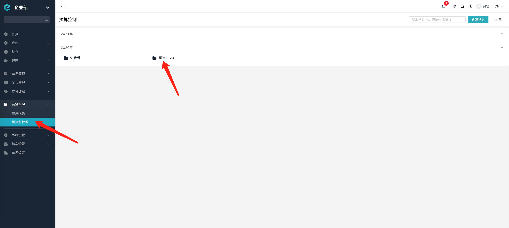
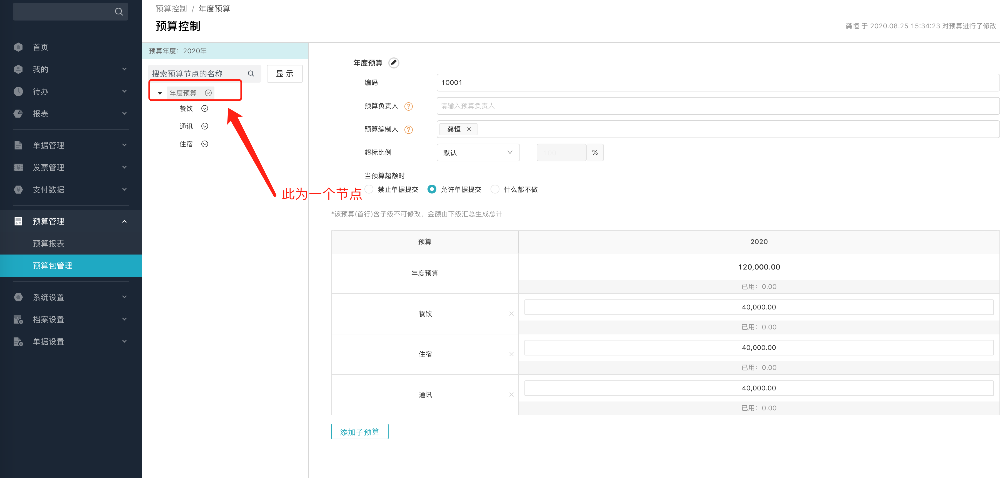
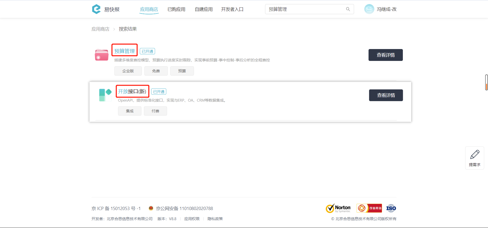

# 开始使用预算

---
## 概念

### 1.什么是“预算包”？

在易快报桌面端 **预算管理 -> 预算包管理** 界面，每个“文件夹”代表了一个 **预算包**，**预算包** 包括了若干个 **预算节点**。 
点击“文件夹”进入预算详情页，页面左侧树形列表的每个节点就是一个 **预算节点**。

下图为 **预算包** 列表在产品界面上的展示，这个列表可通过[获取预算包列表](/docs/open-api/budget/get-budget-list)接口取得。
      

---
### 2.“预算节点”在哪里？

下图为 **预算节点** 在产品界面上的展示，可通过[获取预算包详细信息](/docs/open-api/budget/get-budget-details)接口获取其信息。

---
## 使用前提
在使用预算相关接口前，请确保您的企业已经开启了【**开放接口(新)**】与【**预算管理**】功能。
    
您可以联系您的实施顾问来开通此功能，也可以拨打客服热线 **400-999-8293** 获取更多支持。

---

