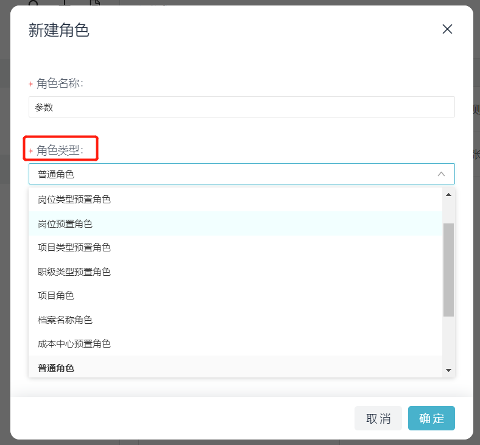

# 更新角色下员工信息

import Control from "@theme/Control";

<Control
method="PUT"
url="/api/openapi/v1/roledefs/$`roledefId`/staffs"
/>

:::caution
- 只有数据来源为【**[API导入](/docs/open-api/corporation/info#新建角色)**】的角色才能使用此接口更新角色。
:::

## Path Parameters

| 名称 | 类型 | 描述 | 是否必填 | 默认值 | 备注 |
| :--- | :--- | :--- | :--- |:--- | :--- |
| **roledefId** | String | 角色ID | 必填 | - | 在易快报桌面端「系统设置」>「角色管理」处查看 |

## Query Parameters

| 名称 | 类型 | 描述 | 是否必填 | 默认值 | 备注 |
| :--- | :--- | :--- | :--- |:--- | :--- |
| **accessToken** | String | 认证token	  | 必填  | -  | [通过授权接口获取](/docs/open-api/getting-started/auth) |
| **staffBy**     | String | 员工ID参数格式 | 非必填 | id | `id` : 传入完整员工ID，格式：`企业id:userId`<br/>`sourceId` : 只传入userId即可 |

## Body Parameters

| 名称 | 类型 | 描述 | 是否必填 | 默认值 | 备注 |
| :--- | :--- | :--- | :--- |:--- | :--- |
| **contents**          | Array   | 角色配置情况     | 必填   | - | 每一个元素对应「角色管理」界面右侧列表的一行 |
| **&emsp; ∟ pathType** | String | `name` 或 `code` 或 `id`  | 非必填 | name | 当 `pathType` = `name` 或不传时，`path` 传入部门名称<br/>或自定义档案项名称；<br/>当 `pathType` = `code` 时，`path` 传入部门编码或自定<br/>义档案项编码；<br/>当 `pathType` = `id` 时，`path` 传入部门ID或自定义档<br/>案项ID |
| **&emsp; ∟ path**     | Array  | 部门或自定义档案值 | 非必填 | - | 传入内容参考pathType，传入对应类型的全路径参数<br/>[注意事项](/docs/open-api/corporation/question-answer) |
| **&emsp; ∟ staffs**   | Array  | 员工集	      | 非必填 | - | 值为[员工ID](/docs/open-api/corporation/get-all-staffs) |

:::tip
- 当 `staffs` 为空时，则删除此部门/自定义档案值对应的角色下所有员工。
- 在系统上新建角色时，角色类型可按【部门】和【档案类别】划分，此接口中的 `path` 参数就传这个角色对应的类型值。

:::

## CURL
```json
curl --location --request PUT 'https://app.ekuaibao.com/api/openapi/v1/roledefs/$7FQbuoqQBA9U00/staffs?accessToken=RCIbwHcnF0kg00&staffBy=id' \
--header 'content-type: application/json' \
--header 'Accept: application/json' \
--data-raw '{
    "contents": [
        {
            "path": [  
                "企业名称","财务部","北京财务部"   //部门名称全路径
            ],
            "staffs": [
                "EAQbauUqXweI00:YCgbc2y8_Ivg00"
            ]
        },
        {
            "pathType": "code",
            "path": [
                "code1", "code2"                //部门编码全路径
            ],
            "staffs": [
                "EAQbauUqXweI00:YCgbc2y8_Ivg00"
            ]
        },
        {
            "pathType": "id",
            "path": [
                "EAQbauUqXweI00","EAQbauUqXweI00:ID_3wUvB7G2b3w"  //部门ID全路径
            ],
            "staffs": [
                "EAQbauUqXweI00:YCgbc2y8_Ivg00"
            ]
        }
    ]
}'
```

## 成功响应
:::caution
- 响应需要判断状态码来确定是否成功。
:::

```text
code 204
```

## 失败响应
```json
{
    "errorCode": 412,
    "errorMessage": "数据错误:[0:路径不存在[部门], 0:人员不存在[EAQbauUqXweI00:YCgbc2y8_Ivg00]]",
    "errorDetails": null,
    "code": null,
    "data": null
}
```
