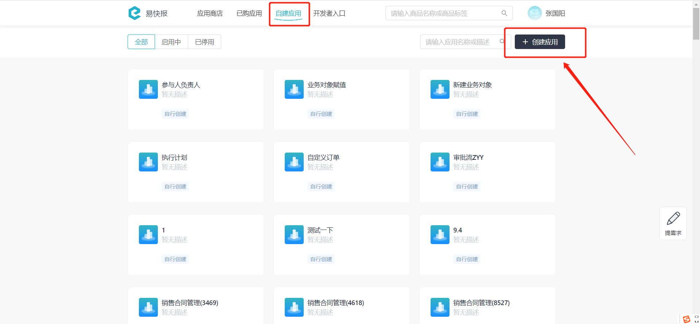
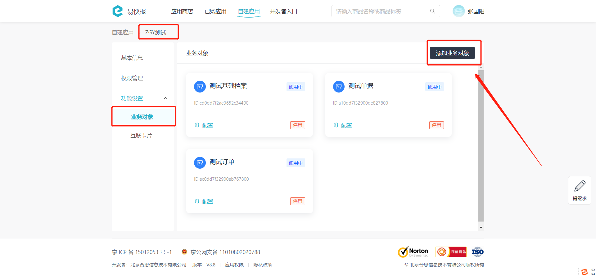
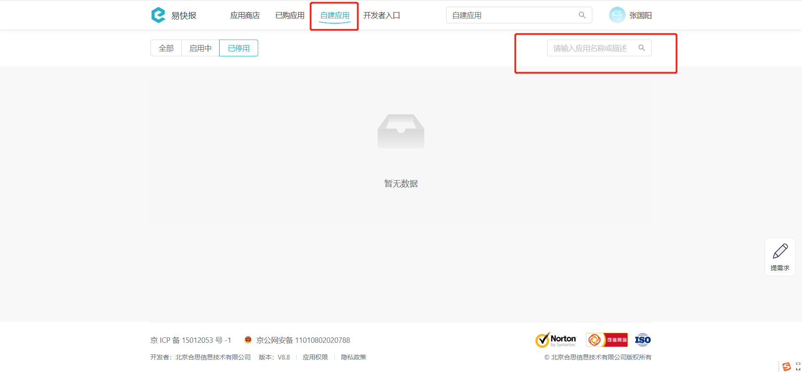
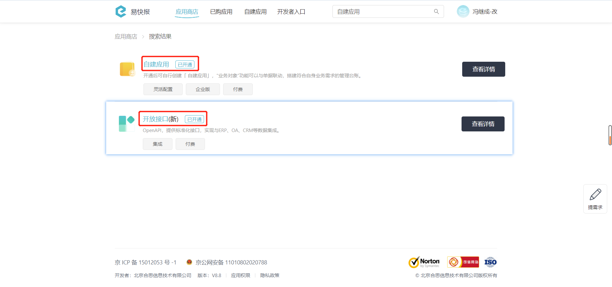

# 开始使用自建应用

---
## 迭代更名图 

---
## 名词解释

:::tip
`自建应用/自定义扩展` ：由客户的系统管理员，通过产品提供的可以高度自定义的功能，并结合OpenAPI等开放能力，自行搭建的个性化应用，仅在当前企业内生效，可以与企业内其他功能和应用结合。
- 每个自建应用对应了一个外部系统，例如「销售易CRM」、「致远OA」等。
- 每个自建应用可以创建一个或多个业务对象，对应外部系统中的业务对象，例如「销售易CRM」中的「客户」、「商机」、「线索」。
- 通过业务对象的定义，用户可在易快报系统中产生若干份对象实例，例如「销售易CRM」中的「客户」实体，有「客户1」、「客户2」、「客户3」三个实例。
:::

### （1）创建自建应用

### （2）添加业务对象

---
## 应用场景
自定义扩展主要满足三个核心场景：

- 参考外部数据产生易快报系统单据或单据明细。例如：导入订单成为消费明细。
- 关联外部系统的审批单据。例如：在报销单里关联OA合同审批单。
- 关联外部系统的基础档案。例如：在报销单里关联CRM系统的客户。

---
## 使用前提
在使用自建应用接口前，请确保您的企业已经开启了 **【开放接口(新)】** 与 **【自建应用】** 功能。

您可以联系您的实施顾问来开通此功能，也可以拨打客服热线 **400-999-8293** 获取更多支持。

---

