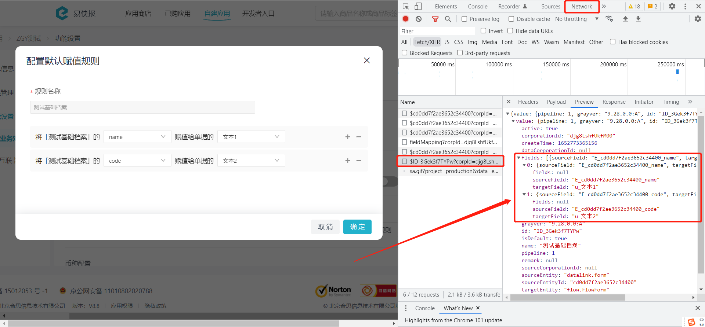

# 常见问题总结

---
## 问题一

### Q：如何获取 **自建应用ID** 或 **业务对象ID**？

A：**自建应用ID** 可在易快报【**应用中心**】->【**自建应用**】页面查看（需管理员权限）。

点击【**功能设置**】->【**业务对象**】查看 **业务对象ID**（需管理员权限）。

---
## 问题二

### Q：如何获取一个业务对象实例数据的详情？

A：通过[获取业务对象实例信息](/docs/open-api/datalink-extend/get-entity-object)接口获取。

---
## 问题三

### Q：更新自建应用接口想要修改 `name` ，但是返回还是原来的值？

A：该接口 `v2` 版本只支持修改管理员，但是同时依然需要传 `name` 值，`v2.1` 版本支持修改应用名称，不修改时传原名称即可。

---
## 问题四

### Q：如何查看业务对象字段不同 `type` 的具体参数，比如自动编码？

A：【**自建应用**】->【**功能设置**】->【**业务对象**】->【**业务属性**】->【**业务属性菜单**】中，添加“自动编号”类型的字段，点击查看编号规则。

---
## 问题五

### Q：配置默认赋值规则时，如何获取目标字段值？

A：

（1）通过[获取全局字段列表](/docs/open-api/forms/get-customs-param)接口返回的 `name` 参数获取。

（2）可在易快报PC端对应页面通过操作返回数据查看 `targetField`。

---