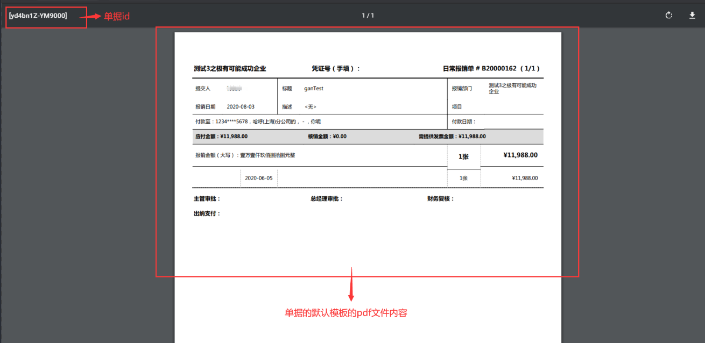

# 获取单据PDF文件流
根据单据ID获取单据打印模板生成的PDF文件流。

import Control from "@theme/Control";

<Control
method="GET"
url="/api/openapi/v1/flowDetails/getFlowsPdf/[`ids`]"
/>

## Path Parameters

| 名称 | 类型 | 描述 | 是否必填 | 默认值 | 备注 |
| :--- | :--- | :--- | :--- |:--- | :--- |
| **ids** | Array | 单据ID | 必填 | - | [单据ID获取方式](/docs/open-api/flows/question-answer#问题一)，**打印的单据必须所属于同一员工**<br/>示例：[ zKIbl2WX4I8I00 , I8I00zKIbl2WX4 , zKIbI00l2WX4I8 ] |

## Query Parameters

| 名称 | 类型 | 描述 | 是否必填 | 默认值 | 备注 |
| :--- | :--- | :--- | :--- |:--- | :--- |
| **accessToken** | String | 认证token | 必填 | - | [通过授权接口获取](/docs/open-api/getting-started/auth) |

## CURL
```shell
curl --location --request GET 'https://app.ekuaibao.com/api/openapi/v1/flowDetails/getFlowsPdf/[yd4bn1Z-YM9000]?accessToken=cWEbn1cA0kjU00'
```

## 成功响应
一个PDF文件，文件名为单据ID，例如下图：


