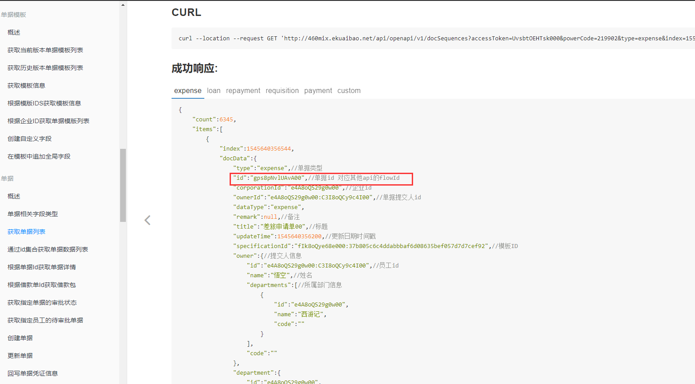

# 常见问题总结

---
## 问题一

Q: 如何获取单据Id？

A: 单据Id可在【配置出站消息】接口中获取，或者查询单据列表接口。
- 第一种方式：[配置出站消息](/docs/open-api/outbound-message/outbound-new)

- 第二种方式：[获取单据列表(包含已删除单据)](/docs/open-api/flows/get-forms-sequences)

 

---