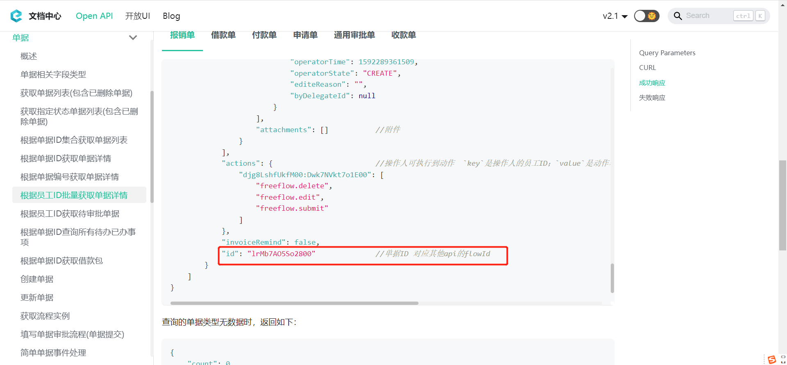

# 常见问题总结

---
## 问题一

### Q: 如何获取单据ID？

A: 三种方式如下：
- 第一种方式：[配置出站消息](/docs/open-api/outbound-message/outbound-new)

- 第二种方式：[根据单据编号获取单据详情](/docs/open-api/flows/get-forms-details-byCode) 得到单据ID

- 第三种方式：[根据员工ID批量获取单据详情](/docs/open-api/flows/get-forms-details-byStaff)

---