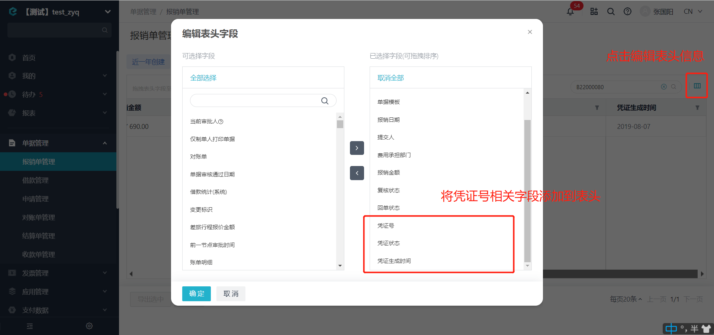

# 回写单据凭证信息
支持批量回写单据凭证。

import Control from "@theme/Control";

<Control
method="PUT"
url="/api/openapi/v2.1/flow/data/erpVoucher"
/>

<details>
  <summary><b>更新日志</b></summary>
  <div>

  [**1.6.0**](/docs/open-api/notice/update-log#160) &emsp; -> 🚀 接口升级 `v2.1` 版本，新增了业务校验只允许 `paid`（已支付/审批完成）状态回写单据凭证。<br/>
  [**0.7.132**](/docs/open-api/notice/update-log#07132) -> 🐞 修复了回写凭证信息清除凭证号时，凭证状态、生成时间未能正确回写的BUG。<br/>

  </div>
</details>

:::caution
- 只允许单据为 **`paid` 已支付/审批完成** 状态回写单据凭证。
:::

## Query Parameters

| 名称 | 类型 | 描述 | 是否必填 | 默认值 | 备注 |
| :--- | :--- | :--- | :--- |:--- | :--- |
| **accessToken** | String | 认证token | 必填 | - | [通过授权接口获取](/docs/open-api/getting-started/auth) |

## Body Parameters

| 名称 | 类型 | 描述 | 是否必填 | 默认值 | 备注 |
| :--- | :--- | :--- | :--- |:--- | :--- |
|**voucher**                     | Array  | 凭证信息       | 必填  | - | 凭证信息（**至少一条**） |
|**&emsp; ∟ flowId**            | String | 单据ID         | 必填  | - | [单据ID获取方式](/docs/open-api/flows/question-answer#问题一) |
|**&emsp; ∟ voucherNo**         | String | 单据凭证号      | 必填  | - |  根据实际业务提供的凭证号<br/>如果传空 `""` 则删除该单据的凭证号 |
|**&emsp; ∟ voucherCreateTime** | String | 单据凭证生成时间 | 必填  | - |  毫秒级时间戳 |
|**&emsp; ∟ fiscalPeriod**      | String | 会计期间       | 非必填 | - |  会计期间 |

:::tip
- 在系统中 **单据管理** 模块，编辑表头字段，添加凭证相关字段到表头，即可看到凭证相关信息。
  
:::

## CURL
```json
curl --location --request PUT 'https://app.ekuaibao.com/api/openapi/v2.1/flow/data/erpVoucher?accessToken=ID_3xhx4F9YDa0:djg8LshfUkfM00' \
--header 'Content-Type: application/json' \
--data-raw '{
    "voucher":[
        {
            "flowId": "ID_3wPHuDsWTMM",
            "voucherNo": "202201260001",
            "voucherCreateTime": "1565175685575"
        }
    ]
}'
```

## 成功响应
```json
{
    "value": true
}
```

## 失败响应
当 `flowId`（单据ID）错误时，报错如下：
```json
{
    "errorCode": 412,
    "errorMessage": "不存在此单据[yd4bn1Z-YM900]",
    "errorDetails": null,
    "code": null,
    "data": null
}
```

当单据不处于 **`paid` 已支付/审批完成** 状态时报错如下：
```json
{
    "errorCode": 412,
    "errorMessage": "单据Id:[[ID_3FQR$Yx5LWM]]的单据不是已支付状态，不能回写单据凭证，请检查",
    "errorDetails": null,
    "code": null,
    "data": null
}
```