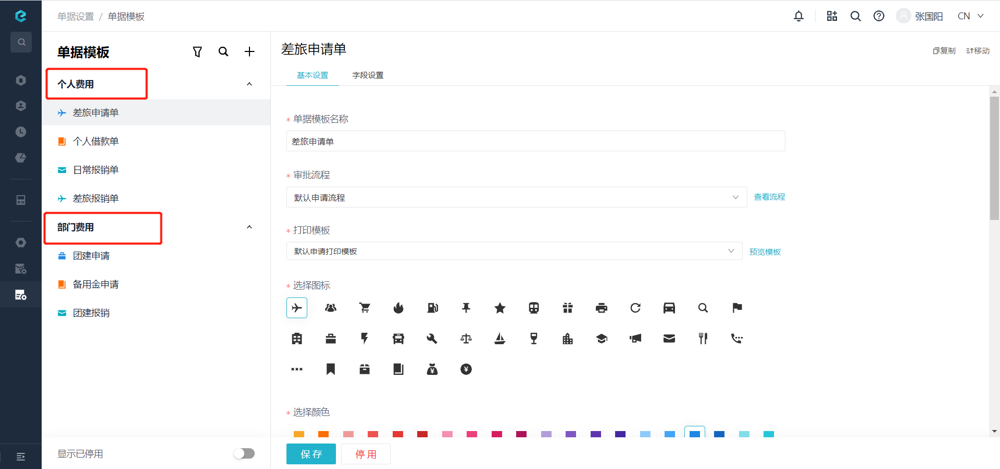

# 根据模板组名称获取模板组信息

import Control from "@theme/Control";

<Control
method="GET"
url="/api/openapi/v1/specifications/getByName"
/>

<details>
  <summary><b>更新日志</b></summary>
  <div>
    <a href="https://docs.ekuaibao.com/docs/open-api/notice/update-log" target="_blank"><b>1.0.0</b></a> -> 🆕 新增了本接口。<br/>
  </div>
</details>

## Query Parameters

| 名称 | 类型 | 描述 | 是否必填 | 默认值 | 备注 |
| :--- | :--- | :--- | :--- |:--- | :--- |
| **accessToken** | String  | 认证token	| 必填 | - | [通过授权接口获取](/docs/open-api/getting-started/auth) |
| **name**        | String  | 模板组名称  | 必填 | - | 模板组名称|

## CURL
```shell
curl --location --request GET 'https://app.ekuaibao.com/api/openapi/v1/specifications/getByName?name=个人费用&accessToken=ID_3wajigF3wH0:xgJ3wajigF25H0' \
--header 'content-type: application/json' \
--header 'Accept: application/json'
```

## 成功响应
```json
{
    "value": {
        "id": "xgJ3wajigF25H0:personalCost",   //模板组ID
        "name": "个人费用",                     //模板组名称
        "active": true,                        //是否启用
        "corporationId": "xgJ3wajigF25H0",     //企业ID
        "createTime": 1585218096459,           //创建时间
        "updateTime": 1585218170725            //修改时间
    }
}
```

## 失败响应
模板组名称错误时，返回此响应数据：
```json
{
    "errorCode": 412,
    "errorMessage": "单据模版组不存在",
    "errorDetails": null,
    "code": null,
    "data": null
}
```

## 单据模板组位置

