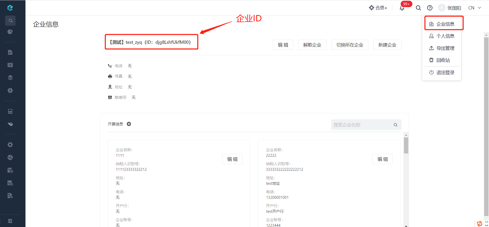

# 获取地址前缀
由于接口地址会根据易快报系统版本发生变动，故使用此接口来获取最新的地址前缀。

import Control from "@theme/Control";

<Control
method="GET"
url="/api/openapi/v2/location"
/>

<details>
  <summary><b>更新日志</b></summary>
  <div>
    <a href="https://docs.ekuaibao.com/docs/open-api/notice/update-log" target="_blank"><b>0.7.138</b></a> -> 🆕 新增了飞书地址前缀。<br/>
  </div>
</details>

## Query Parameters

| 名称 | 类型 | 描述 | 是否必填 | 默认值 | 备注 |
| :--- | :--- | :--- | :--- |:--- | :--- |
| **corpId** | String |  企业ID  | 必填 | - | 通过易快报桌面端「**企业信息**」界面查看 |



## CURL
```shell
curl --location --request GET 'https://app.ekuaibao.com/api/openapi/v2/location?corpId=-yQbjbywbc640011'
```

:::tip
- 不同平台获取前缀的方式不同。
:::

| 平台 | 地址 |
| :--- | :--- |
| 易快报独立版     | `https://app.ekuaibao.com` |
| 钉钉           | `https://dd2.ekuaibao.com` |
| 企业微信        | `https://wx2.ekuaibao.com` |
| 云之家          | `https://kdcloud2.ekuaibao.com` |
| 钉钉企业自建应用  | `https://ddenterprise.ekuaibao.com` |
| 飞书            | `https://feishu.ekuaibao.com` |

## 成功响应
```json
{
    "value": "https://app.ekuaibao.com/"
}
```


