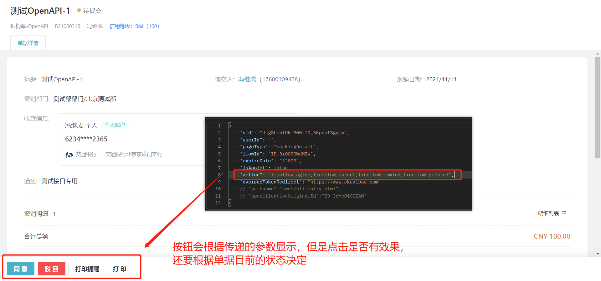
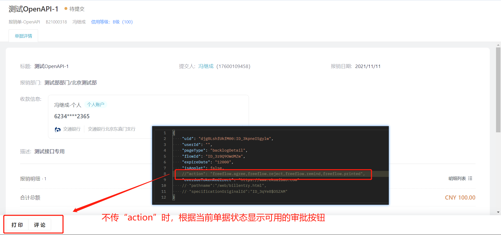

# 访问临时授权

import Control from "@theme/Control";

<Control
method="POST"
url="/api/openapi/v1.1/provisional/getProvisionalAuth"
/>

<details>
  <summary><b>更新日志</b></summary>
  <div>

  [**1.7.1**](/updateLog/update-log#171) &emsp; -> 🆕 新增了 `authType`（授权方式）参数，控制单点链接可用次数。<br/>
  [**1.5.0**](/updateLog/update-log#150) &emsp; -> 🐞 修复了被委托人审批会签节点的单据（`pageType` = `form`）时，无审批按钮的BUG。 <br/>
  [**1.0.0**](/updateLog/update-log#100) &emsp; -> 🚀 接口升级 `v1.1` 版本，新增了 `pageType` = `frontPage` 类型，进入合思 **首页**。<br/>
  [**0.7.163**](/updateLog/update-log#07163) -> 🆕 新增了 `approvalUrl`（审批完成后跳转地址）参数。<br/>

  </div>
</details>

## Query Parameters

| 名称 | 类型 | 描述 | 是否必填 | 默认值 | 备注 |
| :--- | :--- | :--- | :--- |:--- | :--- |
| **accessToken** | String | 认证token | 必填 | - | 通过 [获取授权](/docs/open-api/getting-started/auth) 获取 `accessToken` |

## Body Parameters

| 名称 | 类型 | 描述 | 是否必填 | 默认值 | 备注 |
| :--- | :--- | :--- | :--- |:--- | :--- |
| **uid**                     | String  | 员工ID           | 非必填 | - |  当 `userId` 非必填时 `uid` 必填  |
| **userId**                  | String  | 第三方员工ID      | 非必填 | - | 当 `uid` 非必填时 `userId` 必填 |
| **pageType**                | String  | 登录页面类型       | 必填  | - | `frontPage` : 首页<br/>`home` : 我的单据<br/>`approve` : 待办列表<br/>`form` : 单据详情页<br/>`new` : 新建单据<br/>`mall` : 商城（**不支持移动端**）<br/>`backlogDetail` : 查看待办详情，同时底部菜单<br/>显示指定审批按钮（**不支持移动端**） |
| **authType**                | String  | 授权方式          | 非必填 | - | `CODE` : 表示获得的单点链接仅可使用一次，不能二次使用<br/>（使用此参数实际上是返回另一个接口 `url`，重定向到原地址隐藏掉 `url` 里面的 `accessToken`，从而实现仅可使用一次）<br/>**不传此参数表示单点链接在有效期内可无限使用**<br/>**不支持 `new`、`mall`、`backlogDetail` 类型** |
| **expireDate**              | String  | 授权有效期        | 必填   | - |  单位：秒，最大不能超过 `604800` 秒（7天） |
| **overdueTokenRedirect**    | String  | 重定向URL        | 非必填 | - | `expireDate` 过期后重定向到该地址 |
| **isApplet**                | Boolean | 是否跳转app端     | 非必填 | `false` |  `true` : 跳转app端<br/>`false` : 跳转web端   |
| **flowId**                  | String  | 单据ID           | 非必填 | - | 当「 `pageType` = `form` 或 `backlogDetail` 」时<br/>必填，表示需要访问的单据详情页 |
| **approvalUrl**             | String  | 审批完成后跳转地址 | 非必填 | - | 当「 `pageType` = `form` 或 `backlogDetail` 」时<br/>参数有效，表示单据审批完成后跳转的地址 |
| **action**                  | String  | 审批按钮类型      | 非必填 | - | 仅当「 `pageType` = `backlogDetail` 」时参数<br/>有效，表示审批待办时想要显示的按钮类型 |
| **pathname**                | String  | 授权路径         | 非必填 | - |  当 `pageType` = `new` 时，填值<br/>`/web/billentry.html` 或者<br/>`/applet/thirdparty.html`，视平台而定 |
| **specificationOriginalId** | String  | 单据模板ID       | 非必填 | - |  当 `pageType` = `new` 时，此参数必填 |

:::tip
 - `uid` 与 `userId` 只需要填写一个即可，若都填写，以 `uid` 为准进行操作；
 - 当 `pageType` = `form` 时，`flowId` 参数必填，`approvalUrl` 参数选填；
 - 当 `pageType` = `new` 时，`pathname`、`specificationOriginalId` 参数必填；
 - 当 `pageType` = `mall` 时，用户必须已开通商城，否则该接口会返回错误提示；<br/>
 且只需要传递 `uid`（或者 `userId` ）、 `isApplet` = `false`（不支持移动端）和 `expireDate` 3个参数即可，其他均可不传；
 - 当 `pageType` = `backlogDetail` 时，`isApplet` = `false`（不支持移动端），`flowId` 参数必填，`approvalUrl`、`action` 参数选填（action 不传显示默认的审批按钮，多个值用 `,` 分隔）。

 
 
 
:::

### 审批按钮(`action`)类型

| action | 说明 |
| :--- | :--- |
| **freeflow.agree**        | 同意       |
| **freeflow.reject**       | 驳回       | 
| **freeflow.remind**       | 打印提醒    |
| **freeflow.printed**      | 打印       | 
| **freeflow.addnode**      | 转交       | 
| **freeflow.back**         | 回退       | 
| **freeflow.comment**      | 评论       | 
| **freeflow.modify**       | 修改       |  
| **freeflow.activate**     | 激活       | 
| **freeflow.receive**      | 确认收单    | 
| **freeflow.nullify**      | 作废       |
| **freeflow.pay**          | 支付       |
| **freeflow.addExpress**   | 添加寄送信息 |
| **freeflow.jumpExpress**  | 跳过寄送    |
| **freeflow.shiftApprove** | 转交审批    |
| **freeflow.addSignNode**  | 加签审批    |

## CURL
```json
curl --location --request POST 'https://app.ekuaibao.com/api/openapi/v1.1/provisional/getProvisionalAuth?accessToken=cxEbrzNJSA3A00' \
--header 'Content-Type: application/json' \
--data-raw '{
    "uid": "34A73EyI8A0w00:Kh0bnmDTrU9g00",
    //"userId": "",
    "pageType": "home",
    //"flowId": "",
    "expireDate": "120",
    "isApplet": true,
    //"action": "",
    "overdueTokenRedirect": "https://www.ekuaibao.com"
}'
```

## 成功响应
```json
{
    "value": {
      "message": "https://app.ekuaibao.com/applet/thirdparty.html?accessToken=SGYqVpXcuhIIYQJkd0w2G0&ekbCorpId=34A73EyI8A0w00&pageType=home&overdueTokenRedirect=[https://www.ekuaibao.com](https://www.ekuaibao.com)", //第三方临时访问合思URL
      "code": "true" // 请求状态
    }
}
```
跳转商城返回信息：
```json
{
    "value": {
        "message": "https://mall-app.ekuaibao.com/wportal/?token={商城token}",
        "code": "true"
    }
}
```

## 失败响应
| HTTP状态码 | 错误码 | 描述 | 排查建议 |
| :--- | :--- | :--- | :--- |
    | **200** | false | expireDate最多只能指定7天内的秒数！| `expireDate` 最大仅支持7天的秒数，即 `604800` 秒，请确认是否大于 `604800` 秒 | 
| **200** | - | 临时访问地址已过期，请重新获取访问临时授权 | `authType` = `CODE` 时，单点链接仅可使用一次，请确认是否重复使用单点链接 | 
