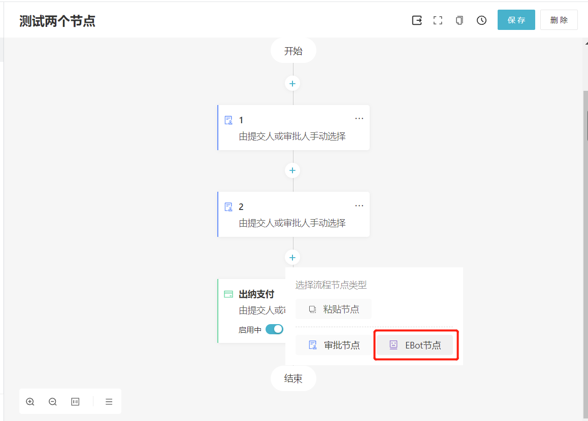
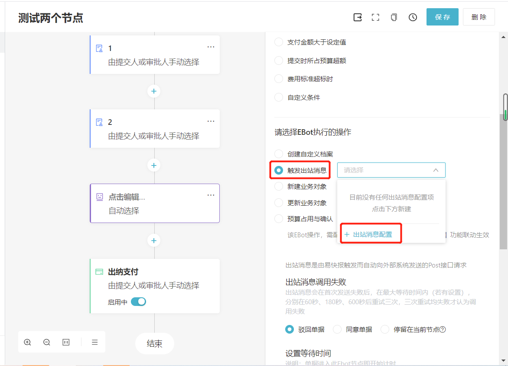
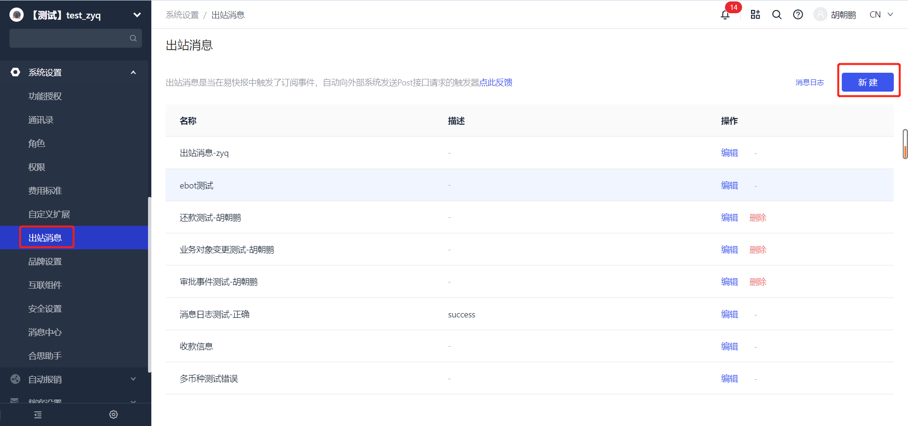

# 概述

---
## 概念
- 出站消息是由 **易快报** 触发，并且自动向外部系统发送的 **POST** 接口请求，用于解决 **易快报** 与 **外部系统(如OA系统)** 的自动对接。

- 当前支持【**E-Bot节点**】、【**单据审批事件**】、【**业务对象数据变更**】、【**还款事件**】四种类型触发出站消息。

:::tip
- 出站消息受到 **应用功能** 限制。如果是通过 E-Bot 触发，则需要开通【**E-Bot**】功能。
- 如果【**出站消息**】功能关闭：
  - 无法新建出站消息；
  - E-Bot上无法继续配置出站消息；
  - 已经配置好的出站消息不受影响。
:::

---
## 使用前提
在使用出站消息接口前，请确保您的企业已经开启了【**出站消息**】与【**E-Bot**】功能。

您可以联系您的实施顾问来开通此功能，也可以拨打客服热线 **400-999-8293** 获取更多支持。

---
## 使用场景
### 1.如何在E-Bot节点触发“出站消息”？

（1）在企业管理的后台配置审批流时，添加"EBot节点"。

（2）点击编辑节点，选择EBot执行的操作为"触发出站消息"。 
（3）在下拉框中选择"出站消息配置"，进行配置。

---
### 2.如何在单据审批时触发“出站消息”？

管理员可在 **系统设置 -> 出站消息** 下，选择不同的通知类型触发消息。

**注意：通知类出站消息支持更多字段类型，请在[配置出站消息](/docs/open-api/outbound-message/outbound-new)中查看。**

---

