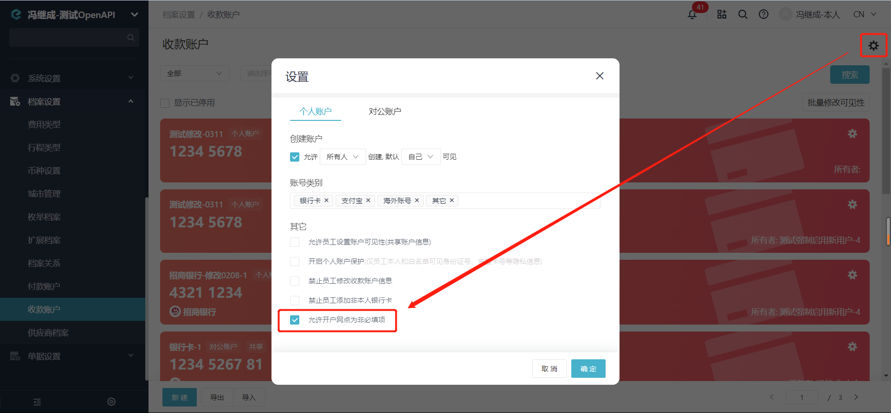

# 新增收款账户

import Control from "@theme/Control";

<Control
method="POST"
url="/api/openapi/v2/payeeInfos"
/>

## Query Parameters

| 名称 | 类型 | 描述 | 是否必填 | 默认值 | 备注 |
| :--- | :--- | :--- | :--- |:--- | :--- |
| **accessToken** | String | 认证token | 必填 | - | [通过授权接口获取](/docs/open-api/getting-started/auth) |

## Body Parameters

| 名称 | 类型 | 描述 | 是否必填 | 默认值 | 备注 |
| :--- | :--- | :--- | :--- |:--- | :--- |
| **staffId**         | String | 所有者ID    | 非必填 | - | 当 `owner` = `INDIVIDUAL` 时必填；<br/>当 `owner` = `CORPORATION` 时非必填；<br/>可以通过[获取员工列表](/docs/open-api/corporation/get-all-staffs)获取 |
| **type**            | String | 账户类型    | 必填 | -| `PUBLIC` : 对公账户<br/>`PERSONAL` : 个人账户 |
| **name**            | String | 开户名称    | 必填 | - | 开户名称 |
| **cardNo**          | String | 银行卡号    | 必填 | - | 银行卡号 |
| **bank**            | String | 银行名称    | 非必填 | - | 银行名称 |
| **branch**          | String | 开户网点    | 必填 | - | 获取[开户网点](/docs/open-api/pay/get-all-branch)<br/>可通过系统配置改为 ”**非必填**“，详见下方**TIP**注意事项 |
| **owner**           | String | 所属类型    | 必填 | - | `INDIVIDUAL` : 个人<br/>`CORPORATION` : 企业 |
| **city**            | String | 银行所在城市 | 非必填 | - | 银行所在城市 |
| **province**        | String | 银行所在省   | 非必填 | - | 银行所在省 |
| **bankLinkNo**      | String | 银联号      | 非必填 | - | **当开户网点与易快报系统不匹配时，<br/>可通过银联号匹配** |
| **certificateType** | String | 证件类型    | 非必填 | - | 详细信息见下方【[证件类型对照表](/docs/open-api/pay/new-account#证件类型对照表)】|
| **certificateNo**   | String | 证件号码    | 非必填 | - | 证件号码 |
| **remark**          | String | 备注信息    | 非必填 | - | 备注信息 |
| **visibility**                          | Object   | 可见范围       | 非必填 | - | 可见范围对象 |
| **&emsp; ∟ fullVisible**                | Boolean | 是否全员可见    | 必填 | - | `true` : 全员可见<br/>`false` : 部分可见<br/>部分可见则仅有白名单中可见 |
| **&emsp; ∟ roles**                      | Array   | 角色白名单      | 必填 | - | 值为[角色ID](/docs/open-api/corporation/get-roles-group) |
| **&emsp; ∟ staffs**                     | Array   | 员工白名单      | 必填 | - | 值为[员工ID](/docs/open-api/corporation/get-all-staffs) |
| **&emsp; ∟ departments**                | Array   | 部门白名单      | 必填 | - | 值为[部门ID](/docs/open-api/corporation/get-departments) |
| **&emsp; ∟ departmentsIncludeChildren** | Boolean | 下属部门是否可见 | 必填 | - | `true` : 可见 &emsp; `false` : 不可见 |

:::tip
- 当 `branch`（开户网点）不确定且必填时，可填写 ”1“（branch不可为null），并保证 `bankLinkNo`（银联号）正确，系统会根据银联号自动回填开户网点。
- 当不需要线上支付时，可通过系统配置，关闭 “**开户网点**” 必填。

  
:::

### 证件类型对照表

| 证件类型 | code |
| :--- | :--- |
| **居民身份证**                | 01 |
| **临时身份证**                | 02 |
| **护照**                     | 03 |
| **户口簿**                   | 04 |
| **军人身份证**                | 05 |
| **武装警察身份证**             | 06 |
| **港澳台居民往来内地通行证**     | 07 |
| **外交人员身份证**             | 08 |
| **外国人居留许可证**            | 09 |
| **边民出入境通行证**            | 10 |
| **其它**                     | 11 |
| **澳居民来往内地通行证(香港)**   | 47 |
| **港澳居民来往内地通行证(澳门)** | 48 |
| **湾居民来往大陆通行证**        | 49 |
| **纳税人识别号(TIN)**         | 54 |

## CURL
```json
curl --location --request POST 'https://app.ekuaibao.com/api/openapi/v2/payeeInfos?accessToken=cxEbrzNJSA3A00' \
--header 'Content-Type: application/json' \
--data-raw '{
    "staffId": "qbY9qb2btg0800:8_c9qazkY8b800",
    "type": "PERSONAL",
    "name": "工商银行付款账户",
    "cardNo": "84745996999",
    "bank": "工商银行",
    "branch": "中国工商银行股份有限公司北京范家胡同支行",
    "owner": "CORPORATION",
    "city": "北京市",
    "province": "北京市",
    "bankLinkNo": "102100020044",
    "certificateType": "01",
    "certificateNo": "100999",
    "remark": "备注",
    "visibility":
      {
            "fullVisible": false,
            "roles": ["7pYbiCfk4IcY00", "Kv0biCfk4IcM00"],
            "staffs": ["Y-8biCacIM5U00:ukMbeB_7-M3000"],
            "departments": ["Y-8biCacIM5U00"],
            "departmentsIncludeChildren": true
      }
}'
```

## 成功响应
```json
{
    "id": "wfo9tKSDNc0000"  //新增的收款账户ID
}
```

## 失败响应
请勿重复添加同一账户，否则返回以下内容：
```json
{
    "errorCode": 412,
    "errorMessage": "该账户已存在，无法创建",
    "errorDetails": null,
    "code": null,
    "data": null
}
```

