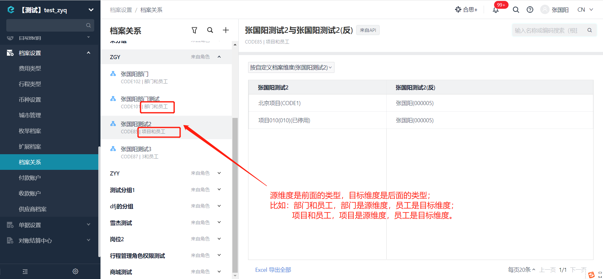

# 新增某档案关系下的档案项数据

import Control from "@theme/Control";

<Control
method="POST"
url="/api/openapi/v2.1/recordLink/add/$`id`"
/>

<details>
  <summary><b>更新日志</b></summary>
  <div>

  [**1.4.0**](/updateLog/update-log#140) -> 🐞 更新了校验逻辑，档案关系类型共六种，全都做参数校验，若传入已删除参数则报错<br/>
  &emsp; &emsp; &emsp; &emsp; &emsp; ● **未激活/已移除** 员工，不能进行任何档案关系数据操作。<br/>
  &emsp; &emsp; &emsp; &emsp; &emsp; ● body参数里传多个值时，校验参数任意一个不存在则报错。<br/>
  &emsp; &emsp; -> 🐞 无效果的新增返回信息提示。<br/>
  [**1.3.0**](/updateLog/update-log#130) -> 🆕 新增 `type` 类型参数，支持 `id` 或 `code` 传参。<br/>
  [**1.2.0**](/updateLog/update-log#120) -> 🚀 接口升级 `v2.1` 版本，修复了传其他类型自定义档案项ID（非档案关系配置的类型）可以创建成功数据的问题。<br/>

  </div>
</details>

## Path Parameters

| 名称 | 类型 | 描述 | 是否必填 | 默认值 | 备注 |
| :--- | :--- | :--- | :--- |:--- | :--- |
| **id** | String | 档案关系ID | 必填 | - | 通过 [获取企业下档案关系列表](/docs/open-api/recordLink/get-dimension-relation) 获取 | 

## Query Parameters

| 名称 | 类型 | 描述 | 是否必填 | 默认值 | 备注 |
| :--- | :--- | :--- | :--- |:--- | :--- |
| **accessToken** | String | 认证token | 必填 | - | 通过 [获取授权](/docs/open-api/getting-started/auth) 获取 `accessToken` |
| **type**        | String | 参数类型   | 非必填 | id | `id` : 传id值 &emsp; `code` : 传code值<br/>**请保证 `code` 唯一，『员工』和『部门』的 `code` 在系统上允许为空和重复** |

## Body Parameters

| 名称 | 类型 | 描述 | 是否必填 | 默认值 | 备注 |
| :--- | :--- | :--- | :--- |:--- | :--- |
| **sourceValues**  | Array  | 源维度值	| 必填  | - | 源维度值 |
| **purposeValues** | Array  | 目标维度值	| 必填  | - | 目标维度值 |

:::tip
- 关于源维度值和目标维度值的区分：

:::

## CURL
import Tabs from '@theme/Tabs';
import TabItem from '@theme/TabItem';

<Tabs>
<TabItem value="id" label="id" default>

```json
curl --location --request POST 'https://app.ekuaibao.com/api/openapi/v2.1/recordLink/add/$ID_3BFuV7KbVDw?accessToken=ID_3BFuV7KbNDw:bwa3wajigF0WH0&type=id' \
--header 'Content-Type: application/json' \
--data-raw '{
    "sourceValues": [   //以“员工和项目”档案关系为例，源维度值传某个员工的ID
        "bwa3wajigF0WH0:qKZ3wlg6bv9OGg","bwa3wajigF0WH0:IqQ3wlg6bv9QGg"
    ],
    "purposeValues": [  //以“员工和项目”档案关系为例，目标维度值传某个项目的ID
        "ID_3zYtLIa21gM","ID_3zYtLIa22gM"
    ]
}'
```
</TabItem>
<TabItem value="code" label="code">

```json
curl --location --request POST 'https://app.ekuaibao.com/api/openapi/v2.1/recordLink/add/$ID_3BFuV7KbVDw?accessToken=ID_3BFuV7KbNDw:bwa3wajigF0WH0&type=code' \
--header 'Content-Type: application/json' \
--data-raw '{
    "sourceValues": [   //以“员工和项目”档案关系为例，源维度值传某个员工的工号（CODE)
        "1001","1002","1003"
    ],
    "purposeValues": [  //以“员工和项目”档案关系为例，目标维度值传某个项目的CODE
        "CODE1","CODE2","CODE3"
    ]
}'
```
</TabItem>
</Tabs>

## 成功响应
| HTTP状态码 | 错误码 | 描述 | 排查建议 |
| :--- | :--- | :--- | :--- |
| **200** | - | 关系新增成功 | - |

## 失败响应
| HTTP状态码 | 错误码 | 描述 | 排查建议 |
| :--- | :--- | :--- | :--- |
| **200** | - | 传入的档案关系参数已存在，无法新增         | 请确认传入的档案关系参数是否已存在（例如，同一组参数重复调用）| 
| **412** | - | 档案关系ID:ID_3BfDMDHeZ20不存在或已删除！| 请确认 `id`（档案关系ID）是否已删除 | 
| **412** | - | 无效的档案关系ID                       | 请确认 `id`（档案关系ID）是否存在 | 
| **412** | - | 维度值[sss]对应的数据不存在              | 请确认 `sourceValues`（源维度值）或 `purposeValues`（目标维度值）是否存在 | 
| **412** | - | [code]为[CODE3]的数据已停用或删除       | 请确认 `sourceValues`（源维度值）或 `purposeValues`（目标维度值）是否停用 | 
| **412** | - | [code]为[20220408]的员工未激活         | 包含员工类型的档案关系，请确认传参的员工是否激活或移除 |


