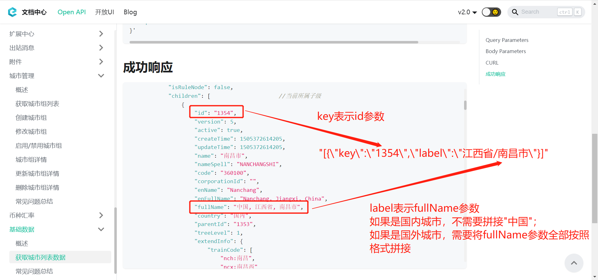

# 新增员工
当员工新增到企业后，该员工可通过 **快捷登录**（短信验证码登录）的方式进入合思，或者通过 **忘记密码** 来设置密码。

import Control from "@theme/Control";
import Tabs from '@theme/Tabs';
import TabItem from '@theme/TabItem';

<Control
method="POST"
url="/api/openapi/v1.1/staffs"
/>

<details>
  <summary><b>更新日志</b></summary>
  <div>

  [**1.23.0**](/updateLog/update-log#1230)&emsp;-> 🐞 接口支持新增 **外部人员**。<br/>
  [**1.20.0**](/updateLog/update-log#1200)&emsp;-> 🐞 接口支持传入 `nickName`（员工别名）字段，且响应信息中新增了该字段。<br/>
  [**1.19.0**](/updateLog/update-log#1190)&emsp;-> 🐞 响应信息中新增了 `globalRoaming`（国际区号）字段。<br/>
  [**1.8.0**](/updateLog/update-log#180) &emsp; -> 🚀 接口升级 `v1.1` 版本，新增了 `cellphone`（手机号）参数校验，只允许传英文括号和数字。<br/>
  [**0.7.140**](/updateLog/update-log#07140) -> 🆕 新增了支持自定义字段保存。<br/>
  [**0.7.133**](/updateLog/update-log#07133) -> 🆕 新增了控制发送邮件标识参数。<br/>

  </div>
</details>

:::caution
- 当新增员工的 **手机号**/**邮箱** 与一个已停用的员工相同，那么系统将启用已停用的员工并更新其员工信息，而不会创建一个新员工。
- 使用此接口新增的员工，您将 **无法在合思界面上维护其通讯录**，只能通过接口更新信息和删除。
:::

## Query Parameters

| 名称 | 类型 | 描述 | 是否必填 | 默认值 | 备注 |
| :--- | :--- | :--- | :--- |:--- | :--- |
| **accessToken** | String  | 认证token	| 必填  | - | 通过 [获取授权](/docs/open-api/getting-started/auth) 获取 `accessToken` |

## Body Parameters

| 名称 | 类型 | 描述 | 是否必填 | 默认值 | 备注                                                                                                                                                                                                       |
| :--- | :--- | :--- | :--- |:--- |:---------------------------------------------------------------------------------------------------------------------------------------------------------------------------------------------------------|
| **name**                      | String    | 员工姓名           | 必填  | - | 员工姓名                                                                                                                                                                                                     |
| **nickName**                  | String    | 员工别名           | 非必填 | - | 员工别名                                                                                                                                                                                                     |
| **code**                      | String    | 工号              | 非必填 | - | 工号                                                                                                                                                                                                       |
| **cellphone**                 | String    | 手机号            | 非必填 | - | 如果手机号为国外手机号，传参示例 : "(区号)手机号"<br/>手机号或邮箱必须至少填一个<br/>当 `external` = `true` 时，**手机号必填**<br/>**只允许传英文括号和数字**                                                                                                 |
| **email**                     | String    | 邮箱              | 非必填 | - | 可以不传，但是不可以传 `""`<br/>手机号或邮箱必须至少填一个                                                                                                                                                                       |
| **external**                  | Boolean   | 是否外部员工       | 非必填 | false | `true` : 外部员工 &emsp; `false` : 内部员工                                                                                                                                                                      |
| **note**                      | String    | 备注              | 非必填 | - | 备注                                                                                                                                                                                                       |
| **defaultDepartment**         | String    | 默认部门ID         | 必填   | - | 请确保默认部门在 `departments` 里。如果不在，系统会自动将departments的第一个元素视为默认部门<br/>当 `external` = `true` 时，只能传 **外部部门ID**，与 `departments`** 任选一个必填即可**，通过 [获取外部部门列表](/docs/open-api/corporation/get-external-department) 获取 |
| **departments**               | Array     | 所在部门ID，至少1个  | 必填  | - | 兼职部门，请确保至少包含默认部门<br/>当 `external` = `true` 时，只能传 **外部部门ID**，与 `defaultDepartment`** 任选一个必填即可**，通过 [获取外部部门列表](/docs/open-api/corporation/get-external-department) 获取                                      |
| **userid**                    | String    | 第三方平台的人员ID   | 非必填 | - | 如需要同步钉钉、企业微信等第三方平台人员，需要加上此参数<br/>**如果 `cellphone` 参数在系统中已注册，本参数不生效，会返回 `cellphone` 对应的 `userid`**                                                                                                        |
| **useNewAccount**             | Boolean   | 是否强制启用新用户   | 非必填 | false | 新增员工手机号被离职员工占用时<br/>`true` : 是，新建员工ID<br/>`false` : 否，重新启用离职员工ID并修改员工信息<br/>                                                                                                                             |
| **useSendEmail**              | Boolean   | 是否禁止发送邮件通知 | 非必填  | false | `true` : 禁止 &emsp; `false` : 不禁止                                                                                                                                                                         |
| **staffCustomForm**           | Object    | 自定义字段         | 非必填  | - | 自定义字段                                                                                                                                                                                                    |
| **&emsp; ∟ rankType**  | String    | 职级档案项ID       | 非必填  | - | 通过 [获取自定义档案项](/docs/open-api/dimensions/get-dimension-items) 获取                                                                                                                                          |
| **&emsp; ∟ postType**  | String    | 岗位档案项ID       | 非必填  | - | 通过 [获取自定义档案项](/docs/open-api/dimensions/get-dimension-items) 获取                                                                                                                                          |
| **&emsp; ∟ base**      | String    | 常驻地            | 非必填  | - | 参考格式 : "\[\{\"key\":\"8\",\"label\":\"北京市/海淀区\"\}\]"                                                                                                                                                     |
| **&emsp; ∟ u_字段名**   | String    | 自定义字段         | 非必填  | - | 自定义字段，格式为"u\_字段名"，例如 : u\_项目<br/>可通过 [获取员工自定义字段](/docs/open-api/contacts/get-allCustomeProperty) 获取字段名                                                                                                   |

:::tip
- 员工ID生成格式规则：
  - `useNewAccount` 不传或传 **false** 时，默认按照 **企业ID:userId** 格式进行拼接
  - `useNewAccount` 传 **true** 时，系统会自动生成新的ID，按照 **企业ID:系统生成的ID** 格式进行拼接

- `base`（常驻地）参数拼接说明：<br/>
  通过 **[获取城市列表数据](/docs/open-api/basedata/get-basedata-city)** 接口获取数据后，找到对应城市。
  - `id` 对应 `key`
  - `fullName` 对应 `label`


:::

## CURL

<Tabs>
<TabItem value="internal" label="内部员工" default>

```json
curl --location --request POST 'https://app.ekuaibao.com/api/openapi/v1.1/staffs?accessToken=ID01w4CBfydlin%3AxgJ3wajigF25H0' \
--header 'content-type: application/json' \
--header 'Accept: application/json' \
--data-raw '{
    "name":"张三",                   //员工姓名
    "nickName": "老三",              //别名
    "code":"36987",                 //工号
    "cellphone":"15070403486",      //手机号
    "email":"Cmzhouxiaofeng@xxx.com.cn",    //邮箱
    "note":"备注",                    //备注
    "defaultDepartment":"JOYbpjPP-E2Q00:pAwbwH_W7sec00",  //默认部门
    "departments":[                                       //所在部门
        "JOYbpjPP-E2Q00:pAwbwH_W7sec00"
    ],
    "staffCustomForm":{                                   //员工自定义字段
        "rankType":"lUcctXntW82A00",   
        "postType":"ltUcxNyWSQ1o00",
        "base":"[{\"key\":\"7370\",\"label\":\"山西省/长治/上党区\"}]",
        "u_文本1":"",
        "u_num1":"1",
        "u_员工档案":"ID_3b9EX5San3s",
        "u_money1":{
            "standard":"123.1234",
            "standardStrCode":"CNY",
            "standardNumCode":"156",
            "standardSymbol":"¥",
            "standardUnit":"元",
            "standardScale":2
        },
        "u_date1":1624896000000
    }
}'
```
</TabItem>
<TabItem value="external" label="外部员工">

```json
curl --location 'https://app.ekuaibao.com/api/openapi/v1.1/staffs?accessToken=ID01w4CBfydlin%3AxgJ3wajigF25H0' \
--header 'Content-Type: application/json' \
--data-raw '{
    "name":"赵六24",                   //员工姓名
    "nickName": "老六24",              //别名
    "code":"1024",                    //工号
    "cellphone":"15588881024",        //手机号	
    "email":"15588881024@163.com",    //邮箱
    "external":true                   //是否外部员工
    "note":"新增外部员工",             //备注
    "defaultDepartment":"xgJ3wajigF25H0:ID01w4CBfaWeTB:external",  //默认部门
    "departments":[                                                //所在部门
        "xgJ3wajigF25H0:ID_3wajigF2aH0:external",  
        "xgJ3wajigF25H0:ID01w4CBfaWeTB:external"
    ]
}'
```

</TabItem>
</Tabs>

## 成功响应
```json
{
    "value": {
        "id": "JOYbpjPP-E2Q00:IIEbwYgR2E5M00",  //员工ID
        "name": "张三",                         //员工姓名
        "nickName": "老三",                     //员工别名
        "code": "36987",                       //员工工号
        "departments": [                       //所在部门
            "JOYbpjPP-E2Q00:pAwbwH_W7sec00"
        ],
        "defaultDepartment": "JOYbpjPP-E2Q00:pAwbwH_W7sec00", //默认部门
        "cellphone": "15070403486",             //手机号
        "active": true,                         //true：在职，false：已离职（账号逻辑删除，在系统上不可见）
        "userId": "sQgbwYgR2E5s00",             //第三方平台人员ID
        "email": "cmzhouxiaofeng@xxx.com.cn",   //登录邮箱（大写字母全转换为小写字母）
        "showEmail": "Cmzhouxiaofeng@xxx.com.cn",//员工个人信息显示邮箱（大写字母保持不变）
        "external": false,                      //是否外部员工
        "authState": true,                      //是否激活，表示账号是否可用
        "globalRoaming": "+86",                 //国际区号
        "note": "备注",                         //备注
        "staffCustomForm": {                    //员工自定义字段
            "rankType":"lUcctXntW82A00",        //职级档案项ID        
            "postType":"ltUcxNyWSQ1o00",        //岗位档案项ID
            "base":"[{\"key\":\"7370\",\"label\":\"山西省/长治/上党区\"}]",//常驻地
            "u_文本1": "",
            "u_num1": "1",
            "u_员工档案": "ID_3b9EX5San3s",
            "u_money1": {
                "standard": "123.1234",
                "standardStrCode": "CNY",
                "standardNumCode": "156",
                "standardSymbol": "¥",
                "standardUnit": "元",
                "standardScale": 2
            },
            "u_date1": 1624896000000
        },
        "updateTime": "2022-08-05 14:59:19",    //更新时间
        "createTime": "2022-08-05 14:59:19"     //创建时间
    }
}
```

## 失败响应
| HTTP状态码 | 错误码 | 描述 | 排查建议 |
| :--- | :--- | :--- | :--- |
| **400** | - | 手机号格式不正确，只能包含数字和英文括号 | 请确认 `cellphone`（手机号）是否包含非法字符 | 
| **400** | - | 新增员工数据库异常：该手机号/邮箱账号已被其他员工使用，请勿重复绑定 | 请确认新增员工的 `cellphone`（手机号）/ `email`（邮箱）在本企业中是否已存在，且未停用，可通过 [获取员工列表](/docs/open-api/corporation/get-all-staffs) 获取确认 | 
| **400** | - | 新增员工数据库异常：部门ID不存在 | 请确认新增外部员工（`external` = `true`）时，`defaultDepartment`（默认部门ID）或 `departments`（所在部门ID）是否为外部部门ID，可通过 [获取外部部门列表](/docs/open-api/corporation/get-external-department) 获取确认 | 
| **400** | - | 新增外部员工手机号不能为空 | 请确认新增外部员工（`external` = `true`）时，`cellphone`（手机号）是否传参 | 
| **400** | - | 该账号已被其他员工使用，请勿重复绑定 | 请确认新增员工的 `userid`（第三方平台的人员ID）在系统中是否已存在，可通过 [获取员工列表](/docs/open-api/corporation/get-all-staffs) 获取确认<br/>**如果 `userid` 不是本企业占用，请更换 `userid`** | 
| **403** | - | 部门不能为空 | 请确认 `defaultDepartment`（默认部门ID）或 `departments`（所在部门ID）是否传参 | 

