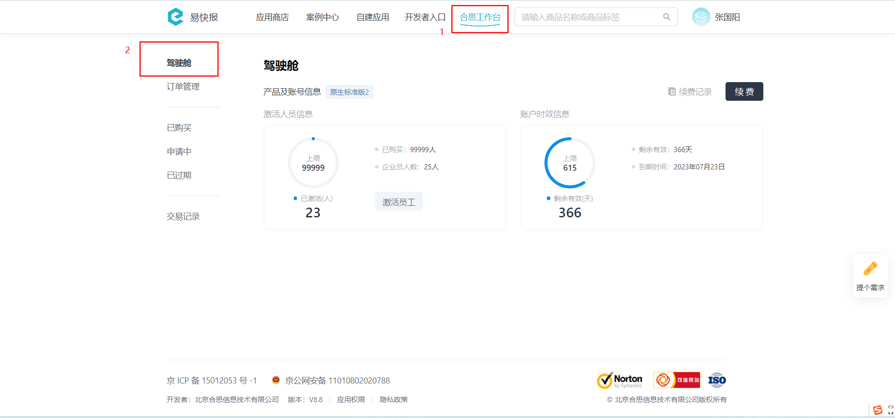

# 获取已激活员工列表 

import Control from "@theme/Control";

<Control
method="GET"
url="/api/openapi/v1/staffs/authorized"
/>

<details>
  <summary><b>更新日志</b></summary>
  <div>

  [**1.19.0**](/docs/open-api/notice/update-log#1190)&emsp;-> 🐞 响应信息中新增了 `globalRoaming`（国际区号）字段。<br/>
  [**0.7.161**](/docs/open-api/notice/update-log#07161) &emsp; -> 🆕 新增了本接口。<br/>

  </div>
</details>

## Query Parameters

| 名称 | 类型 | 描述 | 是否必填 | 默认值 | 备注 |
| :--- | :--- | :--- | :--- |:--- | :--- |
| **accessToken** | String  | 认证token	     | 必填 | - | 通过 [获取授权](/docs/open-api/getting-started/auth) 获取 `accessToken` |
| **start**       | Number  | 分页查询的起始序号 | 必填 | - | 分页的起始值是从 `0` 开始， 而不是传统的 `1` 开始 |
| **count**       | Number  | 查询数据条数      | 必填 | - | 最大不能超过 `100` |

:::tip
- 系统上获取已激活的员工人数页面如下：

:::

## CURL
```shell
curl --location --request GET 'https://app.ekuaibao.com/api/openapi/v1/staffs/authorized?accessToken=ID_3v7kdsVUWhg:djg8LshfUkfM00&start=0&count=100'
```

## 成功响应
```json
{
    "count": 14,  //已激活员工总数
    "items": [    //已激活员工信息
        {
            "id": "PCx3rwm3aA00qM:ID_3rAZNCY2V$g",   //员工ID
            "name": "李四",                          //员工姓名
            "code": "",                              //员工工号
            "departments": [                         //所在部门
              "PCx3rwm3aA00qM:ID_3rw$2RXc5lM"
            ],
            "defaultDepartment": "PCx3rwm3aA00qM:ID_3rw$2RXc5lM",  //默认部门
            "cellphone": "",                         //手机号
            "active": true,                          //true：在职，false：已离职（账号逻辑删除，在系统上不可见）
            "userId": "ID_3rAZNCY2U$g",              //第三方平台人员ID
            "email": "cmzhouxiaofeng@xxx.com.cn",    //登录邮箱（大写字母全转换为小写字母）
            "showEmail": "Cmzhouxiaofeng@xxx.com.cn",//员工个人信息显示邮箱（大写字母保持不变）
            "external": false,                       //是否外部员工
            "authState": true,                       //是否激活，表示账号是否可用
            "globalRoaming": "+86",                  //国际区号
            "note": "notea",                         //备注
            "staffCustomForm": {                     //员工自定义字段
              "base": "[{\"key\":\"7370\",\"label\":\"山西省/长治/上党区\"}]",  //常驻地
              "u_数字字段": "1"
            },
            "updateTime": "2022-09-05 10:43:56",    //更新时间
            "createTime": "2022-09-05 10:43:56"     //创建时间
        },
        {
            "id": "PCx3rwm3aA00qM:ID_3rAZNCY2X$g",
            "name": "王五",
            "code": "00008",
            "departments": [
              "PCx3rwm3aA00qM:ID_3rw$2RXc5lM"
            ],
            "defaultDepartment": "PCx3rwm3aA00qM:ID_3rw$2RXc5lM",
            "cellphone": "18888888888",
            "active": true,
            "userId": "ID_3rAZNCY2W$g",
            "email": "mshanxidd1@xxx.com.cn",
            "showEmail": "mshanxidd1@xxx.com.cn",
            "external": false,
            "authState": true,
            "globalRoaming": "+86",   
            "note": null,
            "staffCustomForm": {
              "u_爱好": ""
            },
            "updateTime": "2022-10-25 04:10:09",
            "createTime": "2021-11-03 00:11:08"
        }
    ]
}
```

## 失败响应
| HTTP状态码 | 错误码 | 描述 | 排查建议 |
| :--- | :--- | :--- | :--- |
| **200** | - | `{"count": 2,"items": []}` | `count` 大于 `0`但返回员工信息为空时，<br/>请确认 `start`（分页查询的起始序号）是否小于实际员工总数据量 | 
| **403** | - | 未授权 | 请确认 `accessToken`（认证token）是否已过期<br/>请确认 **地址前缀** 是否与您的企业环境一致 | 


