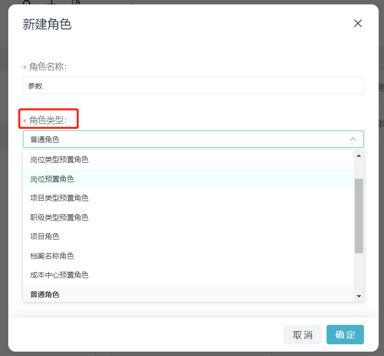

# 更新角色下员工信息

import Control from "@theme/Control";

<Control
method="PUT"
url="/api/openapi/v1/roledefs/$`roledefId`/staffs"
/>

<details>
  <summary><b>更新日志</b></summary>
  <div>

  [**1.9.0**](/docs/open-api/notice/update-log#190) &emsp; -> 🐞 修复了首次调用接口报错后，使用相同错误参数再次调用时，返回成功响应的BUG。<br/>
  [**1.3.0**](/docs/open-api/notice/update-log#130) &emsp; -> 🆕 `staffBy`（员工参数格式）新增了支持 `code`、`cellphone`、`email` 3种参数类型。<br/>
  &emsp; &emsp; &emsp; -> 🐞 兼容老版本，更新「**普通角色**」时 `path` 参数非必填。<br/>
  [**1.2.0**](/docs/open-api/notice/update-log#120) &emsp; -> 🐞 修复了接口 **HTTP 500** 报错问题，增加了 `path`、`staffs` 不允许传 `null` 的校验。<br/>
  [**1.1.1**](/docs/open-api/notice/update-log#111) &emsp; -> 🆕 新增了 `pathType` 参数支持 `id` 类型。<br/>
  [**0.7.137**](/docs/open-api/notice/update-log#07137) -> 🆕 新增了 `pathType`（路径类型）参数。<br/>

  </div>
</details>

:::caution
- 覆盖更新，非增量，只有数据来源为【**[API导入](/docs/open-api/corporation/info#新建角色)**】的角色才能使用此接口更新角色。
:::

## Path Parameters

| 名称 | 类型 | 描述 | 是否必填 | 默认值 | 备注 |
| :--- | :--- | :--- | :--- |:--- | :--- |
| **roledefId** | String | 角色ID | 必填 | - | 在易快报桌面端「系统设置」>「角色管理」处查看<br/>通过 [查询角色组和角色](/docs/open-api/corporation/get-roles-group) 获取 |

## Query Parameters

| 名称 | 类型 | 描述 | 是否必填 | 默认值 | 备注 |
| :--- | :--- | :--- | :--- |:--- | :--- |
| **accessToken** | String | 认证token  | 必填  | -  | 通过 [获取授权](/docs/open-api/getting-started/auth) 获取 `accessToken` |
| **staffBy**     | String | 员工参数格式 | 非必填 | id | `id` : 传入完整员工ID，格式：`企业id : userId`<br/>`sourceId` : 传入 userId <br/>`code` : 员工工号<br/>`cellphone` : 手机号<br/>`email` : 邮箱 |

## Body Parameters

| 名称 | 类型 | 描述 | 是否必填 | 默认值 | 备注 |
| :--- | :--- | :--- | :--- |:--- | :--- |
| **contents**          | Array   | 角色配置情况     | 必填   | - | 每一个元素对应「角色管理」界面右侧列表的一行 |
| **&emsp; ∟ pathType** | String | `name` 或 `code` 或 `id`  | 非必填 | name | 当 `pathType` = `name` 或不传时，`path` 传入部门或自定义档案项名称<br/>当 `pathType` = `code` 时，`path` 传入部门或自定义档案项编码<br/>当 `pathType` = `id` 时，`path` 传入部门或自定义档案项ID |
| **&emsp; ∟ path**     | Array  | 部门或自定义档案值 | 必填 | - | 传入内容参考 `pathType`，传入对应类型的 [全路径参数](/docs/open-api/corporation/question-answer)<br/>**角色类型为「普通角色」时非必填** |
| **&emsp; ∟ staffs**   | Array  | 员工集合         | 必填 | - | **传入 `[]` 时会删除 `path` 值所对应的这条数据**<br/>通过 [获取员工列表](/docs/open-api/corporation/get-all-staffs) 获取 |

:::tip
- 在系统上新建角色时，角色类型可按【部门】和【档案类别】划分，此接口中的 `path` 参数就传这个角色对应的类型值。

:::

## CURL
import Tabs from '@theme/Tabs';
import TabItem from '@theme/TabItem';

<Tabs>
<TabItem value="id" label="id" default>

```json
curl --location --request PUT 'https://app.ekuaibao.com/api/openapi/v1/roledefs/$ID_3BJKZuv0Dow/staffs?accessToken=ID_3BFuV7KbNDw:bwa3wajigF0WH0&staffBy=id' \
--header 'Content-Type: application/json' \
--data-raw '{
    "contents": [  //角色配置情况
        {
            "pathType": "name",                  //当pathType不传或者传name时，path传入部门名称或者自定义档案项名称
            "path": [
                "测试接口专用","部门1","部门1-1"  //部门名称全路径
            ],
            "staffs": [
                "bwa3wajigF0WH0:IqQ3wlg6bv9QGg", //员工ID
                "bwa3wajigF0WH0:qKZ3wlg6bv9OGg"
            ]
        },
        {
            "pathType": "code",                //当pathType传code时，path传入部门编码或者自定义档案项编码
            "path": [
                "GS001","BM002"                //部门编码全路径
            ],
            "staffs": [
                "bwa3wajigF0WH0:aRx3BagJH20mdg"  //员工ID
            ]
        },
        {
            "pathType": "id",                //当pathType传id时，path传入部门ID或者自定义档案项ID
            "path": [
                "bwa3wajigF0WH0","bwa3wajigF0WH0:ID_3wUvB7G2d3w" //部门ID全路径
            ],
            "staffs": [
                "bwa3wajigF0WH0:ID_3lokDfb1p5w"  //员工ID
            ]
        }
    ]
}'
```
</TabItem>
<TabItem value="sourceId" label="sourceId">

```json
curl --location --request PUT 'https://app.ekuaibao.com/api/openapi/v1/roledefs/$ID_3BJKZuv0Dow/staffs?accessToken=ID_3BJKZuv8iow:bwa3wajigF0WH0&staffBy=sourceId' \
--header 'Content-Type: application/json' \
--data-raw '{
    "contents": [  //角色配置情况
        {
            "pathType": "name",                  //当pathType不传或者传name时，path传入部门名称或者自定义档案项名称
            "path": [
                "测试接口专用","部门1","部门1-1"  //部门名称全路径
            ],
            "staffs": [
                "IqQ3wlg6bv9QGg",                //员工USERID
                "qKZ3wlg6bv9OGg"
            ]
        },
        {
            "pathType": "code",                //当pathType传code时，path传入部门编码或者自定义档案项编码
            "path": [
                "GS001","BM002"                //部门编码全路径
            ],
            "staffs": [
                "aRx3BagJH20mdg"               //员工USERID
            ]
        },
        {
            "pathType": "id",                //当pathType传id时，path传入部门ID或者自定义档案项ID
            "path": [
                "bwa3wajigF0WH0","bwa3wajigF0WH0:ID_3wUvB7G2d3w" //部门ID全路径
            ],
            "staffs": [
                "ID_3lokDfb1p5w"             //员工USERID
            ]
        }
    ]
}'
```
</TabItem>
<TabItem value="code" label="code">

```json
curl --location --request PUT 'https://app.ekuaibao.com/api/openapi/v1/roledefs/$ID_3BJKZuv0Dow/staffs?accessToken=ID_3BJKZuv8iow:bwa3wajigF0WH0&staffBy=code' \
--header 'Content-Type: application/json' \
--data-raw '{
    "contents": [  //角色配置情况
        {
            "pathType": "name",                  //当pathType不传或者传name时，path传入部门名称或者自定义档案项名称
            "path": [
                "测试接口专用","部门1","部门1-1"  //部门名称全路径
            ],
            "staffs": [
                "1001",                          //员工CODE（工号）
                "1002"
            ]
        },
        {
            "pathType": "code",                //当pathType传code时，path传入部门编码或者自定义档案项编码
            "path": [
                "GS001","BM002"                //部门编码全路径
            ],
            "staffs": [
                "1003"                         //员工CODE（工号）
            ]
        },
        {
            "pathType": "id",                //当pathType传id时，path传入部门ID或者自定义档案项ID
            "path": [
                "bwa3wajigF0WH0","bwa3wajigF0WH0:ID_3wUvB7G2d3w" //部门ID全路径
            ],
            "staffs": [
                "9458"                       //员工CODE（工号）
            ]
        }
    ]
}'
```
</TabItem>
<TabItem value="cellphone" label="cellphone">

```json
curl --location --request PUT 'https://app.ekuaibao.com/api/openapi/v1/roledefs/$ID_3BJKZuv0Dow/staffs?accessToken=ID_3BJKZuv8iow:bwa3wajigF0WH0&staffBy=cellphone' \
--header 'Content-Type: application/json' \
--data-raw '{
    "contents": [  //角色配置情况
        {
            "pathType": "name",                  //当pathType不传或者传name时，path传入部门名称或者自定义档案项名称
            "path": [
                "测试接口专用","部门1","部门1-1"  //部门名称全路径
            ],
            "staffs": [
                "17600109458",                   //员工手机号
                "12341234123"
            ]
        },
        {
            "pathType": "code",                //当pathType传code时，path传入部门编码或者自定义档案项编码
            "path": [
                "GS001","BM002"                //部门编码全路径
            ],
            "staffs": [
                "18811110002"                  //员工手机号
            ]
        },
        {
            "pathType": "id",                //当pathType传id时，path传入部门ID或者自定义档案项ID
            "path": [
                "bwa3wajigF0WH0","bwa3wajigF0WH0:ID_3wUvB7G2d3w" //部门ID全路径
            ],
            "staffs": [
                "15810011001"                //员工手机号
            ]
        }
    ]
}'
```
</TabItem>
<TabItem value="email" label="email">

```json
curl --location --request PUT 'https://app.ekuaibao.com/api/openapi/v1/roledefs/$ID_3BJKZuv0Dow/staffs?accessToken=ID_3BJKZuv8iow:bwa3wajigF0WH0&staffBy=email' \
--header 'Content-Type: application/json' \
--data-raw '{
    "contents": [  //角色配置情况
        {
            "pathType": "name",                  //当pathType不传或者传name时，path传入部门名称或者自定义档案项名称
            "path": [
                "测试接口专用","部门1","部门1-1"  //部门名称全路径
            ],
            "staffs": [
                "youxiang1@123.com",             //员工邮箱
                "ddd@163.com"
            ]
        },
        {
            "pathType": "code",                //当pathType传code时，path传入部门编码或者自定义档案项编码
            "path": [
                "GS001","BM002"                //部门编码全路径
            ],
            "staffs": [
                "youxiang@123.com"             //员工邮箱
            ]
        },
        {
            "pathType": "id",                //当pathType传id时，path传入部门ID或者自定义档案项ID
            "path": [
                "bwa3wajigF0WH0","bwa3wajigF0WH0:ID_3wUvB7G2d3w" //部门ID全路径
            ],
            "staffs": [
                "youxiang3@123.com"          //员工邮箱
            ]
        }
    ]
}'
```
</TabItem>
</Tabs>

## 成功响应
:::caution
- 响应需要判断 **HTTP状态码** 来确定是否成功，响应成功时无内容返回。
:::

```text
code 204
```

## 失败响应
| HTTP状态码 | 错误码 | 描述 | 排查建议 |
| :--- | :--- | :--- | :--- |
| **403** | - | 没有权限同步此角色 | 请确认所操作的角色数据来源是否为【**API导入**】 | 
| **412** | - | 找不到角色        | 请确认 `roledefId`（角色ID）是否正确或存在 | 
| **412** | - | 数据错误:[0:路径不存在[部门], 0:人员不存在[xxxxxxxxx:xxxx]] | 请确认 `path`（部门或自定义档案值）是否为完整路径参数<br/>请确认员工信息是否正确 | 
| **412** | - | 参数staffs不能为空 | 除了普通角色，`path`（部门或自定义档案值）、`staffs`（员工集合）不允许传 `null` | 
| **412** | - | 参数path不能为空   | 除了普通角色，`path`（部门或自定义档案值）、`staffs`（员工集合）不允许传 `null` | 

