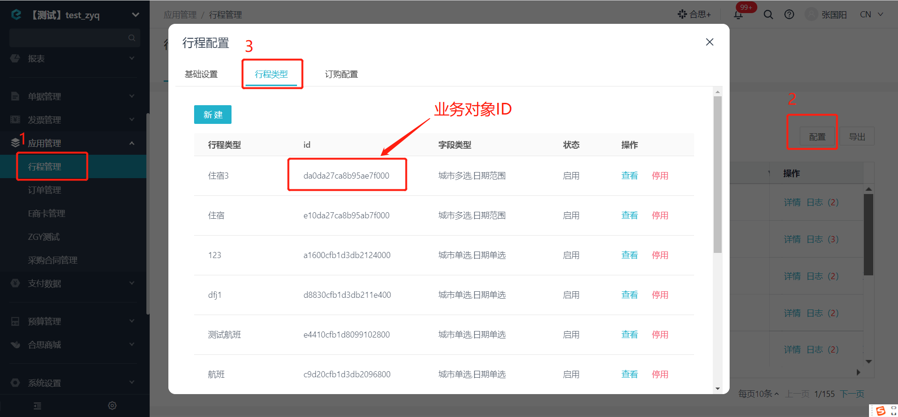
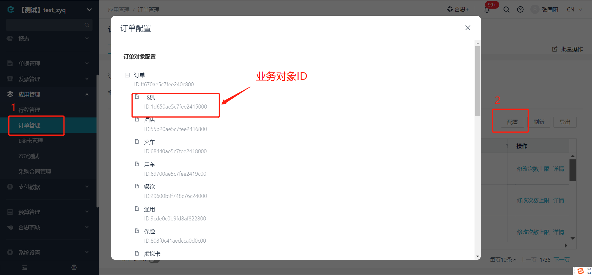

# 根据实例编号获取行程管理/订单管理业务对象实例

import Control from "@theme/Control";

<Control
method="GET"
url="/api/openapi/v2.1/datalink/TRAVEL_MANAGEMENT/byDataLinkCodes"
/>

<details>
  <summary><b>更新日志</b></summary>
  <div>

- [**1.17.0**](/updateLog/update-log#1170)
  - 🆕 新增了本接口。

</div>
</details>

## Query Parameters

| 名称 | 类型 | 描述 | 是否必填 | 默认值 | 备注 |
| :--- | :--- | :--- | :--- |:--- | :--- |
| **accessToken** | String | 认证token | 必填 | - | 通过 [获取授权](/docs/open-api/getting-started/auth) 获取 `accessToken` |

## Body Parameters

| 名称 | 类型 | 描述 | 是否必填 | 默认值 | 备注 |
| :--- | :--- | :--- | :--- |:--- | :--- |
| **entityId** | String | 业务对象ID | 必填 | - | 行程/订单管理的业务对象ID |
| **codes** | Array | 业务对象实例code | 必填 | - | 通过 [获取行程管理/订单管理业务对象列表](/docs/open-api/datalink/get-tripManager-order) 获取<br/>多个用英文逗号 `,` 分隔 |

:::tip

- 【行程管理】、【订单管理】的“业务对象ID”获取见下图：

  

  

- 【行程管理】、【订单管理】中为什么都有”飞机“、”酒店“等这种分类？

    - 2种 **飞机** 的 `entityId`（业务对象ID） 不一样，里面的字段也不一样。
    - **”行程管理“**里的**”飞机“**是申请单审批通过之后生成，然后传给商城。
    - 商城根据行程下完单后，会推送**”订单信息“**给费控，生成订单业务对象，一般来说报销单中需要关联的就是订单业务对象，**”订单管理“**中会有具体的订单信息，例如订单金额、改签费、服务费之类的字段。
    - 费控接收订单的时候，保存在**”订单管理“**中，飞机退改签时，会生成同一条订单。
:::

## CURL
```json
curl --location 'https://app.ekuaibao.com/api/openapi/v2.1/datalink/TRAVEL_MANAGEMENT/byDataLinkCodes?accessToken=ID01oZYPohNeZp%3Adjg8LshfUkfM00&entityId=32240ae5c7fee240e000&codes=TRIP202303020000000591' \
--header 'content-type: application/json' \
--header 'Accept: application/json'
```

## 成功响应
```json
{
    "items": [
        {
            "pipeline": 1,
            "grayver": "9.95.0.0-prd",
            "version": 2,
            "active": true,
            "createTime": 1677753063532,
            "updateTime": 1677753063538,
            "name": "上海市/上海市区 - 四川省/成都市/成都市区",
            "nameSpell": "SHANGHAISHI/SHANGHAISHIQU - SICHUANSHENG/CHENGDOUSHI/CHENGDOUSHIQU",
            "code": "TRIP202303020000000591",   //业务对象实例编码
            "corporationId": "djg8LshfUkfM00",
            "sourceCorporationId": null,
            "dataCorporationId": null,
            "id": "ID01nF5dqyWVxZ",             //业务对象实例ID                  
            "form": {
                "E_89330ae5c7fee240b000_code": "TRIP202303020000000591",    //业务对象实例编码
                "E_89330ae5c7fee240b000_name": "上海市/上海市区 - 四川省/成都市/成都市区",   //业务对象实例名称
                "E_89330ae5c7fee240b000_住宿地": "[{\"key\":\"2494\",\"label\":\"成都市区\",\"type\":\"city\"},{\"key\":\"858\",\"label\":\"上海市区\",\"type\":\"city\"}]",
                "E_89330ae5c7fee240b000_出发地": "[{\"key\":\"858\",\"label\":\"上海市区\"}]",
                "E_89330ae5c7fee240b000_出行人": [
                    "djg8LshfUkfM00:NMIaVspFrM2Q00"
                ],
                "E_89330ae5c7fee240b000_申请人": "djg8LshfUkfM00:NMIaVspFrM2Q00",
                "E_89330ae5c7fee240b000_目的地": "[{\"key\":\"2494\",\"label\":\"成都市区\"}]",
                "E_89330ae5c7fee240b000_订票人": "djg8LshfUkfM00:NMIaVspFrM2Q00",
                "E_89330ae5c7fee240b000_入住日期": 1618537346700,
                "E_89330ae5c7fee240b000_原始单据": "BcccFmP6iU6w00",
                "E_89330ae5c7fee240b000_参考报价": "0",
                "E_89330ae5c7fee240b000_离店日期": 1618537346700,
                "E_89330ae5c7fee240b000_行程日期": 1618537346700,
                "E_89330ae5c7fee240b000_订购状态": "待订购",
                "E_89330ae5c7fee240b000_申请单标题": "1212",
                "E_89330ae5c7fee240b000_申请单编码": "S21000176",
                "E_89330ae5c7fee240b000_申请单预算金额": {
                    "standard": "1121.00",
                    "standardUnit": "元",
                    "standardScale": 2,
                    "standardSymbol": "¥",
                    "standardNumCode": "156",
                    "standardStrCode": "CNY"
                }
            },
            "ledgerAmount": null,
            "ledgerAmountModel": null,
            "totalCount": 0,
            "useCount": 0,
            "entityId": "32240ae5c7fee240e000",     //业务对象ID
            "platformId": "2rYaVsv-UA2I00",         //自建应用ID
            "source": "FLOW",
            "masterId": "",
            "index": 0,
            "visibility": {
                "fullVisible": false,
                "staffs": [
                    "djg8LshfUkfM00:NMIaVspFrM2Q00"
                ],
                "roles": [],
                "departments": [],
                "departmentsIncludeChildren": false
            },
            "visible": true,
            "ownerId": "djg8LshfUkfM00:NMIaVspFrM2Q00",     //所属人ID
            "operatorId": "djg8LshfUkfM00:NMIaVspFrM2Q00",  //操作者ID
            "sourceId": "BcccFmP6iU6w00",
            "selfPlannedConfigs": [],
            "rigidControlPassed": true,
            "controlCalcVersion": 2,
            "topDate": 0,
            "topFlag": 0,
            "flowCounts": {},
            "sourceMessage": ""
        }
    ]
}
```

## 失败响应

| HTTP状态码 | 错误码 | 描述 | 排查建议 |
| :--- | :--- | :--- | :--- |
| **400** | - | 不支持的业务对象「TRAVEL」 | 请确认接口路径中的 `TRAVEL_MANAGEMENT` 拼写是否正确，该参数为固定值  | 
| **400** | - | 查询的数据不存在 | 请确认 `entityId`（业务对象ID）、`codes`（业务对象实例code）是否正确  | 


