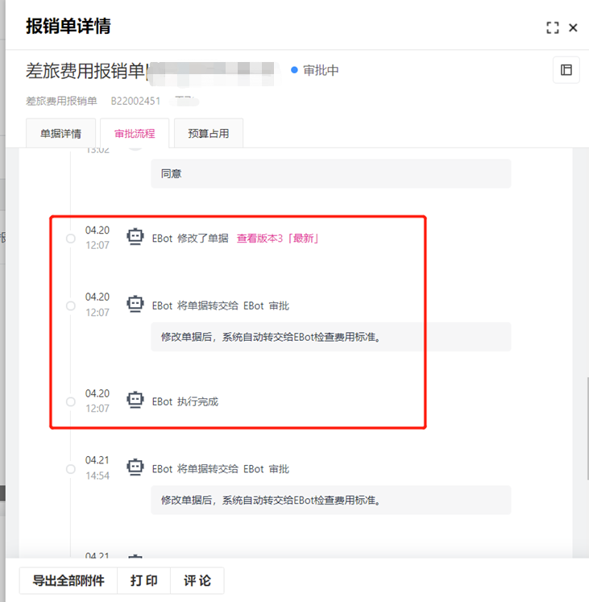

# 外部服务回调审批
EBot调用出站消息后，目标服务器收到消息并进行外部处理，处理后调用此接口（目前只支持EBot节点的审批），通知Ebot执行**"同意"**或**"驳回"**操作。

import Control from "@theme/Control";

<Control
method="POST"
url="/api/outbound/v1/approval"
/>

## Query Parameters

| 名称 | 类型 | 描述 | 是否必填 | 默认值 | 备注 |
| :--- | :--- | :--- | :--- |:--- | :--- |
| **accessToken** | String | 认证token | 必填 | - | 通过 [获取授权](/docs/open-api/getting-started/auth) 获取 `accessToken` |

## Body Parameters

| 名称 | 类型 | 描述 | 是否必填 | 默认值 | 备注                                                                                                  |
| :--- | :--- | :--- | :--- |:--- |:----------------------------------------------------------------------------------------------------|
| **signKey**  | String | 签名秘钥(系统分配) | 必填  | - | 通过出站消息配置上获取                                                                                         |
| **flowId**   | String | 单据ID	          | 必填  | - | 通过出站消息获取                                                                                            |
| **nodeId**   | String | 节点ID	          | 必填  | - | 通过出站消息获取                                                                                            |
| **action**   | String | 审批动作	      | 必填  | - | `accept` : 同意 &emsp; `refuse` : 驳回                                                                  |
| **comment**  | String | 审批意见          | 必填  | - | 审批意见                                                                                                |
| **rejectTo** | String | 驳回的节点ID      | 非必填 | - | 填写需要驳回的节点ID，可根据单据ID<br/>通过 [根据单据ID获取单据详情](/docs/open-api/flows/get-forms-details) 中的 `logs`（审批日志）获取 |

[//记录文档，该参数不对外展示 2022年11月28日上线该参数]: # (| **ebotNodeOnly** | Boolean | 是否仅审批EBOT节点 | 非必填 | false | `true` : 可审批人工节点（仅支持 `action` = `accept` 的同意动作） <br/> `false` : 仅审批EBOT节点                           |)

:::tip


:::

## CURL
```json
curl --location --request POST 'https://app.ekuaibao.com/api/outbound/v1/approval?accessToken=Un0bxmbZ0w8c00' \
--header 'content-type: application/json' \
--header 'Accept: application/json' \
--data-raw '{
    "signKey":"5hPoHsymNqEf",
    "flowId":"MK48h7s2yQ6Y00",
    "nodeId":"FLOW:251847192:631543649",
    "action":"accept",
    "comment":"同意",
    "rejectTo": ""
}'
```

## 成功响应
```json
{
	"value":{
        "code":"204",            //返回编码
        "message":"EBot执行完成"  //返回消息
    }
}
```

## 失败响应

| HTTP状态码 | 错误码 | 描述 | 排查建议 |
| :--- | :--- | :--- | :--- |
| **200** | 401 | 签名秘钥错误企业 | 请确认 `signKey`（签名秘钥）是否正确 |
| **200** | 412 | 当前的审批节点不为:4F7CB33E-8959-43FC-9F3B-210033C8F198，请检查 | 请确认 `nodeId`（节点ID）是否正确 |

### 注意事项
:::caution
- 不支持在 **Ebot节点** 调用【[更新单据](/docs/open-api/flows/update-form)】接口，如果一定要使用，请注意以下问题：
- 调用【[更新单据](/docs/open-api/flows/update-form)】接口后立刻调用本接口，报错：**“当前的审批节点不为:xxx”**
  - 原因是修改了单据，审批流会流转到系统预置的 **费用标准检查节点**（单据模板配置了费用标准时触发），校验通过后再流转回当前 **Ebot节点**，此时才能调用本接口执行回调操作。
  - 审批流从 **费用标准检查节点** 回到 **Ebot节点**，会重新触发Ebot节点上配置的出站消息，这点要额外注意，接收出站消息业务方要做好相应的判断处理，避免程序死循环。


:::

### `message` 补充说明

| 参数 | 说明 |
|:--- |:--- |
| **204** | EBot执行完成 |
| **400** | 请求参数错误 |
| **401** | 签名秘钥错误 |
| **412** | 异常message |
| **500** | EBot审批失败 |


